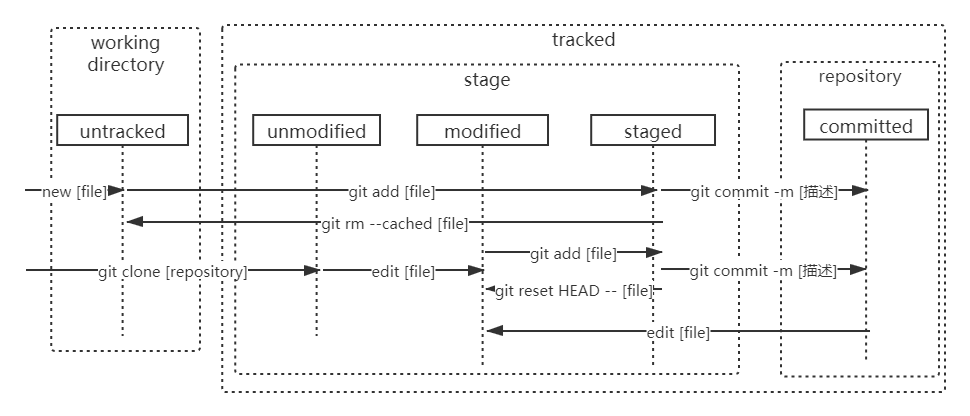

# git文件状态

对于一个文件，对 git 而言有四种状态，一种是 Untracked （未跟踪），以及其他三种属于 git 内部的状态：已提交（committed）、已修改（modified）、已暂存（staged）。

- Untracked：未跟踪，指文件尚未纳入 git 版本管理
- 已提交：表示该文件已经被安全地保存在本地数据库中了；
- 已修改：表示修改了某个文件，但还没有提交保存；
- 已暂存：表示把已修改的文件放在下次提交时要保存的清单中。

文件状态查看：

- `git status [filename]`：查看指定文件状态
- `git status`：查看所有文件状态
- `git status -s`：以精简的方式查看文件状态

文件位置：

- working directory：工作目录
- stage：暂存区
- repository：本地仓库

文件状态转换：

