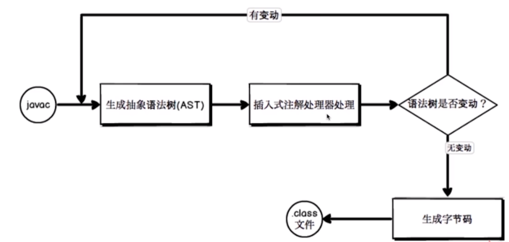
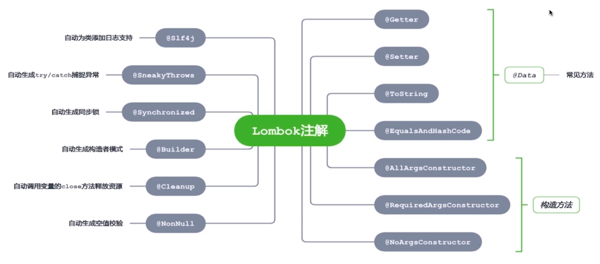
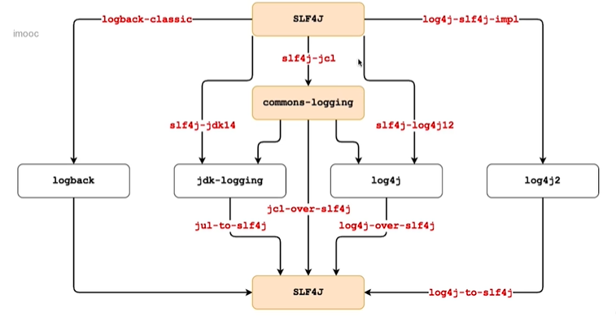

# Lombok

注解运行时的解析方式：

1. 运行时解析
2. 编译时解析

编译时解析的两种机制：

- Annotation Processing Tool（注解处理器）：jdk1.8被移除

- Pluggable Annotation Processing API（JSR269插入式注解处理器）

  

Lombok提供的注解：



使用：

1. 在idea中安装lombok plugin

2. 在pom.xml中引入依赖：

   ```xml
   <dependency>
       <groupId>org.projectlombok</groupId>
       <artifactId>lombok</artifactId>
       <version>1.18.12</version>
   </dependency>
   ```

常用注解：

- @Getter：生成 get 方法，可用于 class 和 property 

  ```java
  // 生成懒加载的get方法
  @Getter(lazy = true)
  private final String name = "Hello";
  
  // 控制生成的get方法的访问权限，默认public
  @Getter(value = AccessLevel.PRIVATE)
  private String password;
  ```

- @Setter：生成 set 方法，可用于 class 和 property

  ```java
  @Setter
  private String name;
  
  @Setter(value = AccessLevel.PRIVATE)
  private String password;
  ```

- @ToString：生成 toString 方法，用于注解 class

- @EqualsAndHashCode：生成equals和hashCode方法，注解在class上

- @NonNull：生成非空检查

- 构造参数：

  - @AllArgsConstructor：全参
  - @NoArgsConstructor：无参
  - @RequiredArgsConstructor

- @Cleanup：生成资源关闭的代码，用于注解资源变量

- @Slf4j：简化日志引入方式

- @Builder：简化对象创建过程

- @Singular：配合@Builder注解，简化集合类型操作

常见的日志框架：

- SLF4J 和 commons-logging 均只是提供了接口，没有实现
- logback、log4j等为日志具体的实现  

