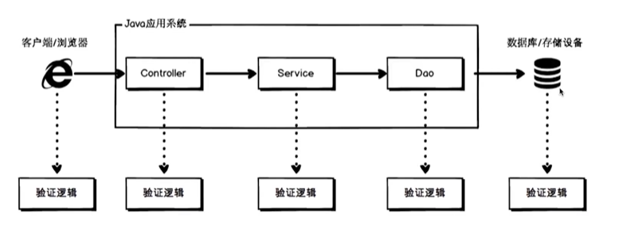
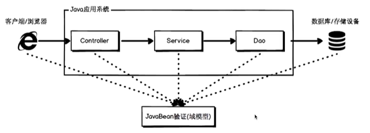
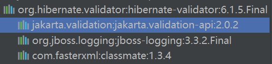

# 校验

### 验证方类

分层验证：



JavaBean验证模型：



Bean Validation：为JavaBean验证定义了相应的数据模型和API，是一套基于**注解/XML**的数据校验规范

JCP：Java Community Process，是使有兴趣的各方参与定义Java的特征和未来版本的正式过程；JCP使用JSR（Java Specification Requests）作为正式规范文档，描述被提议加入到Java体系中的规范与技术

JSR与Bean Validation的版本对应：

- JSR 303：Bean Validation 1.0
- JSR 349：Bean Validation 1.1
- JSR 380：Bean Validation 2.0

 Hebernate Validation：Bean Validation的实现，版本对应

- Bean Validation 1.0 的实现：Hibernate Validator 4.3.1.Final
- Bean Validation 1.1 的实现：Hibernate Validator 5.1.1.Final，jdk版本6+，Spring Boot版本1.5.x
- Bean Validation 2.0 的实现：Hibernate Validator 6.0.1.Final，jdk版本8+，Spring Boot版本2.0.x

Spring Validation：为Heibernate Validation的基础上的二次封装，以满足在Spring环境中更简单、高效的数据验证

### 常用注解

> Java EE在2018年更名为Jakarta EE，因此规范进行坐标有所变化

分三类：

- 控制校验类：@Null、@NotNull、@NotEmpty、@NotBlank等
- 范围校验类：@Min、@Size、@Digits、@Future、@Negative等
- 其他校验类：@Email、@URL、@AssertTrue、@Pattern等

基本使用：

1. 引入依赖：

   - Bean Validation 2.0规范的依赖项，即接口：

     ```xml
     <dependency>
         <groupId>javax.validation</groupId>
         <artifactId>validation-api</artifactId>
         <version>2.0.1.Final</version>
     </dependency>
     
     <!-- Java EE 更名后的坐标 -->
     <dependency>
         <groupId>jakarta.validation</groupId>
         <artifactId>jakarta.validation-api</artifactId>
         <version>2.0.1</version>
     </dependency>
     ```

   - Hibernate Validator的依赖项，即实现：

     ```xml
     <dependency>
         <groupId>org.hibernate</groupId>
         <artifactId>hibernate-validator</artifactId>
         <version>6.1.5.Final</version>
     </dependency>
     ```

     

     小细节：hibernate-validator已经导入了Bean Validator API，因此无需再次手动导入API

   - 导入javax.el依赖，EL是一个工具包，该依赖提供的为接口：

     > Expression Language 3.0表达式语言规范最终版于2013-4-29发布，`Tomcat 8、Jetty 9、GlasshFish 4`都已经支持了`EL 3.0`。
     >
     > 新特性包括：符串拼接操作符、符串拼接操作符、赋值、分号操作符、对象方法调用、Lambda表达式、静态字段/方法调用、构造器调用、Java8集合操作

     ```xml
     <dependency>
         <groupId>javax.el</groupId>
         <artifactId>javax.el-api</artifactId>
         <version>3.0.0</version>
     </dependency>
     ```

   - 导入 EL 的实现依赖：

     > Java EE没有提供el的实现，需要容器自行提供，常见的有org.glassfish.web（EL3.0后不再支持），或者org.glassfish，或者tomcat的实现

     ```xml
     <dependency>
         <groupId>org.glassfish.web</groupId>
         <artifactId>javax.el</artifactId>
         <version>2.2.6</version>
     </dependency>
     <!-- 嵌入式的tomcat -->
     <dependency>
         <groupId>org.apache.tomcat.embed</groupId>
         <artifactId>tomcat-embed-el</artifactId>
         <version>9.0.22</version>
     </dependency>
     <!-- 传统的tomcat（tomcat8.5之前自带，之后需要自行导入） -->
     <dependency>
         <groupId>org.apache.tomcat</groupId>
         <artifactId>tomcat-jasper-el</artifactId>
         <version>9.0.22</version>
         <scope>provided</scope>
     </dependency>
     ```

   - 导入测试依赖 junit：

     ```xml
     <dependency>
         <groupId>junit</groupId>
         <artifactId>junit</artifactId>
         <version>4.13</version>
         <scope>compile</scope>
     </dependency>
     ```

2. 依赖的最佳导入：一般来说，javax.el-api 以及 validation-api都是没有必要单独导入的，第三方包都会自带，因此，大多数情况下，只需导入如下依赖：

   ```xml
   <dependency>
       <groupId>org.hibernate.validator</groupId>
       <artifactId>hibernate-validator</artifactId>
       <version>6.0.17.Final</version>
   </dependency>
   <dependency>
       <groupId>org.apache.tomcat.embed</groupId>
       <artifactId>tomcat-embed-el</artifactId>
       <version>9.0.22</version>
   </dependency>
   ```

3. 基本使用：

   ```java
   // UserInfo类
   @Data
   public class UserInfo {
       /** 校验注解支持分组验证，groups属性 */
   
       /** NotNull：允许为空字符串，只要不为null */
       @NotNull(message = "用户ID不能为空")
       private String userId;
       
       /** NotEmpty：不会去掉前后空格 */
       @NotEmpty(message = "用户名不能为空")
       private String userName;
       
       /** NotBlank：会自动去掉字符串前后空格后进行验证 */
       @NotBlank(message = "密码不能为空，且不能为空格")
       @Length(min = 6, max = 20, message = "密码长度为6-20")
       private String password;
       
       @Email(message = "邮箱格式无效")
       private String email;
       
       @Min(value = 18, message = "年龄不能小于18")
       @Max(value = 60, message = "年龄不能大于60")
       private Integer age;
       
       @Past(message = "生日不能为未来时间点")
       private LocalDate birthday;
       
       /**
        * @Size 对集合元素进行校验
        * @valid 级联验证，能够对集合中的元素进行验证
        */
       @NotNull(message = "朋友不能为空")
       @Size(min = 1, max = 200, message = "好友个数1-200")
       private List<@Valid UserInfo> friends;
   }
   
   // 参数校验
   public class UserInfoService {
   
       private UserInfo userInfo;
   
       /**
        * 入参
        * @param userInfo
        */
       public void setUserInfo(@Valid UserInfo userInfo) {
       }
   
       /**
        * 出参
        * @return
        */
       public @Valid UserInfo getUserInfo() {
           return new UserInfo();
       }
   
       /**
        * 默认构造函数
        */
       public UserInfoService() {
       }
   
       /**
        * 接受UserInfo作为参数的构造函数
        * @param userInfo
        */
       public UserInfoService(@Valid UserInfo userInfo) {
           this.userInfo = userInfo;
       }
   }
   
   // 校验
   public class ValidationTest {
       // 验证器对象
       private Validator validator;
       // 待验证对象
       private UserInfo userInfo;
       // 验证结果集合
       private Set<ConstraintViolation<UserInfo>> set;
       // 验证结果集合
       private Set<ConstraintViolation<UserInfoService>> otherSet;
   
       /**
        * 初始化
        */
       @Before
       public void init() {
           // 初始化验证器
           validator = Validation.buildDefaultValidatorFactory()
                   .getValidator();
   
           // 初始化待验证对象 - 用户信息
           userInfo = new UserInfo();
           userInfo.setUserId("");
           userInfo.setUserName(" ");
           userInfo.setPassword("12665");
           userInfo.setEmail("12@qq.cn");
           userInfo.setAge(19);
           userInfo.setBirthday(LocalDate.now().plusMonths(2));
           userInfo.setFriends(new ArrayList<UserInfo>() {{
               add(new UserInfo());
           }});
       }
   
       /**
        * 对实例进行验证
        */
       @Test
       public void nullValidate() {
           // 使用验证器进行验证
           set = validator.validate(userInfo);
       }
   
       /**
        * 对方法参数进行验证
        *
        * @throws NoSuchMethodException
        */
       @Test
       public void paramValidation() throws NoSuchMethodException {
           // 获取校验执行器
           ExecutableValidator executableValidator =
                   validator.forExecutables();
           // 待验证对象
           UserInfoService service = new UserInfoService();
           // 待验证方法
           Method method = service.getClass().
                   getMethod("setUserInfo", UserInfo.class);
           // 方法输入参数
           Object[] paramObjects = new Object[]{new UserInfo()};
           // 对方法的输入参数进行校验
           otherSet = executableValidator.validateParameters(service, method, paramObjects);
       }
   
       /**
        * 对方法返回值进行校验
        */
       @Test
       public void returnValueValidation() throws NoSuchMethodException,
       InvocationTargetException, IllegalAccessException {
           // 获取校验指示器
           ExecutableValidator executableValidator =
                   validator.forExecutables();
           // 构造要校验的方法对象
           UserInfoService service = new UserInfoService();
           Method method = service.getClass()
                   .getMethod("getUserInfo");
           // 调用方法得到返回值
           Object returnValue = method.invoke(service);
           // 校验方法返回值是否符合约束
           otherSet = executableValidator.validateReturnValue(
                   service,
                   method,
                   returnValue
           );
       }
   
       /**
        * 对构造函数进行校验
        */
       @Test
       public void constructorValidation() throws NoSuchMethodException {
           // 获取验证执行器
           ExecutableValidator executables = validator.forExecutables();
           // 获取构造函数
           Constructor<UserInfoService> constructor = UserInfoService.class.
                   getConstructor(UserInfo.class);
           Object[] params = new Object[]{new UserInfo()};
           // 校验构造函数
           otherSet = executables.validateConstructorParameters(constructor, params);
       }
   
       /**
        * 结果打印
        */
       @After
       public void print() {
           otherSet.forEach(item -> {
               // 验证信息输出
               System.out.println(item.getMessage());
           });
       }
   }
   ```

4. 自定义约束注解：

   1. 约束注解的定义

      ```java
      @Documented
      // 定义注解作用目标
      @Target({ElementType.FIELD})
      // 注解的保留策略
      @Retention(RetentionPolicy.RUNTIME)
      // 约束注解关联的验证器
      @Constraint(validatedBy = PhoneValidator.class)
      public @interface Phone {
          // 约束注解验证时的输出信息
          String message() default "手机号校验错误";
          // 约束注解在校验时所属的组别
          Class<?>[] groups() default {};
          // 约束注解的有效负载
          Class<? extends Payload>[] payload() default {};
      }
      ```

   2. 约束验证规则（约束验证器）

      ```java
      public class PhoneValidator implements ConstraintValidator<Phone,String> {
          @Override
          public boolean isValid(String s, ConstraintValidatorContext constraintValidatorContext) {
              // 手机号验证规则：158+其他8位
              String check = "158\\d{8}";
              Pattern regex = Pattern.compile(check);
      
              // 空值处理
              String s1 = Optional.ofNullable(s).orElse("");
              Matcher matcher = regex.matcher(s1);
              return matcher.matches();
          }
      }
      ```

   3. 约束注解的声明

   4. 结束验证流程