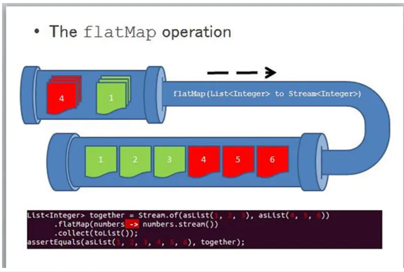
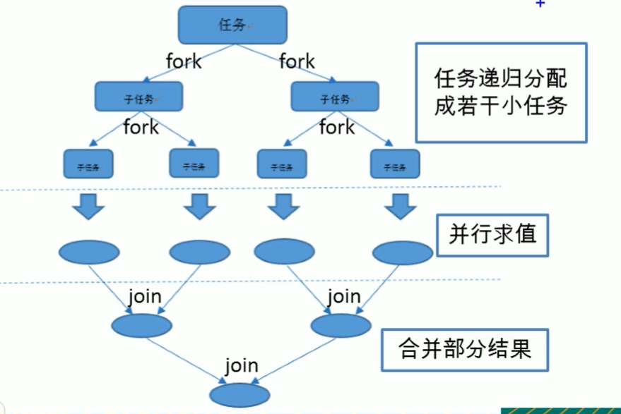
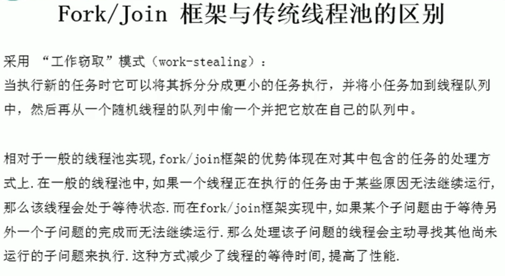

# Stream API

Stream API的作用：

- 从数据源（如数组、集合等）产生流，然后经过一系列的操作产生新流
- Stream：是数据渠道，用于操作数据源（集合、数组等）所产生的元素序列，是一个计算过程。Stream的注意事项：
  - Stream自身不会存储元素
  - Stream不会改变源对象，相反，会返回一个持有结果的新Stream
  - Stream操作是延迟执行的，这意味着流中的操作会等到需要结果时才执行

使用Stream API的步骤：

1. 创建Stream
2. 中间操作
3. 终止（终端）操作

创建Stream：

1. 通过Collection系列集合提供的stream()方法和parallelStream()方法

2. 通过Arrays中的静态方法stream()获取数组流

3. 通过Stream类中的静c态方法 of()

4. 创建无限流

   - 迭代：Stream.iterate()
   - 生成：Stream.generate(Supplier)

   ```java
   // 创建流的方式：
   // 1.通过Collection的stream()方法或者parallelStream()方法
   List<Integer> list = Arrays.asList(12, 13, 14, 15, 16);
   Stream<Integer> stream1 = list.stream();
   // 2.通过Arrays.stream()方法将数组转换成流
   int[] nums = {1, 2, 3, 4, 5, 6, 7};
   IntStream stream2 = Arrays.stream(nums);
   // 3.通过Stream.of()静态方法
   Stream<Integer> stream3 = Stream.of(10, 12, 13, 14);
   // 4.创建无限流
   // 迭代
   Stream<Integer> iterate = Stream.iterate(12, x -> x * x);
   // 生成
   Stream<Double> generate = Stream.generate(Math::random);
   ```

中间操作：

> Stream的中间操作 ：多个中间操作可以连接起来形成一个流水线，除非流水线上触发终止操作，否则中间操作不会执行任何的处理，而在终止操作时进行一次性全部处理，称为"惰性求值"。
>
> 内部迭代与外部迭代：
>
> - 内部迭代：迭代操作由Stream API完成
> - 外部迭代：迭代操作在外部完成

1. 筛选与切片

   - filter：接受Lambda，从流中排除某些元素
   - limit：截断流，使其元素不超过给定数量，短路
   - skip：跳过元素，返回一个扔掉了前n个元素的流，若流中元素不足n个，则返回一个空流。与limit(n)互补
   - distinct：筛选，通过流所生成元素的hashCode()和equals()取出重复元素

2. 映射

   - map：接受Lambda，将元素转换成其他形式或提取信息。接受一个函数作为参数，该函数会被应用到每个元素上，并将其映射成一个新的元素
   - flatMap：接受一个函数作为参数，将流中的每个值都转换成另一个流，然后把所有流连接成一个流。
   - flatMap与Map的区别类似于List的add和addAll

   

   ```java
   List<String> list1 = Arrays.asList("Hello","Good","Yes");
   Stream<Stream<Character>> streamStream = list1.stream()
       .map(str -> {
           List<Character> list2 = new ArrayList<>();
           for (char c : str.toCharArray()) {
               list2.add(c);
           }
           return list2.stream();
       });
   Stream<Character> characterStream = list1.stream()
       .flatMap(str -> {
           List<Character> list2 = new ArrayList<>();
           for (char c : str.toCharArray()) {
               list2.add(c);
           }
           return list2.stream();
       });
   ```

3. 排序

   - sorted()：自然排序，待比较元素必须实现Comparable接口
   - sorted(Comparator com)：定制排序，自定义比较器Comparator

4. 终止操作：终端操作会将流从流的流水线生成结果，其结果可以是任何不是流的值，如List、void、Integer等，常见的终止操作：

   查找与匹配：

   - allMatch(Predicate p)：检查是否匹配所有元素
   - anyMatch(Predicate p)：检查是否至少匹配一个元素
   - noneMatch(Predicate p)：检查是否没有匹配的元素
   - findFirst()：返回第一个元素
   - findAny()：返回当前流中的任意元素
   - count()：返回流中元素的总个数
   - max()：返回流中最大值
   - min()：返回流中最小值

   规约：将流中的元素反复结合起来，得到一个值，常常和map、flatMap连接，称为map-reduce模式

   - reduce(T identity,BinaryOperator)
   - reduce(BinaryOperator)

   收集：

   - collect：将流转换成其他形式，接受一个Collector接口的实现，用于给Stream中的元素做汇总的方法

   - Collector接口中方法的实现决定了如何对流执行收集操作（如收集到List、Set、Map），但是**Collectors**实用类提供了很多静态方法，可以方便的创建收集器实例

     ```java
     List<Employee> employees = new ArrayList<>();
     employees = new ArrayList<>();
     employees.add(new Employee("zhan", 100, 30));
     employees.add(new Employee("lisi", 200, 20));
     employees.add(new Employee("wang", 200, 25));
     employees.add(new Employee("wuli", 250, 25));
     employees.add(new Employee("fanj ", 250, 19));
     
     // 使用Collectors进行计算
     // 求年龄最大的人
     Optional<Employee> max = employees.stream()
         .collect(Collectors.maxBy((e1, e2) -> Integer.compare(e1.getAge(), e2.getAge())));
     // 求薪水平均值
     Double collect1 = employees.stream()
         .collect(Collectors.averagingInt(Employee::getSalary));
     // 求薪水最小值
     Optional<Integer> collect2 = employees.stream()
         .map(Employee::getSalary)
         .collect(Collectors.minBy(Integer::compare));
     // 求薪水总和
     Integer collect3 = employees.stream()
         .collect(Collectors.summingInt(Employee::getSalary));
     // 转换成set
     Set<Integer> set = employees.stream()
         .map(Employee::getSalary)
         .collect(Collectors.toSet());
     // 转换成list
     List<Employee> list1 = employees.stream()
         .sorted((e1, e2) -> Integer.compare(e1.getSalary(), e2.getSalary()))
         .collect(Collectors.toList());
     // 分组，通过薪水进行分组
     Map<Integer, List<Employee>> collect = employees.stream()
         .collect(Collectors.groupingBy(Employee::getSalary));
     // 分组，通过年纪进行分组
     Map<String, List<Employee>> collect4 = employees.stream()
         .collect(Collectors.groupingBy(o -> {
             Employee e = (Employee) o;
             if (e.getAge() <= 20) {
                 return "少年";
             } else if (e.getAge() <= 25) {
                 return "青年";
             } else {
                 return "中年";
             }
         }));
     // 多级分组
     Map<Integer, Map<Integer, List<Employee>>> collect6 = employees.stream()
         .collect(Collectors.groupingBy(Employee::getAge,
                                        Collectors.groupingBy(Employee::getSalary)));
     // 分区
     Map<Boolean, List<Employee>> collect5 = employees.stream()
         .collect(Collectors.partitioningBy(e -> e.getSalary() > 250));
     ```

5. 简单使用：

   ```java
   // 1.返回数组中每个值平方的数组
   // Arrays.stream生成的为intStream，需要包装成Stream<Integer>
   int[] nums = {1, 2, 3, 4, 5};
   List<Integer> collect = Arrays.stream(nums)
       .boxed()
       .map(i -> i * i)
       .collect(Collectors.toList());
   // 2.使用map和reduce计算数组的元素个数
   Optional<Integer> reduce = Arrays.stream(nums)
       .boxed()
       .map(e -> 1)
       .reduce(Integer::sum);
   System.out.println(reduce.get());
   // 3.对字符串数组进行排序输出
   String[] s=new String[]{"Hello","Array","Name","Great"};
   String reduce1 = Arrays.stream(s)
       .sorted()
       .reduce("",String::concat);
   String collect1 = Arrays.stream(s)
       .sorted()
       .collect(Collectors.joining(",", "[", "]"));
   System.out.println(reduce1);
   System.out.println(collect1);
   Arrays.stream(s)
       .flatMap(str -> {
           List<Character> tmp = new ArrayList<>();
           for (char c : str.toCharArray()){
               tmp.add(c);
           }
           return tmp.stream();
       })
       .sorted()
       .forEach(System.out::print);
   }
   ```

并行流与串行流：

- 并行流就是把一个内容分成多个数据块，并用不同的线程分别处理每个数据块的流
- 串行流与并行流的切换：parallel()方法和sequential()方法

Fork / Join框架：在必要的情况下，将一个大任务，进行拆分（fork）成若干个小任务（拆到不可以再拆分时），再将一个个小任务运算的结果进行 join 汇总





```java
// ForkJoin计算0-1亿的和，采用累加
public class ForkJoinTest extends RecursiveTask<Long> {

    private static final long serialVersionUID = 123L;

    private long start;
    private long end;

    private static final long THRESHOLD = 10000;

    public ForkJoinTest(long start, long end) {
        this.start = start;
        this.end = end;
    }

    @Override
    protected Long compute() {
        long length = end - start;

        if (length <= THRESHOLD) {
            long sum = 0;
            for (long i = start; i < end; i++) {
                sum += i;
            }
            return sum;
        } else {
            long middle = (start + end) / 2;
            // 拆分子任务，然后压入线程队列
            ForkJoinTest left = new ForkJoinTest(start, middle);
            left.fork();
            ForkJoinTest right = new ForkJoinTest(middle + 1, end);
            right.fork();
            // 合并子任务
            return left.join()+right.join();
        }
    }
}

// 测试
    @org.junit.Test
    public void testForkJoin() {
        // 使用forkJoin框架进行计算
        Instant start = Instant.now();

        ForkJoinPool pool = new ForkJoinPool();
        ForkJoinTask<Long> task = new ForkJoinTest(0, 100000000L);
        Long sum = pool.invoke(task);

        Instant end = Instant.now();
        System.out.println("sum = " + sum +
                "\ntime = " + Duration.between(start, end).toMillis() + "ms");

    }

    @org.junit.Test
    public void testStream() {
        // 采用并行流进行计算
        Instant start = Instant.now();

        long sum = LongStream.rangeClosed(0, 100000000L)
                .parallel()
                .reduce(0, Long::sum);

        Instant end = Instant.now();
        System.out.println("sum = " + sum +
                "\ntime = " + Duration.between(start, end).toMillis() + "ms");
    }
```

Optional类：

`Optional<T>` 类是一个容器类，代表一个值存在或者不存在，原来用null表示一个值不存在，现在Optional可以更好的表达这个概念，并且可以避免空指针异常。Optional常用方法：

- Optional.of(T t)：创建一个Optional实例
- Optional.empty()：创建一个空的Optional实例
- Optional.ofNullable(T t)：若t不为null，创建Optional实例，否则创建空实例
- isPresent()：判断是否包含值
- orElse(T t)：如果调用对象包含值，返回该值，否则返回t
- orElseGet(Supplier s)：如果调用对象包含值，返回该值，否则返回s获取的值
- map(Function f)：如果有值进行处理，并返回处理后的Optional，否则返回Optional.empty()
- flatMap(Function mapper)：与map类似，要求返回值必须是Optional

