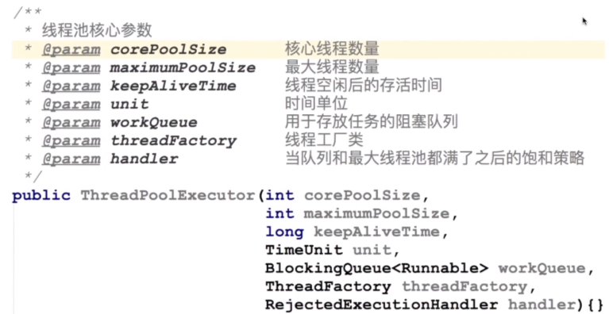
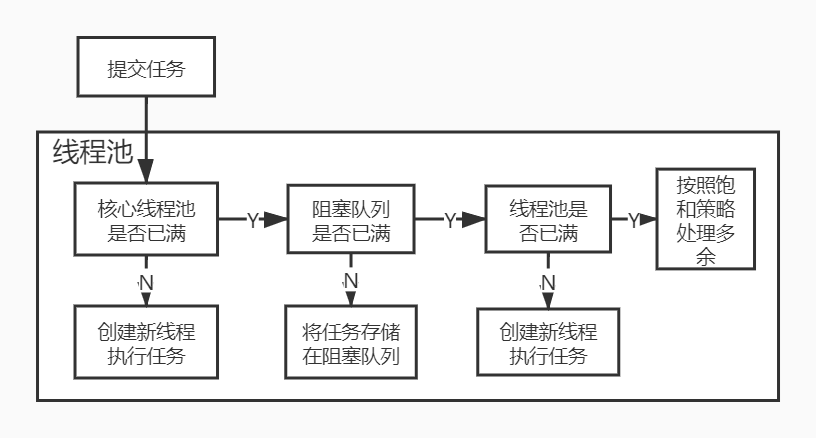
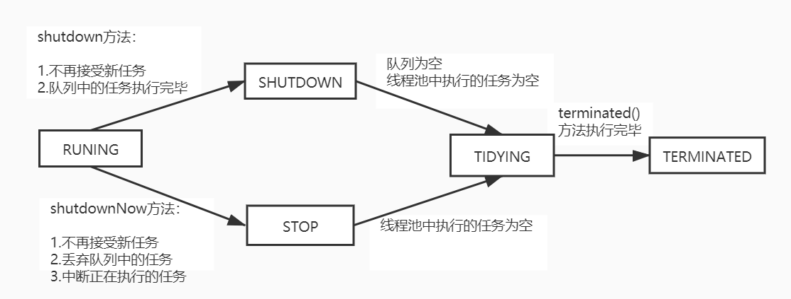

# 线程池

> 线程池：事先创建若干个可执行的线程放入一个容器中，需要的时候从容器中获取线程不用自行创建，使用完毕不需要消耗线程而是放回容器中，从而减少创建和销毁线程的开销
>
> 优势：
>
> - 降低资源消耗
> - 提高响应速度
> - 提高线程的可管理性

### 简单的线程池设计

线程池的核心参数：



线程池的处理流程：



线程池可选择的阻塞队列：

- 无界队列

- 有界队列

- 同步移交队列

  ```java
  @Test
  public void test() throws InterruptedException {
      // 基于数组的有界队列，队列容量为10
      ArrayBlockingQueue<Integer> queue =
          new ArrayBlockingQueue<>(10);
      // 往队列中添加元素：在队列满了之后会阻塞
      for (int i = 0; i < 20; i++) {
          queue.put(i);
          System.out.println("向队列中添加值：" + i);
      }
  }
  
  @Test
  public void test1() throws InterruptedException {
      // 基于链表的有界阻塞队列，设定容量为10
      // 在创建时如果不设定容量大小，
      // 则阻塞队列大小为默认值Integer.MAX_VALUE，即为无界队列
      LinkedBlockingQueue<Integer> queue =
          new LinkedBlockingQueue<>(10);
      // 往队列中添加元素：队列满了后会阻塞
      for (int i = 0; i < 20; i++) {
          queue.put(i);
          System.out.println("向队列中添加值：" + i);
      }
  }
  
  @Test
  public void test2(){
      // 同步移交阻塞队列：没有存储能力
      // 其插入依赖一个线程的put，删除依赖线程的take
      SynchronousQueue<Integer> queue =
          new SynchronousQueue<>();
      // 插入值
      new Thread(()->{
          try {
              queue.put(1);
              System.out.println("插入成功");
          } catch (InterruptedException e) {
              e.printStackTrace();
          }
      }).start();
      // 获取值
      new Thread(()->{
          try {
              Integer take = queue.take();
              System.out.println("获取成功："+take);
          } catch (InterruptedException e) {
              e.printStackTrace();
          }
      }).start();
  }
  ```

线程池可选的拒绝策略（可以查看ThreadPoolExecutor）：

- AbortPolicy：终止策略（默认），当阻塞队列已满，且超出最大线程数的时候，抛出异常
- DiscardPolicy：抛弃策略，当阻塞队列已满，且超出最大线程数，直接忽略后提交的任务
- DiscardOldestPolicy：抛弃旧任务策略，当阻塞队列已满，且超出最大线程数，再次添加时，先从阻塞队列中移除旧任务，再往线程池添加新任务
- CallerRunsPolicy：调用者运行策略，当阻塞队列已满，且超出最大线程数，再次添加时，该任务将由调用者线程本身执行任务

常见的线程池创建方式：Excutors工具类

```java
/**
 * 创建的为无限线程池，且使用的是同步移交队列，即一个提交对应一个线程
 * 使用时应该注意避免创建大量线程导致系统崩溃
 */
public static ExecutorService newCachedThreadPool() {
    return new ThreadPoolExecutor(0, Integer.MAX_VALUE,
                                  60L, TimeUnit.SECONDS,
                                  new SynchronousQueue<Runnable>());
}
/**
 * 创建的为固定大小的线程池，然而阻塞队列没有限制，使用时
 * 应该避免队列中存储的任务数爆炸
 */
public static ExecutorService newFixedThreadPool(int nThreads) {
    return new ThreadPoolExecutor(nThreads, nThreads,
                                  0L, TimeUnit.MILLISECONDS,
                                  new LinkedBlockingQueue<Runnable>());
}
/**
 * 创建的为只有单个线程的线程池，然而阻塞队列中任务数没有限制，使用时
 * 应该避免队列中存储的任务数爆炸
 */
public static ExecutorService newSingleThreadExecutor() {
    return new FinalizableDelegatedExecutorService
        (new ThreadPoolExecutor(1, 1,
                                0L, TimeUnit.MILLISECONDS,
                                new LinkedBlockingQueue<Runnable>()));
}
```

线程池的执行方式：

```java
// 创建固定大小的线程池
ExecutorService service =
    Executors.newFixedThreadPool(5);

Callable<Integer> callable = ()->{
    // 线程休眠1s
    TimeUnit.SECONDS.sleep(1);
    Random random = new Random();
    return random.nextInt(10);
};
// 向线程池提交任务的两种方式：
// 1.利用submit方法提交任务，接受任务的返回结果Callable
Future<Integer> future = service.submit(callable);
try {
    // 阻塞方法，直到任务有返回值后才向下执行
    Integer integer = future.get();
    System.out.println(integer);
} catch (InterruptedException | ExecutionException e) {
    e.printStackTrace();
}
// 2.使用execute方法提交任务，该方法无返回值，Runnable
service.execute(()->{
    System.out.println("Hello World");
});
```

线程池的状态：

