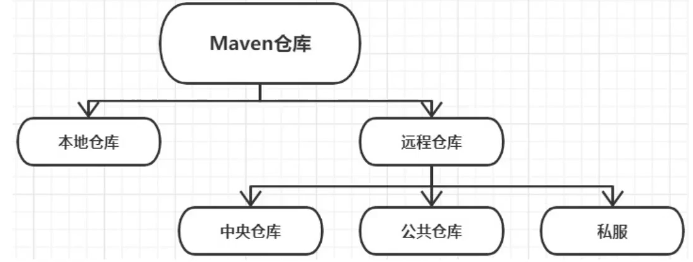

# maven仓库 

> 存储依赖的地方，maven仓库不仅存放依赖，而且每个依赖都有唯一标识（坐标），供java项目使用。

### 仓库分类

依赖查找顺序：本地仓库 > 私服（如果配置） > 公共仓库（如果配置） > 中央仓库

- 本地仓库：setting.xml中配置的目录
- 中央仓库：由Maven社区提供，不用任何配置，Maven中内置了中央仓库的地址
  - [https://mvnrepository.com/](https://mvnrepository.com/) ：仓库搜索服务
  - [http://repo.maven.apache.org/maven2](http://repo.maven.apache.org/maven2) ：中央仓库地址
- 公共仓库，用于加速，比如阿里云仓库
- 私服

