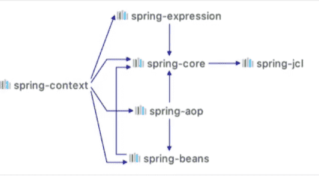

# Spring引言

### 概念

> Spring是什么？
>
> - Spring是一个优秀的项目管理框架，同时也是一套Java EE解决方案；
> - Spring是众多优秀设计模式的组合（工厂、单例、代理、适配器、包装器、观察者、模板、策略）；
> - Spring并未替代现有框架，而是现有框架的整合；
>
> Spring核心容器：
>
> - Beans
> - Core
> - Context
> - SpEL

### 工厂模式

使用 properties 格式的文件作为配置文件，使用反射获得所在的类。

1. 在resources目录下创建 bean.properties 文件

2. 创建实体：

   ```java
   @Data
   public class User {
       private int id;
       private String name;
   }
   ```

3. 创建工厂类：

   ```java
   import java.io.IOException;
   import java.io.InputStream;
   import java.lang.reflect.InvocationTargetException;
   import java.util.Properties;
   
   public class BeanFactory {
       private Properties properties = new Properties();
       private String config;
   
       public BeanFactory(String config) {
           // 1.得到properties文件的输入流
           try (InputStream resourceAsStream = BeanFactory.class.getResourceAsStream(config)) {
               // 2.properties 加载配置文件
               properties.load(resourceAsStream);
           } catch (IOException e) {
               e.printStackTrace();
           }
       }
   
       public Object getBean(String name) throws NoSuchMethodException,
               ClassNotFoundException,
               IllegalAccessException,
               InvocationTargetException,
               InstantiationException {
           // 1.通过name，获取对应的类路径
           String classPath = properties.getProperty(name);
           // 2. 通过反射构建对象
           if (classPath != null) {
               Class clazz = Class.forName(classPath);
               return clazz.getConstructor().newInstance();
           }
           return null;
       }
   }
   ```

4. 创建entity进行测试：

   ```java
           // 创建工厂文件
           BeanFactory beanFactory=new BeanFactory("/bean.properties");
           // 从工厂中获取对象
           User user= (User) beanFactory.getBean("User");
   ```

### 使用Spring框架

1. 在pom.xml中引入依赖：

    ```xml
    <!-- Spring依赖 -->
    <dependency>
        <groupId>org.springframework</groupId>
        <artifactId>spring-context</artifactId>
        <version>5.2.7.RELEASE</version>
    </dependency>
    <!-- junit，单元测试用 -->
    <dependency>
        <groupId>junit</groupId>
        <artifactId>junit</artifactId>
        <version>5.6.2</version>
        <scope>test</scope>
    </dependency>
    ```
    
    Spring常用jar的依赖关系：
    
    
    
    jar包彼此依赖时，只需导入最外层的 Jar 包即可由 maven 自动将相关的依赖 jar 导入项目。
    
2. 创建Spring配置文件

    > Spring的配置文件命名没有限制，约定俗成的命名有：spring-context.xml、applicationContext.xml、beans.xml

    ```xml
    <?xml version="1.0" encoding="UTF-8"?>
    <beans xmlns="http://www.springframework.org/schema/beans"
           xmlns:xsi="http://www.w3.org/2001/XMLSchema-instance"
           xsi:schemaLocation="http://www.springframework.org/schema/beans
            https://www.springframework.org/schema/beans/spring-beans.xsd">
    
        <!-- bean对象配置 -->
        <bean id="user" class="top.songfang.entity.User">
            <property name="id" value="1"/>
            <property name="name" value="张"/>
        </bean>
    </beans>
    ```

3. 测试

    ```java
        @Test
        public void test(){
            // 获取Spring上下文
            ApplicationContext context=new ClassPathXmlApplicationContext("/spring-context.xml");
            // 通过Class获取实例
            User user=context.getBean(User.class);
            // 通过上述配置的id获取实例
            User user1=(User)context.getBean("user");
            System.out.println(user);
        }
    ```

    

