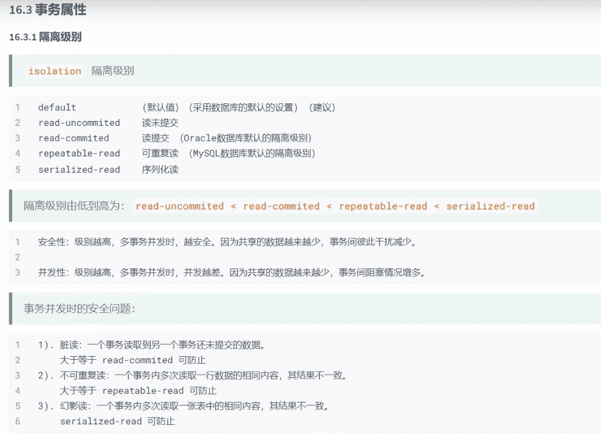
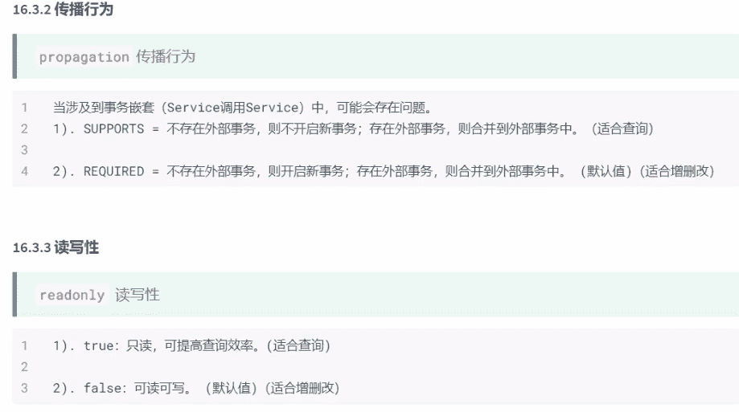
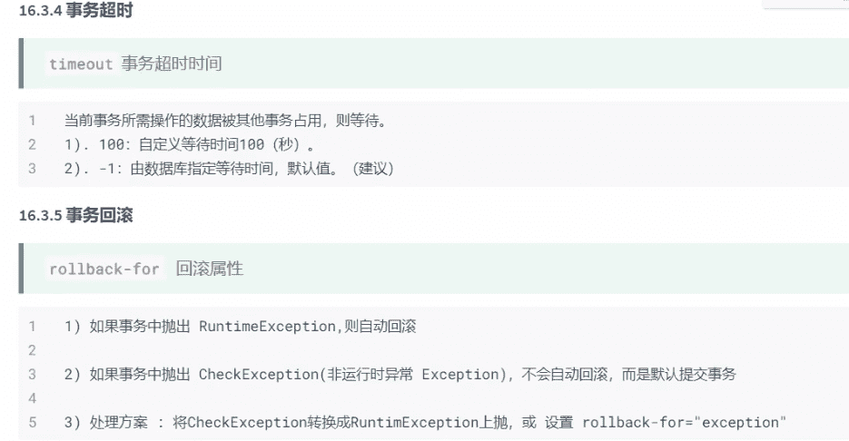

# Spring整合mybatis

### 导入依赖

```xml
<dependencies>
    <!-- Spring 依赖 -->
    <dependency>
        <groupId>org.springframework</groupId>
        <artifactId>spring-context</artifactId>
    </dependency>
    <dependency>
        <groupId>org.springframework</groupId>
        <artifactId>spring-aspects</artifactId>
    </dependency>
    <dependency>
        <groupId>org.springframework</groupId>
        <artifactId>spring-jdbc</artifactId>
    </dependency>
    
    <!-- Spring整合mybatis -->
    <dependency>
        <groupId>org.mybatis</groupId>
        <artifactId>mybatis-spring</artifactId>
    </dependency>
    
    <!-- mybatis -->
    <dependency>
        <groupId>org.mybatis</groupId>
        <artifactId>mybatis</artifactId>
    </dependency>
    
    <!-- druid连接池 -->
    <dependency>
        <groupId>com.alibaba</groupId>
        <artifactId>druid</artifactId>
    </dependency>
    
    <!-- mysql驱动 -->
    <dependency>
        <groupId>mysql</groupId>
        <artifactId>mysql-connector-java</artifactId>
    </dependency>
    
    <!-- Junit -->
    <dependency>
        <groupId>junit</groupId>
        <artifactId>junit</artifactId>
        <scope>test</scope>
    </dependency>
    
    <!-- lombok -->
    <dependency>
        <groupId>org.projectlombok</groupId>
        <artifactId>lombok</artifactId>
    </dependency>
</dependencies>
```

### 创建配置文件

1. resources/jdbc.properties：

   ```properties
   jdbc.driver=com.mysql.cj.jdbc.Driver
   jdbc.url=jdbc:mysql://localhost:3306/test?useUnicode=true&characterEncoding=utf-8&serverTimezone=Asia/Shanghai
   jdbc.username=root
   jdbc.password=root
   
   jdbc.initialSize=1
   jdbc.minIdle=1
   jdbc.maxActive=2
   ```

2. spring-context.xml：

   ```xml
   <?xml version="1.0" encoding="UTF-8"?>
   <beans xmlns="http://www.springframework.org/schema/beans"
          xmlns:xsi="http://www.w3.org/2001/XMLSchema-instance"
          xmlns:context="http://www.springframework.org/schema/context"
          xsi:schemaLocation="http://www.springframework.org/schema/beans
              https://www.springframework.org/schema/beans/spring-beans.xsd
              http://www.springframework.org/schema/context
              https://www.springframework.org/schema/context/spring-context.xsd" >
   
       <!-- 配置文件参数化（使用参数占位符） -->
       <context:property-placeholder location="classpath:jdbc.properties"/>
   
       <!-- 与PooledDataSource集成（二选一） -->
       <bean id="dataSource" class="org.apache.ibatis.datasource.pooled.PooledDataSource">
           <property name="driver" value="${jdbc.driver}"/>
           <property name="url" value="${jdbc.url}"/>
           <property name="username" value="${jdbc.username}"/>
           <property name="password" value="${jdbc.password}"/>
       </bean>
   
       <!-- 与DruidDataSource集成（二选一） -->
       <bean id="dataSource" class="com.alibaba.druid.pool.DruidDataSource" init-method="init" destroy-method="close">
           <!-- 基本配置 -->
           <property name="driverClassName" value="${jdbc.driver}" />
           <property name="url" value="${jdbc.url}"/>
           <property name="username" value="${jdbc.url}"/>
           <property name="password" value="${jdbc.password}"/>
   
           <!-- 配置初始化大小、最大、最小 -->
           <property name="initialSize" value="${jdbc.initialSize}"/>
           <property name="minIdle" value="${jdbc.minIdle}"/>
           <property name="maxActive" value="${jdbc.maxActive}"/>
   
           <!-- 配置获取连接等待超时的时间 -->
           <property name="maxWait" value="60000"/>
   
           <!-- 配置检测间隔，检测需要关闭的空闲连接，单位ms -->
           <property name="timeBetweenEvictionRunsMillis" value="60000"/>
   
           <!-- 配置一个连接在池中最小生存时间，单位ms -->
           <property name="minEvictableIdleTimeMillis" value="300000"/>
       </bean>
   </beans>
   ```

3. 在spring-context.xml中配置SqlSessionFactory：

   ```xml
   <!-- 工厂bean：生成SqlSessionFactory -->
   <bean id="sqlSessionFactory" class="org.mybatis.spring.SqlSessionFactoryBean">
       <!-- 注入连接池 -->
       <property name="dataSource" ref="dataSource"/>
       <!-- 注入dao-mapper文件信息，如果映射文件和dao接口同包同名，则此配置可省略-->
       <property name="mapperLocations">
           <list>
               <value>classpath:top/songfang/dao/*.xml</value>
           </list>
       </property>
       <!-- 为dao-mapper中的文件中的实体定义缺省过程 -->
       <property name="typeAliasesPackage" value="top.songfang.entity"/>
   </bean>
   ```

4. 在spring-context.xml中配置MapperScannerConfigurer：

   ```xml
   <!--
       管理DAO实现类的创建，并创建DAO对象，存入工厂管理
       1. 扫描所有的DAO接口，去构建DAO实现
       2. 将DAO实现存入工厂管理
       3. DAO实现对象在工厂中的id是：首字母小写的-接口的类名
   -->
   <bean id="mapperScannerConfigurer" class="org.mybatis.spring.mapper.MapperScannerConfigurer">
       <!--
           dao接口所在的包，如果有多个包，使用逗号或分号分隔
       -->
       <property name="basePackage" value="top.songfang.dao"/>
       <!--
           如果工厂中只有一个SqlSessionFactory的bean，此配置可省略
       -->
       <property name="sqlSessionFactoryBeanName" value="sqlSessionFactory"/>
   </bean>
   ```

5. entity：

   ```java
   @Data
   public class User1 {
       private Integer id;
       private String username;
       private String password;
       private boolean gender;
       private Date registryTime;
   }
   ```

6. dao

   ```java
   public interface User1Dao {
       List<User1> queryUsers();
   }
   ```

7. mapper.xml

   ```xml
   <?xml version="1.0" encoding="UTF-8" ?>
   <!DOCTYPE mapper
           PUBLIC "-//mybatis.org//DTD Mapper 3.0//EN"
           "http://mybatis.org/dtd/mybatis-3-mapper.dtd">
   <mapper namespace="top.songfang.dao.User1Dao">
       <sql id="select">
           select id,username,password,gender,registry_time as registryTime
           from t_user
       </sql>
       <select id="queryUsers" resultType="User1">
           <include refid="select"/>
       </select>
   </mapper>
   ```

8. 测试：

   ```java
   public class TestSpringMybatis {
       @Test
       public void test(){
           ApplicationContext context=new
                   ClassPathXmlApplicationContext("/spring-context.xml");
           SqlSessionFactory sqlSessionFactory= (SqlSessionFactory) context.getBean("sqlSessionFactory");
           SqlSession sqlSession = sqlSessionFactory.openSession();
           User1Dao mapper = sqlSession.getMapper(User1Dao.class);
           List<User1> user1s = mapper.queryUsers();
           user1s.forEach(System.out::println);
       }
       @Test
       public void test1(){
           ApplicationContext context=new
                   ClassPathXmlApplicationContext("/spring-context.xml");
           User1Dao user1Dao= (User1Dao) context.getBean("user1Dao");
           user1Dao.queryUsers().forEach(System.out::println);
       }
   }
   ```

### 事务管理

1. 在spring-context.xml中配置事务管理器：

   ```xml
   <!-- 1.引入一个事务管理器，其中依赖dataSource，借以获得连接，进而控制事务逻辑 -->
   <bean id="txManager" class="org.springframework.jdbc.datasource.DataSourceTransactionManager">
       <property name="dataSource" ref="dataSource"/>
   </bean>
   
   <!-- 
   	2.配置事务通知，基于事务管理器，进一步定制，生成一个额外功能：Advice 
   	此Advice可以切入任何需要事务的方法，通过事务管理器为方法控制事务
   -->
   <tx:advice id="tx" transaction-manager="txManager">
       <!-- 事务属性 -->
       <tx:attributes>
           <tx:method name="*User" rollback-for="Exception"/>
           <!-- 以query开头的方法，切入此方法时，采用对应事务实行 -->
           <tx:method name="query*" propagation="SUPPORTS"/>
           <!-- 剩余所有方法 -->
           <tx:method name="*"/>
       </tx:attributes>
   </tx:advice>
   
   <!-- 3.为Service的方法编织事务：生命式事务配置 -->
   <aop:config>
       <aop:pointcut id="pc_tx" expression="execution(* top.songfang.service.User1Service.*(..))"/>
       <aop:advisor advice-ref="tx" pointcut-ref="pc_tx"/>
   </aop:config>
   ```

2. 事务属性：

   

   

   