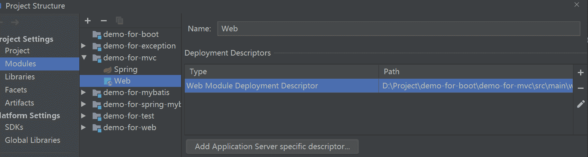
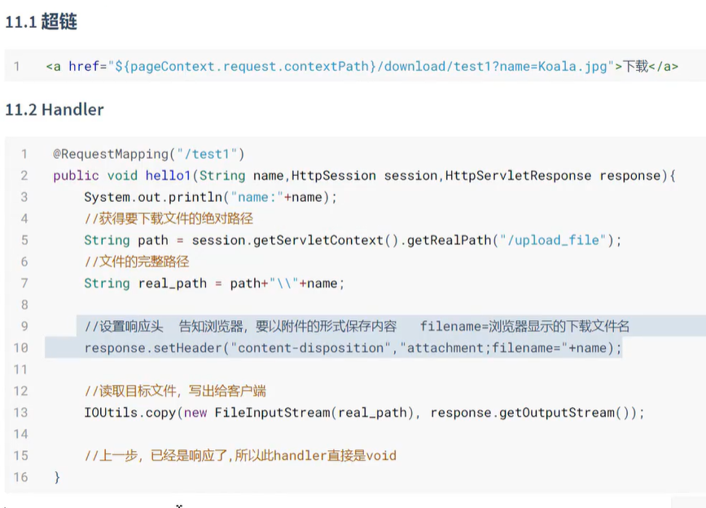
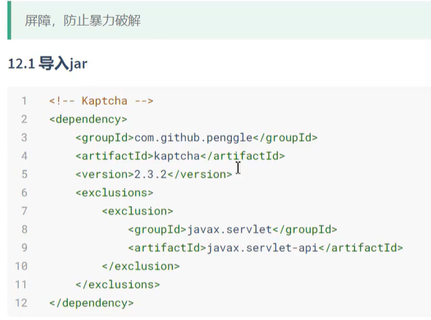
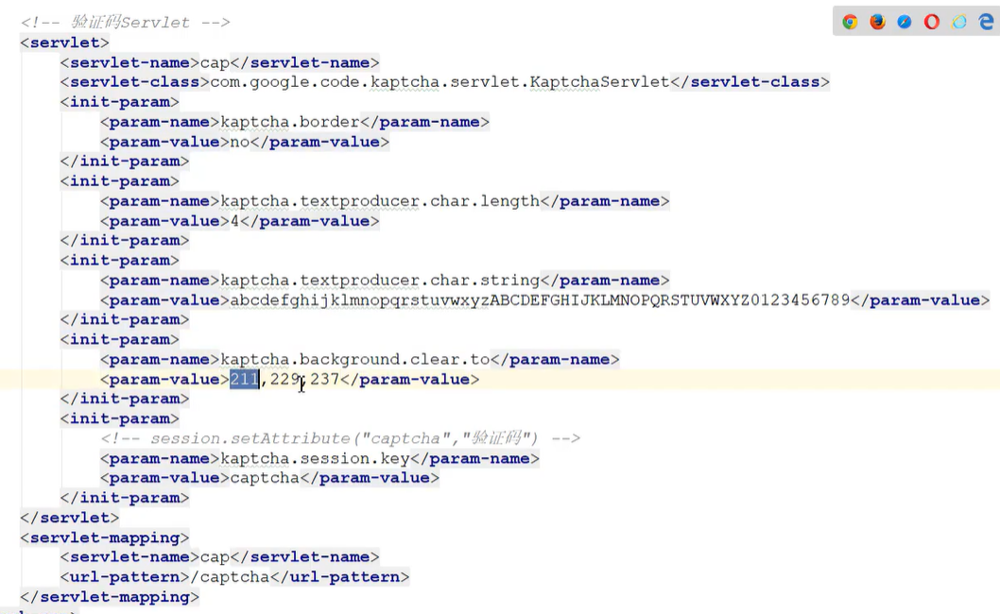
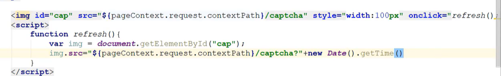
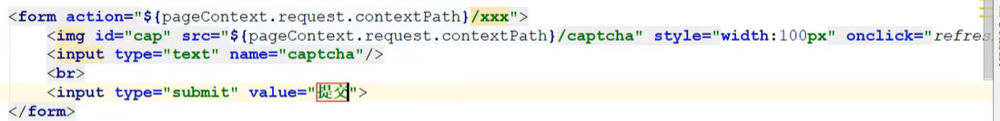
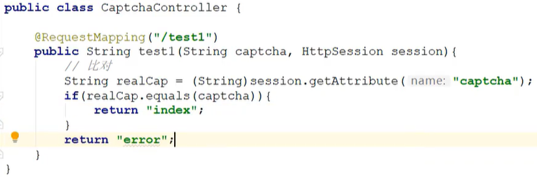

# Spring MVC

### 工作流程

1. 导入依赖：

    ```xml
    <dependency>
        <groupId>org.springframework</groupId>
        <artifactId>spring-webmvc</artifactId>
        <version>5.2.7.RELEASE</version>
    </dependency>
    ```
    
2. 在src/main/目录下创建webapp目录，然后再webapp目录下创建WEB_INF目录，通过 idea 自动生成web.xml 文件：

    

3. 修改web.xml，配置Spring MVC前端控制器：

    ```xml
    <?xml version="1.0" encoding="UTF-8"?>
    <web-app xmlns="http://xmlns.jcp.org/xml/ns/javaee"
             xmlns:xsi="http://www.w3.org/2001/XMLSchema-instance"
             xsi:schemaLocation="http://xmlns.jcp.org/xml/ns/javaee http://xmlns.jcp.org/xml/ns/javaee/web-app_4_0.xsd"
             version="4.0">
    
        <!-- Spring MVC前端控制器
            1.前端，接受所有请求
            2.启动SpringMVC工厂 spring-mvc.xml
            3.SpringMVC流程调度
        -->
        <servlet>
            <servlet-name>mvc</servlet-name>
            <servlet-class>
                org.springframework.web.servlet.DispatcherServlet
            </servlet-class>
            <!-- 声明spring-mvc.xml创建Spring工厂 -->
            <init-param>
                <param-name>contextConfigLocation</param-name>
                <param-value>classpath:spring-mvc.xml</param-value>
            </init-param>
            <!-- 默认懒加载，设置饥饿模式 -->
            <load-on-startup>1</load-on-startup>
        </servlet>
        <servlet-mapping>
            <servlet-name>mvc</servlet-name>
            <url-pattern>/</url-pattern>
        </servlet-mapping>
    
    </web-app>
    ```

4. 创建后端控制器：

    ```java
    package top.songfang.controller;
    
    import org.springframework.stereotype.Controller;
    import org.springframework.web.bind.annotation.RequestMapping;
    
    @Controller
    @RequestMapping("/hello")
    public class HelloController {
        @RequestMapping("/test")
        public String hello(){
            System.out.println("hello");
            return "index";
        }
    }
    ```

5. 创建resources/spring-mvc.xml配置文件：

    ```xml
    <?xml version="1.0" encoding="UTF-8"?>
    <beans xmlns="http://www.springframework.org/schema/beans"
           xmlns:xsi="http://www.w3.org/2001/XMLSchema-instance"
           xmlns:context="http://www.springframework.org/schema/context"
           xmlns:mvc="http://www.springframework.org/schema/mvc"
           xsi:schemaLocation="http://www.springframework.org/schema/beans
                                https://www.springframework.org/schema/beans/spring-beans.xsd http://www.springframework.org/schema/context https://www.springframework.org/schema/context/spring-context.xsd http://www.springframework.org/schema/mvc https://www.springframework.org/schema/mvc/spring-mvc.xsd">
    
        <!-- 声明要扫描的包 -->
        <context:component-scan base-package="top.songfang.controller"/>
        <!-- 注册注解开发驱动 -->
        <mvc:annotation-driven/>
        <!-- 视图解析器：
            作用：1.捕获后端控制器的返回值="index"
                 2.解析：在返回值的前后进行拼接 ==> "/index.jsp"
        -->
        <bean class="org.springframework.web.servlet.view.InternalResourceViewResolver">
            <!-- 前缀 -->
            <property name="prefix" value="/"/>
            <!-- 后缀 -->
            <property name="suffix" value=".jsp"/>
        </bean>
    
    </beans>
    ```

6. 在webapp中创建index.jsp，然后配置tomcat进行访问测试

### 参数传递

```java
// entity
@Data
public class User{
    private Integer id;
    private String name;
    private Boolean gender;
    private Date date;
}
// controller
@Controller
@RequestMapping("/hello")
public class HelloController {
    @RequestMapping("/test")
    public String hello(){
        System.out.println("hello");
        return "index";
    }

    // http://localhost:8080/demo_for_mvc_war/hello/test1?
    // id=1&name=zh&gender=true&date=2012/2/21 12:12:30
    @RequestMapping("/test1")
    public String hello1(Integer id, String name,
                         Boolean gender, Date date){
        System.out.println("id:"+id+"\t name:"+name+"\t gender:"+gender+
                "\t date:"+date);
        return "index";
    }

    // http://localhost:8080/demo_for_mvc_war/hello/test2?
    // id=1&name=zh&gender=true&date=2012/2/21%2012:12:30
    // 使用对象：参数名与属性名一致
    @RequestMapping("/test2")
    public String hello2(User user){
        System.out.println(user);
        return "index";
    }

    // http://localhost:8080/demo_for_mvc_war/hello/test2?
    // items=zh&items=hello
    // 传递数组
    @RequestMapping("/test3")
    public String test3(String[] items){
        for (String item : items) {
            System.out.println(item);
        }
        return "index";
    }

    // http://localhost:8080/demo_for_mvc_war/hello/test3/2/zh
    @RequestMapping("/test4/{id}/{name}")
    public String hello4(@PathVariable("id") Integer id,@PathVariable("name")String name){
        System.out.println("id:"+id+"\t name:"+name);
        return "index";
    }
}
```

中文乱码问题解决：

1. 页面中字符统一，比如html中设置：`<meta charset="UTF-8">` 

2. tomcat中设置字符集，对get请求中，中文参数乱码有效：

   > tomcat 配置，在安装目录 conf/sever.xml中：添加 URIEncoding="UTF-8"

   ```xml
       <Connector port="8080" protocol="HTTP/1.1"
                  connectionTimeout="20000"
                  redirectPort="8443" URIEncoding="UTF-8"/>
   ```

3. 最后，设置此filter，对post请求中，中文参数乱码有效

   ```xml
   <!-- 此过滤器会进行：request.setCharactorEncoding("utf-8"); -->
   <!-- 设置解决post参数中文乱码的问题 -->
   <filter>
       <filter-name>encoding</filter-name>
       <filter-class>org.springframework.web.filter.CharacterEncodingFilter</filter-class>
   </filter>
   <filter-mapping>
       <filter-name>encoding</filter-name>
       <url-pattern>/*</url-pattern>
   </filter-mapping>
   ```

解决idea控制台输出乱码：

- 产生原因：控制台编码格式为GBK，而tomcat在9版本后默认日志输出格式为UTF-8
- 解决方式：在tomcat安装目录 /conf/logging.properties 文件中，找到 java.util.logging.ConsoleHandler.encoding = UTF-8 并改为 GBK 格式

### 跳转

- forward：转发
- redirect：重定向

路径参数：

- "/xx"：以"/"开头，绝对路径
- "xx/"：不以"/"开头，相对当前类路径

跳转细节：

> 1. 在增删改之后，为了防止请求重复提交，重定向跳转
> 2. 在查询之后，可以做转发跳转

### 传值

> C 得到数据后，跳转到 V，并向V传递数据，进而在V中进行渲染数据
>
> 转发跳转：Request作用域
>
> 重定向跳转：Session作用域

先引入tomcat依赖：

```xml
<dependency>
    <groupId>javax.servlet</groupId>
    <artifactId>javax.servlet-api</artifactId>
    <version>4.0.0</version>
    <scope>provided</scope>
</dependency>
```

直接在Controller参数中传入相应的API：

```java
@Controller
@RequestMapping("/test")
@SessionAttributes(names = {"city","age"})
public class TestController {

    @RequestMapping("/server")
    // 使用原生API
    public String test(HttpServletRequest request, HttpSession session){
        session.setAttribute("name","attribute");
        request.setAttribute("age","attribute");
        return "index";
    }    

    @RequestMapping("/server1")
    public String test1(Model model, SessionStatus status){
        // Model会将值复制进request中
        model.addAttribute("name","attribute");
        // 在上述用@SessionAttributes指定的参数会放入session中
        model.addAttribute("city","attribute");
        model.addAttribute("age","attribute");
        // 会清空所有通过model存入的session
        status.setComplete();
        return "index";
    }
    @RequestMapping("/server2")
    public ModelAndView test2(){
        ModelAndView view = new ModelAndView("/index");
        view.addObject("name","zh");
        return view;
    }
}
```

### 静态资源

> 常见静态资源：html、js、css、图片

>静态文件没有url-pattern，所以默认无法访问，之前可以访问，是由于tomcat默认有一个全局的servlet：`org.apache.catalina.servlets.DefaultServlet`，它的url-pattern是"/"，是全局默认的Servlet。所以每个项目中不能匹配的静态资源请求，有这个Servlet来处理即可。

>但在Spring MVC中DispatcherServlet也采用了"/"作为url-pattern，则项目中不会再使用全局的Servlet，则静态资源不能完成访问。

解决方案：

1. 修改DispatcherServlet的url-pattern，让其匹配 `*.action`或`*.do` ，让访问controller的路径以.action结尾，让静态资源访问走默认的DefaultServlet；

2. DispatcherServlet的url-pattern依然采用"/"，在spring-mvc.xml中追加配置：

   ```xml
   <!-- 
   	额外的增加一个controller，且其requestMapping："/**"，可以匹配所有请求，但是优先级最低；
   	当其他的controller都无法匹配时，请求会转向"/**"，即处理静态资源的处理方式，
   	将请求转发到tomcat中名为default的Servlet
   -->
   <mvc:default-servlet-handler/>
   ```

3. DispatcherServlet的url-pattern依然采用"/"，在spring-mvc.xml中追加配置：

   ```xml
   <!--
   	定义静态资源的访问url以及路径
   -->
   <mvc:resources mapping="/html/**" location="/page/"/>
   <mvc:resources mapping="/css/**" location="/css/"/>
   ```

### JSON处理

> SpringMVC默认的JSON解决方案是Jackson，所以只需要导入Jackson的jar，即可使用

1. 导入依赖：

   ```xml
   <dependency>
       <groupId>com.fasterxml.jackson.core</groupId>
       <artifactId>jackson-databind</artifactId>
       <version>2.11.1</version>
   </dependency>
   ```

2. 使用：

   - @Controller+@ResponseBody
   - @RestController

   ```java
   //@Controller
   @RestController
   public class JacksonController {
   
       @RequestMapping("/user")
   //    @ResponseBody //将返回值转换为Json对象并
       public User test() {
           User user = new User();
           user.setName("张漫画版地方");
           user.setId(12);
           user.setGender(true);
           user.setDate(new Date());
           return user;
       }
   
       // 当返回值为String类型时，Jackson不会做处理，因此需要在Mapping指定字符集
       @RequestMapping(value = "/you", produces = "text/html;charset=utf-8")
   //    @ResponseBody
       public String test1() {
           return "你好啊";
       }
   }
   ```

3. @ResponseBody可以用于Controller的参数，用于将请求体中的 Json数据 转换为 Java对象，注意，Json只解析post方法

4. json格式化：

   - 在需要进行格式化的class属性上添加 @JsonFormat(pattern="") 指定格式化样式，比如Json默认将日期输出为时间戳，将其格式化为 pattern="yyyy-MM-dd HH:mm:ss"，timezone="GMT+8"

   - @JsonIgnore：Json转换时会忽略此属性不做转换

   - @JsonInclude(JsonInclude.Include.NON_NULL)：属性为null时不做转换

   - @JsonInclude(JsonInclude.Include.NON_EMPTY)：属性为集合元素且不能为空集合

   - @JsonProperty("name")：对属性进行改名

   - @JsonSerialize(using=xx.class) ：使用自定义的序列化器输出某属性，自定义序列化器：

     ```java
     public class xx extends JsonSerializer<T>{
         @Override
         public void serialize(){
             // 重写此方法
         }
     }
     ```

### 异常处理

异常解析器，任何一个Handler中抛出异常时都会进入该方法，在xml中配置此bean或者使用java注解配置：

```java
public class MyHandlerException implements HandlerExceptionResolver {
    @Override
    public ModelAndView resolveException(HttpServletRequest httpServletRequest,
                                         HttpServletResponse httpServletResponse, 
                                         Object o, 
                                         Exception e) {
        ModelAndView modelAndView = new ModelAndView();
        if(e instanceof xxException){
            modelAndView.setView("forward:/xx.jsp");
        }else{
            xxx
        }
        return modelAndView;
    }
}
```

### 拦截器

> 作用：抽取handler中的冗余功能

> 执行顺序：preHandler -- postHandler -- afterCompletion

```java
public class MyInterceptor implements HandlerInterceptor {
    // 在handler执行之前执行：抽取handler中的冗余代码
    @Override
    public boolean preHandle(HttpServletRequest request, HttpServletResponse response, Object handler) throws Exception {
        
        // response.sendRediect("/xx.jsp"); // 响应
        
        // false：中断请求
        // true：放行，后续的拦截器或handler就会执行
        return false;
    }

    // 在handler执行之后，响应之前执行，进一步的响应定制
    @Override
    public void afterCompletion(HttpServletRequest request, HttpServletResponse response, Object handler, Exception ex) throws Exception {
        
    }

    // 在页面渲染完毕之后执行：资源回收
    @Override
    public void postHandle(HttpServletRequest request, HttpServletResponse response, Object handler, ModelAndView modelAndView) throws Exception {
        
    }
}
```

在spring-mvc.xml中配置：

```xml
<!-- 拦截器 -->
<mvc:interceptors>
	<mvc:interceptor>
    	<mvc:mapping path="/inter/**"/>
        <mvc:exclude-mapping path="/inter/login"/>
        <bean class="xxx.xxx.MyInterceptor"/>    
    </mvc:interceptor>
</mvc:interceptors>
```

### 文件上传

导入依赖包：

```xml
<dependency>
	<groupId>commons-fileupload</groupId>
    <artifactId>commons-fileupload</artifactId>
    <exclusions>
    	<exclusion>
        	<groupId>javax.servlet</groupId>
            <artifactId>servlet-api</artifactId>
        </exclusion>
    </exclusions>
</dependency>
```

上传方法：

1. method：post
2. enctype="multipart/form-data"

在spring-mvc.xml中配置上传解析器：

```xml
<bean id="multipartResolver" class="org.springframework.web.multipart.commons.CommonsMultipartResolver">
</bean>
```

在Controller中传入参数：MultipartFile file

### 下载



### 验证码











 