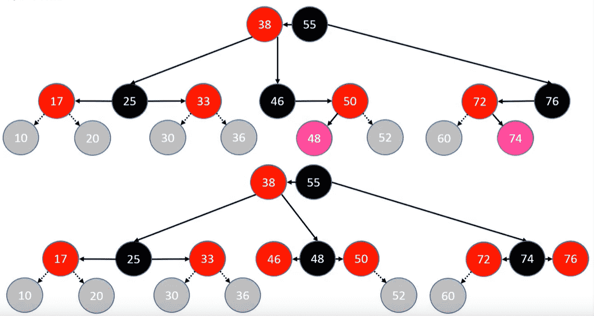

# 树

### 概念

节点、根节点、父节点、子节点、兄弟节点

- 一棵树可以没有任何节点，称为空树
- 一颗树可以只有一个节点，也就是空节点

子树、左子树、右子树

- 节点的度：子树的个数
- 树的度：所有的节点度中的最大值
- 叶子节点（leaf）：度为0的节点
- 非叶子节点：度不为0的节点
- 层数level：根节点在第一层，根节点的子节点在第二层，以此类推，有些教程从第0层开始计算
- 节点的深度depth：根节点到当前节点的唯一路径上的节点总数
- 节点的高度height：从当前节点到最远的叶子节点的路径上的节点总数
- 树的深度：所有节点深度中的最大值
- 树的高度：所有节点高度中的最大值，与树的深度相等

有序树与无序树：

- 有序树：树中的任意节点的子节点之间有顺序关系
- 无序树：树中的任意节点的子节点之间没有顺序关系，也叫自由树

二叉树特点：

- 每个节点的度最大为2
- 左子树和右子树是有序的
- 即使某个节点只有一棵子树，也要区分左右子树

二叉树的性质：

- 非空二叉树的第 i 层，最多有 `2^(i-1)` 个节点  `(i>=1)`

- 在高度为 h 的二叉树上最多有 `2^h-1` 个节点 `(h>=1)`

- 对于任何一棵非空二叉树，如果叶子节点个数为 n0，度为 2 的节点个数为 n2，则有：n0 = n2+1

  > 推导：度为 0、1、2的节点个数分别为 n0、n1、n2，则节点总数：T = n0+n1+n2
  >
  > 根据边数来看：T = n1 + 2*n2 + 1（根节点没有边对应，所以加 1）
  >
  > 因此：n0 = n2+1

特殊二叉树：

- 真二叉树（Proper Binary Tree）：所有的节点的度要么为0，要么为2
- 满二叉树（Full Binary Tree）：所有节点的度要么为0，要么为2，且所有的叶子节点都在最后一层。
  - 在同样高度的二叉树中，满二叉树的叶子节点数量最多、总节点数量最多
  - 满二叉树一定是真二叉树，真二叉树不一定是满二叉树
  - 假设满二叉树的高度为 h（h>=1），那么
    - 第 i 层的节点数量：$ 2^{i-1} $
    - 叶子节点数量：$ 2^{h-1} $
    - 总节点数量 $ n=2^h-1 $
    - 高度 $ h = log_{2}(n+1) $
- 完全二叉树（Complete Binary Tree）：叶子节点只会出现在最后2层，且最后一层的叶子节点都靠左对齐
  - 完全二叉树从根节点至倒数第2层是一棵满二叉树
  - 满二叉树一定是完全二叉树，完全二叉树不一定是满二叉树
  - 性质：
    - 度为1的节点只有左子树
    - 度为1的节点要么是1个，要么是0个
    - 同样节点的二叉树，完全二叉树的高度最小
    - 假设完全二叉树的高度为`h(h>=1)` ，那么
      - 至少有 $ 2^{h-1} $ 个节点
      - 最多有 $ 2^h -1 $ 个节点，即满二叉树
      - 总节点数量为 n，则 $ 2^{h-1} \le n \lt 2^h $
      -  $ h-1 \le log_2n \lt h $ ，即 $ h=floor(log_{2}n) +1 $ ，floor只向下取整，ceil() 向上取整
    - 一棵有 n 个节点的完全二叉树(n>0)，从上到下、从左到有对节点从1开始进行编号，对任意第 i 个节点
      - 如果 i = 1，它是根节点
      - 如果 i > 1，它的父节点编号为 floor(i/2)
      - 如果 `2*i <=n`，那么它的左子节点编号为 `2*i`
      - 如果 `2*i>n`，它无左子节点
      - 如果 `2*i+1<=n`，它的右子节点编号为 `2*i+1`
      - 如果 `2*i+1>n`，它无右子节点
    - 一棵有 n 个节点的完全二叉树(n>0)，从上到下、从左到有对节点从0开始进行编号，对任意第 i 个节点
      - 如果 i = 0，它是根节点
      - 如果 i > 0，它的父节点编号为 `floor((i-1)/2)`
      - 如果 `2*i+1<=n-1`，那么它的左子节点编号为 `2*i+1`
      - 如果 `2*i+1>n-1`，它无左子节点
      - 如果 `2*i+2<=n-1`，它的右子节点编号为 `2*i+2`
      - 如果 `2*i+2>n-1`，它无右子节点
    - 完全二叉树的总节点数量 n ，则
      - 叶子节点数量 `n(叶) = floor((n + 1)/2)` ，即 `n0 = (n+1)>>1`
      - 非叶子节点数量 `n1+n2 = floor(n/2)`

### 二叉搜索树

##### 二叉搜索树的性质

-  若它的左子树不空，则左子树上所有结点的值均小于它的根结点的值
- 若它的右子树不空，则右子树上所有结点的值均大于它的根结点的值
-  它的左、右子树也分别为二叉排序树

##### 二叉搜索树的优势

- 插入一个数值
- 查询是否包含某个数值
- 删除某个数值

##### 二叉搜索树的节点

```java
    private static class Node<E> {
        E element;
        Node<E> left;
        Node<E> right;
        Node<E> parent;

        public Node(E element, Node<E> parent) {
            this.element = element;
            this.parent = parent;
        }

        public Node(E element, Node<E> parent, Node<E> left, Node<E> right) {
            this.element = element;
            this.left = left;
            this.right = right;
            this.parent = parent;
        }
    }
```

##### 二叉搜索树的前提

存放的元素能够进行比较

1. 元素实现 `java.util.Comparable<E>` 接口
2. 或者使用自定义的比较器，java 中提供的比较器接口 `java.util.Comparator` 

这里采用两种实现方式，所以在泛型时参数不作规范，而是在使用时进行判断：

```java
@SuppressWarnings("unchecked")
public class BinarySearchTree<E> {
    private int size;
    private Node<E> root;
    /**
     * 比较器，用于自定义比较方式
     */
    private Comparator<E> comparator;

    public BinarySearchTree(Comparator<E> comparator) {
        this.comparator = comparator;
    }

    public BinarySearchTree() {
        this(null);
    }

    /**
     * 比较函数
     *
     * @param e1
     * @param e2
     * @return 返回值为0，e1==e2;为负数，e1<e2;为正数，e1>e2;
     */
    private int compare(E e1, E e2) {
        // 先使用比较器进行比较
        if (comparator != null) {
            return comparator.compare(e1, e2);
        }
        // 未传入比较器，则必须实现Comparable接口
        return ((Comparable<E>) e1).compareTo(e2);
    }

    private static class Node<E> {
        E element;
        Node<E> left;
        Node<E> right;
        Node<E> parent;

        public Node(E element, Node<E> parent) {
            this.element = element;
            this.parent = parent;
        }

        public Node(E element, Node<E> parent, Node<E> left, Node<E> right) {
            this.element = element;
            this.left = left;
            this.right = right;
            this.parent = parent;
        }
    }
}
```

##### 二叉搜索树的 add 方法

```java
    public void add(E element) {
        elementNotNullCheck(element);

        // 添加为第一个节点
        if (root == null) {
            root = new Node<>(element, null);
        } else {
            // 添加的不是第一个节点
            Node<E> node = root;
            // 找到父节点
            Node<E> parent = root;
            
            int cmp = 0;
            while (node != null) {
                cmp = compare(element, node.element);
                // 保存父节点
                parent = node;
                if (cmp > 0) {
                    node = node.right;
                } else if (cmp < 0) {
                    node = node.left;
                } else {
                    // 值相等：建议进行覆盖
                    node.element = element;
                    return;
                }
            }
            // 插入元素
            Node<E> newNode = new Node<>(element, parent);
            if (cmp > 0) {
                parent.right = newNode;
            } else {
                parent.left = newNode;
            }
        }
        size++;
    }

    private void elementNotNullCheck(E element) {
        if (element == null) {
            throw new IllegalArgumentException("element must not be null");
        }
    }
```

##### 二叉树的遍历

- 前序遍历 Preorder Traversal：根节点、前序遍历左子树、前序遍历右子树
- 中序遍历 Inorder Traversal：中序遍历左子树、根节点、中序遍历右子树，按升序输出结果
- 后序遍历 Postorder Traversal：后序遍历左子树、后序遍历右子树、根节点
- 层序遍历 Level Order Traversal：从上往下，从左到右依次访问每个节点

```java
// 自定义一个接口，允许外界自定义遍历时对节点的操作，仅用于层序遍历以及非递归的前、中、后遍历
    public static interface Visitor<E> {
        /**
         * 允许外界自定义遍历节点的操作
         *
         * @param element
         * @return
         */
        boolean visitor(E element);
    }
// 层序遍历
    public void levelOrderTraversal(Visitor<E> visitor) {
        if (root == null || visitor == null) {
            return;
        }
        Queue<Node<E>> queue = new LinkedList<>();
        // 将 root 节点入队
        queue.offer(root);
        Node<E> node = null;

        while (!queue.isEmpty()) {
            node = queue.poll();
            // 允许外界根据返回值对遍历进行控制
            if (visitor.visitor(node.element)) {
                return;
            }
            if (node.left != null) {
                queue.offer(node.left);
            }
            if (node.right != null) {
                queue.offer(node.right);
            }
        }
    }
// 非递归的统一格式的前、中、后遍历
    public void preorderTraversalNo(Visitor<E> visitor) {
        if (root == null || visitor == null) {
            return;
        }
        // 模仿递归操作，由于二叉搜索树不会保存null值，使用null值作为每次遍历的标志
        Stack<Node<E>> stack = new Stack<>();
        // 根节点入栈
        stack.push(root);
        Node<E> node = null;

        while (!stack.isEmpty()) {
            node = stack.pop();

            // 如果节点不为 null ，说明该节点第一次访问
            // 栈是先入后出，注意顺序
            if (node != null) {

                if (node.right != null) {
                    stack.push(node.right);
                }

                if (node.left != null) {
                    stack.push(node.left);
                }

                // 将node重新加入stack，并再其后添加一个null节点作为已访问的标志
                // 出栈时先看到null标志，然后再访问真值
                stack.push(node);
                stack.push(null);
            } else { // 说明该节点为标志位
                if (visitor.visitor(stack.pop().element)) {
                    return;
                }
            }
        }
    }
    public void inorderTraversalNo(Visitor<E> visitor) {
        if (root == null || visitor == null) {
            return;
        }
        // 模仿递归操作，由于二叉搜索树不会保存null值，使用null值作为每次遍历的标志
        Stack<Node<E>> stack = new Stack<>();
        // 根节点入栈
        stack.push(root);
        Node<E> node = null;

        while (!stack.isEmpty()) {
            node = stack.pop();

            // 如果节点不为 null ，说明该节点第一次访问
            // 栈是先入后出，注意顺序
            if (node != null) {

                if (node.right != null) {
                    stack.push(node.right);
                }

                // 将node重新加入stack，并再其后添加一个null节点作为已访问的标志
                // 出栈时先看到null标志，然后再访问真值
                stack.push(node);
                stack.push(null);

                if (node.left != null) {
                    stack.push(node.left);
                }
            } else { // 说明该节点为标志位
                if (visitor.visitor(stack.pop().element)) {
                    return;
                }
            }
        }
    }
    public void postOrderTraversalNo(Visitor<E> visitor) {
        if (root == null || visitor == null) {
            return;
        }
        // 模仿递归操作，由于二叉搜索树不会保存null值，使用null值作为每次遍历的标志
        Stack<Node<E>> stack = new Stack<>();
        // 根节点入栈
        stack.push(root);
        Node<E> node = null;

        while (!stack.isEmpty()) {
            node = stack.pop();

            // 如果节点不为 null ，说明该节点第一次访问
            // 栈是先入后出，注意顺序
            if (node != null) {
                // 将node重新加入stack，并再其后添加一个null节点作为已访问的标志
                // 出栈时先看到null标志，然后再访问真值
                stack.push(node);
                stack.push(null);

                if (node.right != null) {
                    stack.push(node.right);
                }

                if (node.left != null) {
                    stack.push(node.left);
                }
            } else { // 说明该节点为标志位
                if (visitor.visitor(stack.pop().element)) {
                    return;
                }
            }
        }
    }


// 递归形式的前中后序遍历
	// 操作
    public static abstract class Visitor<E> {
        /**
         * 用于标识是否终止遍历
         */
        boolean stop = false;

        /**
         * 允许外界自定义遍历节点的操作
         *
         * @param element
         * @return
         */
        abstract boolean visitor(E element);
    }

    /**
     * 递归前序遍历
     */
    public void preorderTraversal(Visitor<E> visitor) {
        // visitor 不能为空
        if (visitor == null) {
            return;
        }
        preorderTraversal(root, visitor);
    }

    private void preorderTraversal(Node<E> node, Visitor<E> visitor) {
        if (node == null || visitor.stop) {
            return;
        }
        visitor.stop = visitor.visitor(node.element);
        preorderTraversal(node.left, visitor);
        preorderTraversal(node.right, visitor);
    }

    /**
     * 递归中序遍历
     */
    public void inorderTraversal(Visitor<E> visitor) {
        // visitor 不能为空
        if (visitor == null) {
            return;
        }
        inorderTraversal(root, visitor);
    }

    private void inorderTraversal(Node<E> node, Visitor<E> visitor) {
        if (node == null || visitor.stop) {
            return;
        }
        inorderTraversal(node.left, visitor);
        // 避免打印
        if (visitor.stop) {
            return;
        }
        visitor.stop = visitor.visitor(node.element);
        inorderTraversal(node.right, visitor);
    }

    /**
     * 递归后序遍历
     */
    public void postOrderTraversal(Visitor<E> visitor) {
        // visitor 不能为空
        if (visitor == null) {
            return;
        }
        postOrderTraversal(root, visitor);
    }

    private void postOrderTraversal(Node<E> node, Visitor<E> visitor) {
        // visitor.stop 终止递归
        if (node == null || visitor.stop) {
            return;
        }
        postOrderTraversal(node.left, visitor);
        postOrderTraversal(node.right, visitor);
        // 避免递归返回后继续操作自身元素
        if (visitor.stop) {
            return;
        }
        visitor.stop = visitor.visitor(node.element);
    }
```

##### toString方法

```java
    /**
     * 打印
     * @return
     */
    @Override
    public String toString() {
        StringBuilder builder = new StringBuilder();
        toString(root,builder,"");
        return builder.toString();
    }

    private void toString(Node<E> node,StringBuilder builder,String prefix){
        if (node == null){
            return;
        }
        builder.append(prefix).append(node.element).append("\n");
        toString(node.left,builder,prefix+"L--");
        toString(node.right,builder,prefix+"R--");
    }
```

##### 计算二叉树的高度

```java
// 递归做法：节点的高度等于其左右二叉树节点的最大值 + 1
    public int height() {
        return height(root);
    }

    private int height(Node<E> node) {
        if (node == null) {
            return 0;
        }
        return Math.max(height(node.left), height(node.right)) + 1;
    }
// 非递归（迭代）做法：层序遍历
    public int heightNo() {
        if (root == null) {
            return 0;
        }
        Queue<Node<E>> queue = new LinkedList<>();
        queue.offer(root);
        Node<E> node = null;
        
        int height = 0;
        int size = 1;
        while (!queue.isEmpty()) {
            node = queue.poll();
            size--;
            if (node.left!=null){
                queue.offer(node.left);
            }
            if (node.right!=null){
                queue.offer(node.right);
            }
            if (size == 0){
                // 队列中的数量即下一层的节点数量
                size = queue.size();
                // 高度自增
                height++;
            }
        }
        return height;
    }
```

##### 判断一棵树是否为完全二叉树

- 如果树为 null ，返回 false
- 如果树不为 null，开始层序遍历二叉树（用队列）
  - 如果 node.left !=null && node.right !=null ，则将node.left、node.right按顺序入队
  - 如果 node.left ==null && node.right !=null，返回false
  - 如果 node.left !=null && node.right == null 或者 node.left ==null && node.right == null ，则
    - 后面所有的节点都应该为叶子节点，才是完全二叉树
    - 否则返回 false

```java
    /**
     * 判断一棵树是否为完全二叉树
     *
     * @return
     */
    public boolean isComplete() {
        if (root == null) {
            return false;
        }
        // 层序遍历
        Queue<Node<E>> queue = new LinkedList<>();
        queue.offer(root);
        Node<E> node = null;

        // 标志
        boolean leaf = false;

        while (!queue.isEmpty()) {
            node = queue.poll();

            if (leaf) {
                if (node.left != null || node.right != null) {
                    return false;
                }
            } else {
                if (node.left != null) {
                    queue.offer(node.right);
                    if (node.right != null) {
                        queue.offer(node.right);
                    } else {
                        leaf = true;
                    }
                } else {
                    if (node.right != null) {
                        return false;
                    } else {
                        leaf = true;
                    }
                }
            }
        }
        return true;
    }
```

##### 翻转二叉树

使用前、中、后、层序遍历均可解答

```java
    /**
     * 递归前序遍历
     */
    public Node<E> preorderTraversal() {
        return preorderTraversal(root);
    }

    private Node<E> preorderTraversal(Node<E> node) {
        if (node == null) {
            return node;
        }
        Node<E> left = node.left;
        node.left = node.right;
        node.right = left;
        
        preorderTraversal(node.left);
        preorderTraversal(right);     
        
        return node;
    }
    /**
     * 递归后序遍历
     */
    public Node<E> preorderTraversal() {
        return preorderTraversal(root);
    }

    private Node<E> preorderTraversal(Node<E> node) {
        if (node == null) {
            return node;
        }
        Node<E> left = preorderTraversal(node.left);
        Node<E> right = preorderTraversal(node.right);
        
        node.left = right;
        node.right = left;
        
        return node;
    }
```

##### 根据遍历结果重构二叉树

- 前序遍历 + 中序遍历
- 后序遍历 + 中序遍历
- 真二叉树：前序遍历 + 后序遍历

##### 前驱和后继

- 前驱节点：中序遍历时的前一个节点
  - node.left != null，则 predecessor = node.left.right.right...，终止条件：right == null
  - node.left == null && node.parent != null，则 predecessor = node.parent.parent....，终止条件：node 在 parent 的右子树中 
  - node.left == null && node.parent == null，无前驱节点
- 后继节点：中序遍历时的后一个节点
  - node.right != null，则 successor = node.right.left.left...，终止条件：left == null
  - node.right == null，则 successor = node.parent.parent...，终止条件：node在parent的左子树中
  - node.right == null && node.parent == null，那就没有后继节点

```java
    /**
     * 求前驱节点
     * @param node
     * @return
     */
    private Node<E> predecessor(Node<E> node) {
        if (node == null) {
            return null;
        }

        // 前驱节点在左子树中
        Node<E> p = null;
        if (node.left != null) {
            p = node.left;
            while (p.right != null) {
                p = p.right;
            }
            return p;
        }

        // 从父节点、祖父节点中寻找前驱节点
        while (node.parent != null && node == node.parent.left) {
            node = node.parent;
        }

        // node.parent == null
        // node = node.parent.right;
        return node.parent;
    }

    /**
     * 后继节点
     * @param node
     * @return
     */
    private Node<E> successor(Node<E> node){
        if (node == null) {
            return null;
        }

        // 前驱节点在右子树中
        Node<E> p = null;
        if (node.right != null) {
            p = node.right;
            while (p.left != null) {
                p = p.left;
            }
            return p;
        }

        // 从父节点、祖父节点中寻找后继节点
        while (node.parent != null && node == node.parent.left) {
            node = node.parent;
        }

        // node.parent == null
        // node = node.parent.left;
        return node.parent;
    }
```

##### 二叉搜索树的 delete 操作

- 删除叶子节点：直接删除
  - node == node.parent.left，则 node.parent.left = null
  - node == node.parent.right，则 node.parent.right = null
  - node.parent == null，则 root = null
- 度为1的节点：用子节点替代原节点的位置
  - 令 child 是 node.left 或 node.right
  - node = node.parent.left，则 node.parent.left = child && child.parent = node.parent.left
  - node == node.parent.right，则 node.parent.right = child && child.parent = node.parent.right
  - node.parent == null，则 root = child && child.parent = null
- 度为2的节点：
  - 如果一个节点的度为2，那么其前驱或后继节点的度只可能是 0 或 1
  - 使用其前驱节点或者后继节点的值覆盖原本的节点值，然后删除相应的节点

```java
    /**
     * 通过元素得到相应的节点值
     *
     * @param element
     * @return
     */
    private Node<E> node(E element) {
        elementNotNullCheck(element);

        // 找到相应的节点
        Node<E> node = root;

        int cmp = 0;
        while (node != null) {
            cmp = compare(element, node.element);
            if (cmp == 0) {
                return node;
            } else if (cmp > 0) {
                node = node.right;
            } else {
                node = node.left;
            }
        }
        return null;
    }

    private void remove(Node<E> node) {
        if (node == null) {
            return;
        }
        size--;

        // 节点的度为 2 ，一定存在前驱或后继节点，且前驱或后继节点的度为0或1
        if (node.right != null && node.left != null) {
            // 找到后继节点
            Node<E> s = successor(node);
            // 用后继节点的值覆盖度为 2 的节点的值
            node.element = s.element;
            // 删除后继节点
            node = s;
        }

        // 节点的度为 1 或 0
        Node<E> replacement = node.left != null ? node.left : node.right;
        if (replacement != null) {
            // node节点度为1
            replacement.parent = node.parent;
            if (node.parent == null) {
                // node节点为根节点
                root = replacement;
            } else if (node == node.parent.left) {
                // node节点在父节点的左子树
                node.parent.left = replacement;
            } else {
                node.parent.right = replacement;
            }
        } else if (node.parent == null) {
            // node为叶子节点且为根节点
            root = null;
        } else {
            // node为叶子节点且不为根节点
            if (node == node.parent.left) {
                node.parent.left = null;
            } else {
                node.parent.right = null;
            }
        }
    }
    
    public void remove(E element){
        remove(node(element));
    }
```

##### 二叉搜索树的其他方法

```java
    /**
     * 节点数量
     *
     * @return
     */
    public int size() {
        return size;
    }

    /**
     * 判断树是否为空
     *
     * @return
     */
    public boolean isEmpty() {
        return size == 0;
    }

    public void clear() {
        root = null;
        size = 0;
    }

    public boolean contains(E element) {
        return node(element) != null;
    }
```

##### 重构

将代码拆分为 BinaryTree 和 BinarySearchTree，使 BinaryTree 定义二叉树的常用操作，BinarySearchTree继承BinaryTree然后实现自己特有的方法：

```java
// BinaryTree
public class BinaryTree<E> {
    protected int size;
    protected Node<E> root;

    /**
     * 节点数量
     *
     * @return
     */
    public int size() {
        return size;
    }

    /**
     * 判断树是否为空
     *
     * @return
     */
    public boolean isEmpty() {
        return size == 0;
    }

    public void clear() {
        root = null;
        size = 0;
    }


    /**
     * 递归前序遍历
     */
    public void preorderTraversal(Visitor<E> visitor) {
        // visitor 不能为空
        if (visitor == null) {
            return;
        }
        preorderTraversal(root, visitor);
    }

    private void preorderTraversal(Node<E> node, Visitor<E> visitor) {
        if (node == null || visitor.stop) {
            return;
        }
        visitor.stop = visitor.visitor(node.element);
        preorderTraversal(node.left, visitor);
        preorderTraversal(node.right, visitor);
    }

    /**
     * 递归中序遍历
     */
    public void inorderTraversal(Visitor<E> visitor) {
        // visitor 不能为空
        if (visitor == null) {
            return;
        }
        inorderTraversal(root, visitor);
    }

    private void inorderTraversal(Node<E> node, Visitor<E> visitor) {
        if (node == null || visitor.stop) {
            return;
        }
        inorderTraversal(node.left, visitor);
        // 避免打印
        if (visitor.stop) {
            return;
        }
        visitor.stop = visitor.visitor(node.element);
        inorderTraversal(node.right, visitor);
    }

    /**
     * 递归后序遍历
     */
    public void postOrderTraversal(Visitor<E> visitor) {
        // visitor 不能为空
        if (visitor == null) {
            return;
        }
        postOrderTraversal(root, visitor);
    }

    private void postOrderTraversal(Node<E> node, Visitor<E> visitor) {
        // visitor.stop 终止递归
        if (node == null || visitor.stop) {
            return;
        }
        postOrderTraversal(node.left, visitor);
        postOrderTraversal(node.right, visitor);
        // 避免打印
        if (visitor.stop) {
            return;
        }
        visitor.stop = visitor.visitor(node.element);
    }

    // 非递归的前中后序遍历
    public void preorderTraversalNo(Visitor<E> visitor) {
        if (root == null || visitor == null) {
            return;
        }
        // 模仿递归操作，由于二叉搜索树不会保存null值，使用null值作为每次遍历的标志
        Stack<Node<E>> stack = new Stack<>();
        // 根节点入栈
        stack.push(root);
        Node<E> node = null;

        while (!stack.isEmpty()) {
            node = stack.pop();

            // 如果节点不为 null ，说明该节点第一次访问
            // 栈是先入后出，注意顺序
            if (node != null) {

                if (node.right != null) {
                    stack.push(node.right);
                }

                if (node.left != null) {
                    stack.push(node.left);
                }

                // 将node重新加入stack，并再其后添加一个null节点作为已访问的标志
                // 出栈时先看到null标志，然后再访问真值
                stack.push(node);
                stack.push(null);
            } else { // 说明该节点为标志位
                if (visitor.visitor(stack.pop().element)) {
                    return;
                }
            }
        }
    }

    public void inorderTraversalNo(Visitor<E> visitor) {
        if (root == null || visitor == null) {
            return;
        }
        // 模仿递归操作，由于二叉搜索树不会保存null值，使用null值作为每次遍历的标志
        Stack<Node<E>> stack = new Stack<>();
        // 根节点入栈
        stack.push(root);
        Node<E> node = null;

        while (!stack.isEmpty()) {
            node = stack.pop();

            // 如果节点不为 null ，说明该节点第一次访问
            // 栈是先入后出，注意顺序
            if (node != null) {

                if (node.right != null) {
                    stack.push(node.right);
                }

                // 将node重新加入stack，并再其后添加一个null节点作为已访问的标志
                // 出栈时先看到null标志，然后再访问真值
                stack.push(node);
                stack.push(null);

                if (node.left != null) {
                    stack.push(node.left);
                }
            } else { // 说明该节点为标志位
                if (visitor.visitor(stack.pop().element)) {
                    return;
                }
            }
        }
    }

    public void postOrderTraversalNo(Visitor<E> visitor) {
        if ((root == null) || (visitor == null)) {
            return;
        }
        // 模仿递归操作，由于二叉搜索树不会保存null值，使用null值作为每次遍历的标志
        Stack<Node<E>> stack = new Stack<>();
        // 根节点入栈
        stack.push(root);
        Node<E> node = null;

        while (!stack.isEmpty()) {
            node = stack.pop();

            // 如果节点不为 null ，说明该节点第一次访问
            // 栈是先入后出，注意顺序
            if (node != null) {
                // 将node重新加入stack，并再其后添加一个null节点作为已访问的标志
                // 出栈时先看到null标志，然后再访问真值
                stack.push(node);
                stack.push(null);

                if (node.right != null) {
                    stack.push(node.right);
                }

                if (node.left != null) {
                    stack.push(node.left);
                }
            } else { // 说明该节点为标志位
                if (visitor.visitor(stack.pop().element)) {
                    return;
                }
            }
        }
    }

    /**
     * 层序遍历
     */
    public void levelOrderTraversal(Visitor<E> visitor) {
        if (root == null || visitor == null) {
            return;
        }
        Queue<Node<E>> queue = new LinkedList<>();
        // 将 root 节点入队
        queue.offer(root);
        Node<E> node = null;

        while (!queue.isEmpty()) {
            node = queue.poll();
            // 允许外界根据返回值对遍历进行控制
            if (visitor.visitor(node.element)) {
                return;
            }
            if (node.left != null) {
                queue.offer(node.left);
            }
            if (node.right != null) {
                queue.offer(node.right);
            }
        }
    }

    public static abstract class Visitor<E> {
        /**
         * 用于标识是否终止遍历
         */
        boolean stop = false;

        /**
         * 允许外界自定义遍历节点的操作
         *
         * @param element
         * @return
         */
        abstract boolean visitor(E element);
    }

    /**
     * 打印
     *
     * @return
     */
    @Override
    public String toString() {
        StringBuilder builder = new StringBuilder();
        toString(root, builder, "");
        return builder.toString();
    }

    protected void toString(Node<E> node, StringBuilder builder, String prefix) {
        if (node == null) {
            return;
        }
        builder.append(prefix).append(node.element).append("\n");
        toString(node.left, builder, prefix + "L--");
        toString(node.right, builder, prefix + "R--");
    }

    /**
     * 求前驱节点
     *
     * @param node
     * @return
     */
    protected Node<E> predecessor(Node<E> node) {
        if (node == null) {
            return null;
        }

        // 前驱节点在左子树中
        Node<E> p = null;
        if (node.left != null) {
            p = node.left;
            while (p.right != null) {
                p = p.right;
            }
            return p;
        }

        // 从父节点、祖父节点中寻找前驱节点
        while (node.parent != null && node == node.parent.left) {
            node = node.parent;
        }

        // node.parent == null
        // node = node.parent.right;
        return node.parent;
    }

    /**
     * 后继节点
     *
     * @param node
     * @return
     */
    protected Node<E> successor(Node<E> node) {
        if (node == null) {
            return null;
        }

        // 前驱节点在右子树中
        Node<E> p = null;
        if (node.right != null) {
            p = node.right;
            while (p.left != null) {
                p = p.left;
            }
            return p;
        }

        // 从父节点、祖父节点中寻找后继节点
        while (node.parent != null && node == node.parent.left) {
            node = node.parent;
        }

        // node.parent == null
        // node = node.parent.left;
        return node.parent;
    }

    /**
     * 求二叉树的高度
     *
     * @return
     */
    public int height() {
        return height(root);
    }

    protected int height(Node<E> node) {
        if (node == null) {
            return 0;
        }
        return Math.max(height(node.left), height(node.right)) + 1;
    }

    public int heightNo() {
        if (root == null) {
            return 0;
        }
        Queue<Node<E>> queue = new LinkedList<>();
        queue.offer(root);
        Node<E> node = null;
        int height = 0;
        int size = 1;
        while (!queue.isEmpty()) {
            node = queue.poll();
            size--;
            if (node.left != null) {
                queue.offer(node.left);
            }
            if (node.right != null) {
                queue.offer(node.right);
            }
            if (size == 0) {
                size = queue.size();
                height++;
            }
        }
        return height;
    }

    /**
     * 判断一棵树是否为完全二叉树
     *
     * @return
     */
    public boolean isComplete() {
        if (root == null) {
            return false;
        }
        // 层序遍历
        Queue<Node<E>> queue = new LinkedList<>();
        queue.offer(root);
        Node<E> node = null;

        // 标志
        boolean leaf = false;

        while (!queue.isEmpty()) {
            node = queue.poll();

            if (leaf) {
                if (node.left != null || node.right != null) {
                    return false;
                }
            } else {
                if (node.left != null) {
                    queue.offer(node.right);
                    if (node.right != null) {
                        queue.offer(node.right);
                    } else {
                        leaf = true;
                    }
                } else {
                    if (node.right != null) {
                        return false;
                    } else {
                        leaf = true;
                    }
                }
            }
        }
        return true;
    }

    /**
     * 根据节点移除元素
     * @param node
     */
    protected void remove(Node<E> node) {
        if (node == null) {
            return;
        }
        size--;

        // 节点的度为 2 ，一定存在前驱或后继节点，且前驱或后继节点的度为0或1
        if (node.right != null && node.left != null) {
            // 找到后继节点
            Node<E> s = successor(node);
            // 用后继节点的值覆盖度为 2 的节点的值
            node.element = s.element;
            // 删除后继节点
            node = s;
        }

        // 节点的度为 1 或 0
        Node<E> replacement = node.left != null ? node.left : node.right;
        if (replacement != null) {
            // node节点度为1
            replacement.parent = node.parent;
            if (node.parent == null) {
                // node节点为根节点
                root = replacement;
            } else if (node == node.parent.left) {
                // node节点在父节点的左子树
                node.parent.left = replacement;
            } else {
                node.parent.right = replacement;
            }
        } else if (node.parent == null) {
            // node为叶子节点且为根节点
            root = null;
        } else {
            // node为叶子节点且不为根节点
            if (node == node.parent.left) {
                node.parent.left = null;
            } else {
                node.parent.right = null;
            }
        }
    }

    protected static class Node<E> {
        E element;
        Node<E> left;
        Node<E> right;
        Node<E> parent;

        public Node(E element, Node<E> parent) {
            this.element = element;
            this.parent = parent;
        }

        public Node(E element, Node<E> parent, Node<E> left, Node<E> right) {
            this.element = element;
            this.left = left;
            this.right = right;
            this.parent = parent;
        }
    }
}

// BinarySearchTree
@SuppressWarnings("unchecked")
public class BinarySearchTree<E> extends BinaryTree<E> {
    /**
     * 比较器，用于自定义比较方式
     */
    private Comparator<E> comparator;

    public BinarySearchTree(Comparator<E> comparator) {
        this.comparator = comparator;
    }

    public BinarySearchTree() {
        this(null);
    }

    public boolean contains(E element) {
        return node(element) != null;
    }

    /**
     * add方法
     *
     * @param element
     */
    public void add(E element) {
        elementNotNullCheck(element);

        // 添加第一个节点
        if (root == null) {
            root = new Node<>(element, null);
        } else {
            // 添加的不是第一个节点
            Node<E> node = root;
            // 找到父节点
            Node<E> parent = root;
            int cmp = 0;
            while (node != null) {
                cmp = compare(element, node.element);
                // 保存父节点
                parent = node;
                if (cmp > 0) {
                    node = node.right;
                } else if (cmp < 0) {
                    node = node.left;
                } else {
                    // 值相等：建议进行覆盖
                    node.element = element;
                    return;
                }
            }
            // 插入元素
            Node<E> newNode = new Node<>(element, parent);
            if (cmp > 0) {
                parent.right = newNode;
            } else {
                parent.left = newNode;
            }
        }
        size++;
    }

    /**
     * 通过元素得到相应的节点值
     *
     * @param element
     * @return
     */
    private Node<E> node(E element) {
        elementNotNullCheck(element);

        // 找到相应的节点
        Node<E> node = root;

        int cmp = 0;
        while (node != null) {
            cmp = compare(element, node.element);
            if (cmp == 0) {
                return node;
            } else if (cmp > 0) {
                node = node.right;
            } else {
                node = node.left;
            }
        }
        return null;
    }

    public void remove(E element) {
        remove(node(element));
    }

    /**
     * 比较函数
     *
     * @param e1
     * @param e2
     * @return 返回值为0，e1==e2;为负数，e1<e2;为正数，e1>e2;
     */
    private int compare(E e1, E e2) {
        // 先使用比较器进行比较
        if (comparator != null) {
            return comparator.compare(e1, e2);
        }
        // 未传入比较器，则必须实现Comparable接口
        return ((Comparable<E>) e1).compareTo(e2);
    }

    private void elementNotNullCheck(E element) {
        if (element == null) {
            throw new IllegalArgumentException("element must not be null");
        }
    }
}
```

### 二叉平衡搜索树（AVL树）

普通二叉搜索树的缺陷：在多次的节点添加或者删除后，二叉搜索树有可能退化成链表或者不平衡，导致搜索效率降低。

改进：在节点的删除或者添加操作之后，对二叉搜索树进行调整，使二叉搜索树恢复平衡，即减小树的高度。

平衡二叉搜索树：Balanced Binary Search Tree，BBST，常见的平衡二叉搜索树：AVL树、红黑树

##### AVL树

概念：

- 平衡因子：某节点的左右子树的高度差
- AVL树的特点：
  - 每个节点的平衡因子只可能是 1、0、-1（绝对值 <= 1，如果超过1，称之为“失衡”）
  - 每个节点的左右子树的高度差不超过 1
  - 搜索、添加、删除的时间复杂度为 O(log n)

##### AVL树的失衡

- 添加：
  - 可能会导致所有的祖先节点都失衡
  - 然而只需要高度最低的失衡节点恢复平衡，整棵树就恢复平衡【仅需O(1)次调整】
- 删除：
  - 只可能导致父节点或者祖先节点失衡（只有一个节点失衡），其他节点都不可能失衡
  - 让父节点恢复平衡后，可能会导致更高的祖先节点失衡【最多需要O(logn)次调整】
- 平均时间复杂度：
  - 搜索：O（logn）
  - 添加：O（logn），仅需O（1）次的旋转操作
  - 删除：O（logn），最多需要O（logn）次的旋转操作

##### AVL树的平衡恢复

在AVL树中插入、删除节点后，可能会使AVL树的高度差发生变化，破坏平衡，为了让它重新保持平衡，需要作旋转处理，旋转分四种情况：

- LL - 右单旋：

    - g.left = p.right ，p.right.parent = g
    - p.right = g
    - 让 p 成为这棵子树的根节点：p.parent = g.parent ，g.parent = p
    - 仍然满足：t0 < n < t1 < p < t2 < g < t3
    - 二叉搜索树仍然平衡
    - 更新 g、p的高度
    
    ``` 
            |				 |
            g				 p
           / \			   /  \
          p   t3		  n    g
         / \  			 / \  / \
        n   t2		    t0 t1 t2 t3     
       / \			   /
      t0  t1          x
     /
    x(待插入的节点)
    ```
    
- RR - 左单旋：

    - g.right= p.left，p.left.parent = g
    - p.left= g
    - 让 p 成为这棵子树的根节点：p.parent = g.parent ，g.parent = p
    - 仍然满足：t0 < g < t1 < p < t2 < n< t3
    - 二叉搜索树仍然平衡
    - 更新 g、p的高度
    
    ``` 
            |				 |
            g				 p
           / \			   /   \
          t0  p   		  g      n
             / \  		 / \    /  \
            t1  n       t0 t1  t2  t3
               / \			        \ 
              t2  t3                 x
                   \
                	x(待插入的节点)
    ```
    
- LR - RR 左旋转，LL 右旋转（双旋）：

    - 先对 p 进行左旋转，然后在 g 进行右旋转

    ``` 
            |				 |               |
            g				 g               n
           / \			    / \             /  \
          p   t3		   n   t3          p    g
         / \  			  / \             / \   / \
        t0  n   		 p   t2          t0 t1 t2 t3
           / \			/ \    \                \
          t1  t2       t0  t1   x                x
               \
               x(待插入的节点)  
    ```

- RL - LL右旋转，RR左旋转：

    - 先对 p 进行右旋转，然后对 g 进行左旋转
    ``` 
            |				 |               |
            g				 g               n
           / \			    / \             /  \
          t0  p     	   t0  n           g     p
             / \  			  / \         / \   / \
            n	t3	         t1  p       t0 t1 t2 t3
           / \			    /    / \        /           
          t1  t2           x    t2  t3     x             
         /
        x(待插入的节点)  
    ```

##### 平衡恢复统一处理

根据节点值的大小从小到大一次编号为a，b...


##### 代码实现

###### 代码继承结构

```
		BinaryTree
			|
	BinarySearchTree
		/		\
	AVLTree		RBTree
```

###### BinaryTree

```java
public class BinaryTree<E> {
    protected int size;
    protected Node<E> root;

    /**
     * 节点数量
     *
     * @return
     */
    public int size() {
        return size;
    }

    /**
     * 判断树是否为空
     *
     * @return
     */
    public boolean isEmpty() {
        return size == 0;
    }

    public void clear() {
        root = null;
        size = 0;
    }

    // 非递归的前中后序遍历
    public void preorderTraversalNo(Visitor<E> visitor) {
        if (root == null || visitor == null) {
            return;
        }
        // 模仿递归操作，由于二叉搜索树不会保存null值，使用null值作为每次遍历的标志
        Stack<Node<E>> stack = new Stack<>();
        // 根节点入栈
        stack.push(root);
        Node<E> node = null;

        while (!stack.isEmpty()) {
            node = stack.pop();

            // 如果节点不为 null ，说明该节点第一次访问
            // 栈是先入后出，注意顺序
            if (node != null) {

                if (node.right != null) {
                    stack.push(node.right);
                }

                if (node.left != null) {
                    stack.push(node.left);
                }

                // 将node重新加入stack，并再其后添加一个null节点作为已访问的标志
                // 出栈时先看到null标志，然后再访问真值
                stack.push(node);
                stack.push(null);
            } else { // 说明该节点为标志位
                if (visitor.visitor(stack.pop().element)) {
                    return;
                }
            }
        }
    }

    public void inorderTraversalNo(Visitor<E> visitor) {
        if (root == null || visitor == null) {
            return;
        }
        // 模仿递归操作，由于二叉搜索树不会保存null值，使用null值作为每次遍历的标志
        Stack<Node<E>> stack = new Stack<>();
        // 根节点入栈
        stack.push(root);
        Node<E> node = null;

        while (!stack.isEmpty()) {
            node = stack.pop();

            // 如果节点不为 null ，说明该节点第一次访问
            // 栈是先入后出，注意顺序
            if (node != null) {

                if (node.right != null) {
                    stack.push(node.right);
                }

                // 将node重新加入stack，并再其后添加一个null节点作为已访问的标志
                // 出栈时先看到null标志，然后再访问真值
                stack.push(node);
                stack.push(null);

                if (node.left != null) {
                    stack.push(node.left);
                }
            } else { // 说明该节点为标志位
                if (visitor.visitor(stack.pop().element)) {
                    return;
                }
            }
        }
    }

    public void postOrderTraversalNo(Visitor<E> visitor) {
        if ((root == null) || (visitor == null)) {
            return;
        }
        // 模仿递归操作，由于二叉搜索树不会保存null值，使用null值作为每次遍历的标志
        Stack<Node<E>> stack = new Stack<>();
        // 根节点入栈
        stack.push(root);
        Node<E> node = null;

        while (!stack.isEmpty()) {
            node = stack.pop();

            // 如果节点不为 null ，说明该节点第一次访问
            // 栈是先入后出，注意顺序
            if (node != null) {
                // 将node重新加入stack，并再其后添加一个null节点作为已访问的标志
                // 出栈时先看到null标志，然后再访问真值
                stack.push(node);
                stack.push(null);

                if (node.right != null) {
                    stack.push(node.right);
                }

                if (node.left != null) {
                    stack.push(node.left);
                }
            } else { // 说明该节点为标志位
                if (visitor.visitor(stack.pop().element)) {
                    return;
                }
            }
        }
    }

    /**
     * 层序遍历
     */
    public void levelOrderTraversal(Visitor<E> visitor) {
        if (root == null || visitor == null) {
            return;
        }
        Queue<Node<E>> queue = new LinkedList<>();
        // 将 root 节点入队
        queue.offer(root);
        Node<E> node = null;

        while (!queue.isEmpty()) {
            node = queue.poll();
            // 允许外界根据返回值对遍历进行控制
            if (visitor.visitor(node.element)) {
                return;
            }
            if (node.left != null) {
                queue.offer(node.left);
            }
            if (node.right != null) {
                queue.offer(node.right);
            }
        }
    }
    
    public static interface Visitor<E> {
        /**
         * 允许外界自定义遍历节点的操作
         *
         * @param element
         * @return
         */
        boolean visitor(E element);
    }
    
    /**
     * 求前驱节点
     *
     * @param node
     * @return
     */
    protected Node<E> predecessor(Node<E> node) {
        if (node == null) {
            return null;
        }

        // 前驱节点在左子树中
        Node<E> p = null;
        if (node.left != null) {
            p = node.left;
            while (p.right != null) {
                p = p.right;
            }
            return p;
        }

        // 从父节点、祖父节点中寻找前驱节点
        while (node.parent != null && node == node.parent.left) {
            node = node.parent;
        }

        // node.parent == null
        // node = node.parent.right;
        return node.parent;
    }

    /**
     * 后继节点
     *
     * @param node
     * @return
     */
    protected Node<E> successor(Node<E> node) {
        if (node == null) {
            return null;
        }

        // 前驱节点在右子树中
        Node<E> p = null;
        if (node.right != null) {
            p = node.right;
            while (p.left != null) {
                p = p.left;
            }
            return p;
        }

        // 从父节点、祖父节点中寻找后继节点
        while (node.parent != null && node == node.parent.left) {
            node = node.parent;
        }

        // node.parent == null
        // node = node.parent.left;
        return node.parent;
    }

    /**
     * 方便子类创建自己的节点数据
     *
     * @param element
     * @param parent
     * @return
     */
    protected Node<E> createNode(E element, Node<E> parent) {
        return new Node<>(element, parent);
    }

    /**
     * 二叉树的节点
     */
    protected static class Node<E> {
        E element;
        Node<E> left;
        Node<E> right;
        Node<E> parent;

        public Node(E element, Node<E> parent) {
            this.element = element;
            this.parent = parent;
        }

        public boolean isLeftChild() {
            return parent != null && this == this.parent.left;
        }

        public boolean isRightChild() {
            return parent != null && this == this.parent.right;
        }
    }
}
```

###### BinarySearchTree

二叉搜索树主要是元素的添加和删除方法：

```java
@SuppressWarnings("unchecked")
public class BinarySearchTree<E> extends BinaryTree<E> {
    /**
     * 比较器，用于自定义比较方式
     */
    private Comparator<E> comparator;

    public BinarySearchTree(Comparator<E> comparator) {
        this.comparator = comparator;
    }

    public BinarySearchTree() {
        this(null);
    }
    
    /**
     * 比较函数
     *
     * @param e1
     * @param e2
     * @return 返回值为0，e1==e2;为负数，e1<e2;为正数，e1>e2;
     */
    protected int compare(E e1, E e2) {
        // 先使用比较器进行比较
        if (comparator != null) {
            return comparator.compare(e1, e2);
        }
        // 未传入比较器，则必须实现Comparable接口
        return ((Comparable<E>) e1).compareTo(e2);
    }

    /**
     * 元素非空校验
     * 
     * @param element
     */
    protected void elementNotNullCheck(E element) {
        if (element == null) {
            throw new IllegalArgumentException("element must not be null");
        }
    }

    /**
     * 搜索二叉树是否含有某个元素，只需要通过element进行查找，查找的node是否为null
     * 
     * @param element
     * @return tree：含有该元素，false：不含
     */
    public boolean contains(E element) {
        return node(element) != null;
    }

    /**
     * add方法
     *
     * @param element
     */
    public void add(E element) {
        elementNotNullCheck(element);
        size++;
        // 添加的为第一个节点
        if (root == null) {
            root = createNode(element, null);
            
            // 节点添加后处理
            afterAdd(root);
        } else {
            // 添加的不是第一个节点
            Node<E> node = root;
            // 找到父节点
            Node<E> parent = root;
            int cmp = 0;
            while (node != null) {
                cmp = compare(element, node.element);
                // 保存父节点
                parent = node;
                if (cmp > 0) {
                    node = node.right;
                } else if (cmp < 0) {
                    node = node.left;
                } else {
                    // 值相等：建议进行覆盖
                    node.element = element;
                    return;
                }
            }
            // 插入元素
            Node<E> newNode = createNode(element, parent);
            if (cmp > 0) {
                parent.right = newNode;
            } else {
                parent.left = newNode;
            }
            
            // 节点添加后处理
            afterAdd(newNode);
        }
    }

    /**
     * 添加之后的平衡处理
     * @param node
     */
    protected void afterAdd(Node<E> node){
    }
    
    /**
     * 根据元素值在链表中移除元素
     * 
     * @param element
     */
    public void remove(E element) {
        remove(node(element));
    }

    /**
     * 根据节点移除元素
     *
     * @param node
     */
    protected void remove(Node<E> node) {
        if (node == null) {
            return;
        }
        size--;

        // 节点的度为 2 ，一定存在前驱或后继节点，且前驱或后继节点的度为0或1
        if (node.right != null && node.left != null) {
            // 找到后继节点
            Node<E> s = successor(node);
            // 用后继节点的值覆盖度为 2 的节点的值
            node.element = s.element;
            // 删除后继节点
            node = s;
        }

        // 节点的度为 1 或 0
        Node<E> replacement = node.left != null ? node.left : node.right;
        
        if (replacement != null) {
            // node节点度为1
            replacement.parent = node.parent;
            if (node.parent == null) {
                // node节点为根节点
                root = replacement;
            } else if (node == node.parent.left) {
                // node节点在父节点的左子树
                node.parent.left = replacement;
            } else {
                node.parent.right = replacement;
            }

            // 删除节点后的处理
            afterRemove(node);
        } else if (node.parent == null) {
            // node为叶子节点且为根节点
            root = null;

            // 删除节点后的处理
            afterRemove(node);
        } else {
            // node为叶子节点且不为根节点
            if (node == node.parent.left) {
                node.parent.left = null;
            } else {
                node.parent.right = null;
            }

            // 删除节点后的处理
            afterRemove(node);
        }
    }

    /**
     * 删除之后的平衡处理
     * @param node
     */
    protected void afterRemove(Node<E> node){
    }
    
    /**
     * 通过元素得到相应的节点值
     *
     * @param element
     * @return
     */
    protected Node<E> node(E element) {
        elementNotNullCheck(element);

        // 找到相应的节点
        Node<E> node = root;

        int cmp = 0;
        while (node != null) {
            cmp = compare(element, node.element);
            if (cmp == 0) {
                return node;
            } else if (cmp > 0) {
                node = node.right;
            } else {
                node = node.left;
            }
        }
        return null;
    }
}
```

###### AvlTree

AvlTree在二叉搜索树的基础上根据 height 对添加、删除做了平衡处理，对树的每个节点新增了 height 这一属性，因此，需要继承父类的内部类Node，实现自己的AvlNode

```java
public class AvlTree<E> extends BinarySearchTree<E> {
    public AvlTree(Comparator<E> comparator) {
        super(comparator);
    }

    public AvlTree() {
    }

    @Override
    protected void afterAdd(Node<E> node) {
        while ((node = node.parent) != null) {
            if (isBalanced(node)) {
                // 更新高度
                updateHeight(node);
            } else {
                // 恢复平衡
                reBalance(node);
                // 整棵树恢复平衡
                break;
            }
        }
    }

    @Override
    protected void afterRemove(Node<E> node) {
        // 传入删除的节点，找到删除节点的父节点
        while ((node = node.parent) != null) {
            if (isBalanced(node)) {
                // 更新高度
                updateHeight(node);
            } else {
                // 恢复平衡
                reBalance(node);
            }
        }
    }

    /**
     * 恢复平衡
     *
     * @param grand 高度最低的不平衡节点
     */
    private void reBalance(Node<E> grand) {
        Node<E> parent = ((AvlNode<E>) grand).tallerChild();
        Node<E> node = ((AvlNode<E>) parent).tallerChild();
        // L
        if (parent.isLeftChild()) {
            if (node.isLeftChild()) {
                // LL
                rotate(grand, node.left, node, node.right, parent, parent.right, grand, grand.right);
            } else {
                // LR
                rotate(grand, parent.left, parent, node.left, node, node.right, grand, grand.right);
            }
            // R
        } else {
            if (node.isLeftChild()) {
                // RL
                rotate(grand, grand.left, grand, node.left, node, node.right, parent, parent.right);
            } else {
                // RR
                rotate(grand, grand.left, grand, parent.left, parent, node.left, node, node.right);
            }
        }
    }

    private void rotate(Node<E> r, Node<E> a, Node<E> b, Node<E> c,
                        Node<E> d, Node<E> e, Node<E> f, Node<E> g) {
        // 让 d 成为子树的根节点，r 始终指向根节点
        d.parent = r.parent;
        if (r.isLeftChild()) {
            r.parent.left = d;
        } else if (r.isRightChild()) {
            r.parent.right = d;
        } else {
            root = d;
        }

        // a - b - c
        b.left = a;
        if (a != null) {
            a.parent = b;
        }
        b.right = c;
        if (c != null) {
            c.parent = b;
        }
        // 更新b的高度
        updateHeight(b);

        // e - f - g
        f.left = e;
        if (e != null) {
            e.parent = f;
        }
        f.right = g;
        if (g != null) {
            g.parent = f;
        }
        updateHeight(f);

        // b - d - f
        d.left = b;
        b.parent = d;
        d.right = f;
        f.parent = d;
        updateHeight(d);
    }

    /**
     * 恢复平衡的非统一处理
     *
     * @param grand
     */
    private void reBalanceWithoutCommon(Node<E> grand) {
        Node<E> parent = ((AvlNode<E>) grand).tallerChild();
        Node<E> node = ((AvlNode<E>) parent).tallerChild();
        // L
        if (parent.isLeftChild()) {
            if (node.isLeftChild()) {
                // LL
                rotateRight(grand);
            } else {
                // LR
                rotateLeft(parent);
                rotateRight(grand);
            }
            // R
        } else {
            if (node.isLeftChild()) {
                // RL
                rotateRight(parent);
                rotateLeft(grand);
            } else {
                // RR
                rotateLeft(grand);
            }
        }
    }


    private void rotateLeft(Node<E> grand) {
        Node<E> parent = grand.right;
        Node<E> child = parent.left;

        grand.right = child;
        parent.left = grand;

        afterRotate(grand, parent, child);
    }

    private void rotateRight(Node<E> grand) {
        Node<E> parent = grand.left;
        Node<E> child = parent.right;

        grand.left = child;
        parent.right = grand;

        afterRotate(grand, parent, child);
    }


    private void afterRotate(Node<E> grand, Node<E> parent, Node<E> child) {
        // 让 parent 称为子树的根节点
        parent.parent = grand.parent;
        if (grand.isLeftChild()) {
            grand.parent.left = parent;
        } else if (grand.isRightChild()) {
            grand.parent.right = parent;
        } else {
            // grand 是root节点
            root = parent;
        }

        // 更新 child 的 parent
        if (child != null) {
            child.parent = grand;
        }

        // 更新 grand 的 parent
        grand.parent = parent;

        // 更新高度
        updateHeight(grand);
        updateHeight(parent);
    }

    /**
     * 更新高度
     *
     * @param node
     */
    private void updateHeight(Node<E> node) {
        ((AvlNode<E>) node).updateHeight();
    }

    /**
     * 在创建节点时，使用本身的AvlNode
     *
     * @param element
     * @param parent
     * @return
     */
    @Override
    protected Node<E> createNode(E element, Node<E> parent) {
        return new AvlNode<>(element, parent);
    }

    /**
     * 当前节点是否平衡
     *
     * @param node
     * @return
     */
    protected boolean isBalanced(Node<E> node) {
        return Math.abs(((AvlNode<E>) node).balanceFactor()) <= 1;
    }

    private static class AvlNode<E> extends Node<E> {
        int height = 1;

        public AvlNode(E element, Node<E> parent) {
            super(element, parent);
        }

        /**
         * 获得当前节点的平衡因子
         *
         * @return
         */
        public int balanceFactor() {
            int leftHeight = left == null ? 0 : ((AvlNode<E>) left).height;
            int rightHeight = right == null ? 0 : ((AvlNode<E>) right).height;
            return leftHeight - rightHeight;
        }

        /**
         * 更新当前节点的高度
         */
        public void updateHeight() {
            int leftHeight = left == null ? 0 : ((AvlNode<E>) left).height;
            int rightHeight = right == null ? 0 : ((AvlNode<E>) right).height;
            height = 1 + Math.max(leftHeight, rightHeight);
        }

        /**
         * 获取该节点高度较高的子节点
         *
         * @return
         */
        public Node<E> tallerChild() {
            int leftHeight = left == null ? 0 : ((AvlNode<E>) left).height;
            int rightHeight = right == null ? 0 : ((AvlNode<E>) right).height;
            if (leftHeight > rightHeight) {
                return left;
            }
            if (leftHeight < rightHeight) {
                return right;
            }
            return isLeftChild() ? left : right;
        }
    }
}
```

### B树（B-tree、B-树）


B树是一种平衡的多路搜索树，多用于文件系统、数据库的实现，特点：

- 1个节点可以存储超过两个元素、可以拥有超过 2 个子节点
- 拥有二叉搜索树的一些性质
- 平衡，每个节点的所有子树高度一致
- 比较矮

##### m阶B树的性质（m>=2）

- 假设一个节点存储的元素个数为 x
  - 根节点：1<= x <= m-1
  - 非根节点：ceiling(m/2) - 1 <= x <=  m-1，ceiling 向上取整
  - 如果有子节点，子节点个数 y = x + 1
    - 根节点：2 <= y <=m
    - 非根节点：ceiling(m/2) <= y <= m
      - 如 m=3，2<= y <= 3，因此可以称为(2，3)树，2-3树
      - 如 m=4，2<= y <= 4，因此可以称为(2，4)树，2-3-4树

B树和二叉搜索树：在逻辑上是等价的

- 多代节点合并，可以获得一个超级节点
  - 2代合并的超级节点，最多拥有 4 个子节点，至少是 4阶B树
  - 3代合并的超级节点，最多拥有 8 个子节点，至少是 8阶B树
  - n代合并的超级节点，最多拥有 2^n 个子节点，至少是 2^n 阶B树
- m 阶B树，最多需要 $ log_{2}m $  代合并


##### B树的搜索

1. 先在节点内部从小到大开始搜索元素
2. 如果命中，搜索结束
3. 如果未命中，再去对应的子节点中搜索元素，重复步骤一

##### B树的添加

- **在叶子节点添加元素**，当叶子节点等于 B树的阶数时，产生上溢
- 上溢节点的元素个数必然等于 m 
- 假设上溢节点的最中间元素的位置为 k，将 k 位置的元素向上与父节点合并
- 将 [0,k-1] 和 [k+1,m-1] 位置的元素分裂成两个子节点
- 一次分裂完毕后，有可能导致父节点上溢，依然按照上述方法解决
- 最极端的情况，分裂到根节点，这时候，按照上述方法，使上溢的元素成为新的根节点

##### 删除

- 叶子节点：直接删除

- 非叶子节点：

  1. 找到前驱或后继元素，覆盖所需删除元素的值
  2. 再把前驱或后继元素删除
  3. 非叶子节点的前驱或者后继元素，必然在叶子节点中，所以**真正的元素删除都是发生在叶子节点中**

- 叶子节点被删掉一个元素后，可能会低于最低限制（>= ceiling(m/2)-1）

  

  - 下溢节点的元素数量必然等于 ceiling(m/2) - 2

  - 如果下溢节点临近的兄弟节点，有至少 ceiling(m/2) 个元素，可以向其借一个元素

    

    

    - 将父节点的元素 b 插入到下溢节点的 0 位置（最小位置）
    - 用兄弟节点的元素a（最大的元素）替代父节点的元素 b
    - 这种操作本质就是旋转

  - 如果下溢节点临近的兄弟节点，只有 ceiling(m/2) - 1 个元素

    

    

    - 将父节点的元素 b 挪下来跟左右子节点进行合并
    - 合并后的节点元素个数等于 ceiling(m/2) + ceiling(m/2) -2，不超过 m - 1
    - 该操作可能导致父节点下溢，继续如上操作方法

##### B树的高度变化

- 添加元素上溢到根节点会使B树高度增加
- 删除元素下溢到根节点会使B树高度降低

##### 4阶B树的性质

- 所有节点能存储的元素个数 x ： 1 <= x <= 3
- 所有非叶子节点的子节点个数 y ： 2 <= y <=4

### 红黑树

##### 性质

红黑树也是一种自平衡的二叉搜索树，必须满足以下5条性质：

1. 节点是 RED 或者 BLACK
2. 根节点是 BLACK
3. 叶子节点（外部节点、空节点）都是 BLACK
4. RED 节点的子节点都是 BLACK
   - RED 节点的 parent 都是 BLACK
   - 从根节点到叶子节点的所有路径上不能有2个连续的RED节点
5. 从任一节点到叶子节点的所有路径都包含相同数目的 BLACK 节点

##### 红黑树的等价变换


注意事项：

- 用 2-3 树与红黑树类比不严谨，2-3树不能完美匹配红黑树的所有情况

- 上图的红黑树省略了 null 节点

  

##### 几个术语

- parent：父节点
- sibling：兄弟节点
- uncle：叔父节点（parent的兄弟节点）
- grand：祖父节点（parent的父节点）

##### 前置准备

RbTree继承BinarySearchTree，为了方便添加、删除操作，作如下准备：

1. 在BinaryTree的 `Node<E>` 中添加如下方法：

   ```java
           /**
            * 获得当前节点的兄弟节点
            *
            * @return
            */        
   		public Node<E> sibling(){
               if (isLeftChild()){
                   return parent.right;
               }
               if (isRightChild()){
                   return parent.left;
               }
   
               return null;
           }
   ```
   
2. 前置辅助方法：

   ```java
   public class RbTree<E> extends BinarySearchTree<E> {
       private static final boolean RED = false;
       private static final boolean BLACK = true;
   
       public RbTree() {
           this(null);
       }
   
       public RbTree(Comparator<E> comparator) {
           super(comparator);
       }
   
       /**
        * 添加后处理
        *
        * @param node
        */
       @Override
       protected void afterAdd(Node<E> node) {
           super.afterAdd(node);
       }
   
       /**
        * 删除后处理
        *
        * @param node
        */
       @Override
       protected void afterRemove(Node<E> node) {
           super.afterRemove(node);
       }
   
   
       /**
        * 节点染色函数
        *
        * @param node
        * @param color
        * @return
        */
       private Node<E> color(Node<E> node, boolean color) {
           if (node == null) {
               return null;
           }
           ((RbNode<E>) node).color = color;
           return node;
       }
   
       private Node<E> red(Node<E> node) {
           return color(node, RED);
       }
   
       private Node<E> black(Node<E> node) {
           return color(node, BLACK);
       }
   
       /**
        * 获取节点的颜色
        *
        * @param node
        * @return
        */
       private boolean colorOf(Node<E> node) {
           return node == null ? BLACK : ((RbNode<E>) node).color;
       }
   
       private boolean isBlack(Node<E> node) {
           return colorOf(node) == BLACK;
       }
   
       private boolean isRed(Node<E> node) {
           return colorOf(node) == RED;
       }
   
       /**
        * RbTree节点
        *
        * @param <E> 泛型
        */
       private static class RbNode<E> extends Node<E> {
           // 新添加的节点为 RED，能够满足性质 1、2、3、5
           boolean color = RED;
   
           public RbNode(E element, Node<E> parent) {
               super(element, parent);
           }
       }
   }
   ```

##### add

已知：

- 在B树中，新元素必定是添加到叶子节点中
- 4阶B树的所有节点的元素个数 x 都符合 1<= x <= 3
- 新添加节点为红色，能够使添加后的树满足性质 1、2、3、5，性质4不一定满足

添加：

- 如果添加的是根节点，染成 BLACK 即可

- 红黑树添加节点不为根节点的所有情况：

  

  - 有 4 种情况满足红黑树的性质 4 ：parent 为 BLACK，且同样满足红黑树的其他性质，无须任何额外处理

    
    
  - 有 8 种情况不满足红黑树的性质 4 ：parent 为 RED（Double Red）

    

    - 在上图中，新增节点 52 和 60 的情况类似 LL\RR，修复：

      

      判断条件：uncle 不是 RED

      1. 染色：parent染为黑色，grand染为红色
      2. grand进行单旋操作

    - 新增节点 48 和 74 的情况类似 LR\RL，修复：

      

      判定条件： uncle 不是 RED

      1. 自己染成 BLACK，grand 染成 RED
      2. 进行双旋操作：
         - LR：parent左旋转，grand右旋转
         - RL：parent右旋转，grand左旋转

    - 其中前 4 种属于B树节点上溢的情况：

      LL - 上溢：

      

      判定条件：uncle 是 RED

      1. parent、uncle 染成 BLACK
      2. grand 向上合并
         - 将 grand 节点染成 RED ，当作新添加节点处理
         - grand 向上合并时，可能继续发生上溢
           - 若上溢持续到根节点，只需将根节点染成 BLACK

      RR - 上溢：

      

      判定条件：uncle 是 RED

      1. parent、uncle 染成 BLACK
      2. grand 向上合并
         - 将 grand 节点染成 RED ，当作新添加节点处理
         - grand 向上合并时，可能继续发生上溢
           - 若上溢持续到根节点，只需将根节点染成 BLACK

      LR - 上溢：

      

      判定条件：uncle 是 RED

      1. parent、uncle 染成 BLACK
      2. grand 向上合并
         - 将 grand 节点染成 RED ，当作新添加节点处理
         - grand 向上合并时，可能继续发生上溢
           - 若上溢持续到根节点，只需将根节点染成 BLACK

      RL - 上溢：

      

      判定条件：uncle 是 RED

      1. parent、uncle 染成 BLACK
      2. grand 向上合并
         - 将 grand 节点染成 RED ，当作新添加节点处理
         - grand 向上合并时，可能继续发生上溢
           - 若上溢持续到根节点，只需将根节点染成 BLACK

  ```java
      /**
       * 添加后处理
       *
       * @param node
       */
      @Override
      protected void afterAdd(Node<E> node) {
          Node<E> parent = node.parent;
  
          // 如果添加的是根节点或者上溢到了根节点
          if (parent == null) {
              black(node);
              return;
          }
  
          // 如果父节点为黑色节点，不需要作处理
          if (isBlack(parent)) {
              return;
          }
  
          // uncle节点
          Node<E> uncle = parent.sibling();
          // 祖父节点
          Node<E> grand = parent.parent;
          if (isRed(uncle)) {
              // 叔父节点是红色【B树节点上溢】
              black(parent);
              black(uncle);
              // 把祖父节点当作新添加的节点
              afterAdd(red(grand));
              return;
          }
  
          // 叔父节点不是红色
          if (parent.isLeftChild()) { // L
              if (node.isLeftChild()) {
                  // LL
                  black(parent);
                  red(grand);
                  rotateRight(grand);
              } else {
                  // LR
                  black(node);
                  red(grand);
                  rotateLeft(parent);
                  rotateRight(grand);
              }
          } else {
              if (node.isLeftChild()) {
                  // RL
                  black(node);
                  red(grand);
                  rotateRight(parent);
                  rotateLeft(grand);
              } else {
                  // RR
                  black(parent);
                  red(grand);
                  rotateLeft(grand);
              }
          }
      }
  
      private void rotateLeft(Node<E> grand) {
          Node<E> parent = grand.right;
          Node<E> child = parent.left;
  
          grand.right = child;
          parent.left = grand;
  
          afterRotate(grand, parent, child);
      }
  
      private void rotateRight(Node<E> grand) {
          Node<E> parent = grand.left;
          Node<E> child = parent.right;
  
          grand.left = child;
          parent.right = grand;
  
          afterRotate(grand, parent, child);
      }
  
  
      private void afterRotate(Node<E> grand, Node<E> parent, Node<E> child) {
          // 让 parent 称为子树的根节点
          parent.parent = grand.parent;
          if (grand.isLeftChild()) {
              grand.parent.left = parent;
          } else if (grand.isRightChild()) {
              grand.parent.right = parent;
          } else {
              // grand 是root节点
              root = parent;
          }
  
          // 更新 child 的 parent
          if (child != null) {
              child.parent = grand;
          }
  
          // 更新 grand 的 parent
          grand.parent = parent;
      }
  ```

##### 删除

在B树中，**真正被删除的元素都在叶子节点中**


- 删除 RED 节点：无须任何操作

- 删除 BLACK 节点：

  情况1：拥有 2 个 RED 子节点的 BLACK 节点

  - 不可能被直接删除，因为会找它的子节点替代删除，因此不用考虑这种情况

  情况2：拥有一个 RED 子节点的 BLACK 节点

  

  

  - 判定条件：用以替代的子节点是 RED
  - 修复：将替代的子节点染成 BLACK 即可保持红黑树的性质

  情况3：BLACK 叶子节点

  - 删除的是根节点，无需处理

  - 删除的节点的 sibling 为 BLACK，BLACK叶子节点被删除后，会导致 B 树的下溢

    - 如果 sibling 至少有一个 RED 子节点（判定条件）

      

      

      - 进行旋转操作
      - 旋转之后的中心节点继承 parent 的颜色
      - 旋转之后的左右节点染为 BLACK

    - 如果 sibling 没有一个 RED 节点（判定条件）

      

      - 如果 parent 是 RED，将 sibling 染成 RED、parent 染成 BLACK 即可修复红黑树的性质
      - 如果 parent 是 BLACK，会导致 parent 也下溢，这时只要把 parent 当作被删除的节点处理即可

  - 删除的节点的 sibling 为 RED，BLACK 叶子节点被删除后，会导致 B 树的下溢

    

    - sibling 染成 BLACK，parent 进行旋转，于是回到 sibling 是 BLACK 的情况

  ```java
  // 修改 BinarySearchTree 的remove和afterRemove方法
      protected void remove(Node<E> node) {
          if (node == null) {
              return;
          }
          size--;
  
          // 节点的度为 2 ，一定存在前驱或后继节点，且前驱或后继节点的度为0或1
          if (node.right != null && node.left != null) {
              // 找到后继节点
              Node<E> s = successor(node);
              // 用后继节点的值覆盖度为 2 的节点的值
              node.element = s.element;
              // 删除后继节点
              node = s;
          }
  
          // 节点的度为 1 或 0
          Node<E> replacement = node.left != null ? node.left : node.right;
          if (replacement != null) {
              // node节点度为1
              replacement.parent = node.parent;
              if (node.parent == null) {
                  // node节点为根节点
                  root = replacement;
              } else if (node == node.parent.left) {
                  // node节点在父节点的左子树
                  node.parent.left = replacement;
              } else {
                  node.parent.right = replacement;
              }
  
              // 删除节点后的处理
              afterRemove(node, replacement);
          } else if (node.parent == null) {
              // node为叶子节点且为根节点
              root = null;
  
              // 删除节点后的处理
              afterRemove(node, null);
          } else {
              // node为叶子节点且不为根节点
              if (node == node.parent.left) {
                  node.parent.left = null;
              } else {
                  node.parent.right = null;
              }
  
              // 删除节点后的处理
              afterRemove(node, null);
          }
      }
  
      /**
       * 删除之后的平衡处理
       *
       * @param node        被删除的节点
       * @param replacement 替代的节点
       */
      protected void afterRemove(Node<E> node, Node<E> replacement) {
      }	
  
  
  // RbTree的afterRemove方法
      @Override
      protected void afterRemove(Node<E> node, Node<E> replacement) {
          // 删除的是红色，无需作任何处理
          if (isRed(node)) {
              return;
          }
  
          // 用来取代node的节点是红色
          if (isRed(replacement)) {
              black(replacement);
              return;
          }
  
          Node<E> parent = node.parent;
          // 删除的是根节点
          if (parent == null) {
              return;
          }
  
          // 删除的是黑色叶子节点【下溢】
          // 判断被删除的node是左还是右，或者是因为再次调用时不能正确识别
          boolean left = parent.left == null || node.isLeftChild();
          // 获取兄弟节点
          Node<E> sibling = left ? parent.right : parent.left;
          if (left) {
              // 被删除的节点在左边，兄弟节点在右边
              if (isRed(sibling)) {
                  // 兄弟节点是红色
                  black(sibling);
                  red(parent);
                  rotateLeft(parent);
                  // 更换兄弟
                  sibling = parent.right;
              }
              // 兄弟节点必然是黑色
              if (isBlack(sibling.left) && isBlack(sibling.right)) {
                  // 兄弟节点没有一个红色子节点，父节点要向下跟兄弟节点合并
                  boolean parentBlack = isBlack(parent);
                  black(parent);
                  red(sibling);
                  if (parentBlack) {
                      afterRemove(parent, null);
                  }
              } else {
                  // 兄弟节点至少有一个红色子节点，向兄弟节点借元素
                  if (isBlack(sibling.right)){
                      // 兄弟节点的左边是黑色，兄弟要先旋转
                      rotateRight(sibling);
                      sibling = parent.right;
                  }
                  color(sibling,colorOf(parent));
                  black(sibling.right);
                  black(parent);
                  rotateLeft(parent);
              }
          } else {
              // 被删除的节点在右边，兄弟节点在左边
              if (isRed(sibling)) {
                  // 兄弟节点是红色
                  black(sibling);
                  red(parent);
                  rotateRight(parent);
                  // 更换兄弟
                  sibling = parent.left;
              }
              // 兄弟节点必然是黑色
              if (isBlack(sibling.left) && isBlack(sibling.right)) {
                  // 兄弟节点没有一个红色子节点，父节点要向下跟兄弟节点合并
                  boolean parentBlack = isBlack(parent);
                  black(parent);
                  red(sibling);
                  if (parentBlack) {
                      afterRemove(parent, null);
                  }
              } else {
                  // 兄弟节点至少有一个红色子节点，向兄弟节点借元素
                  if (isBlack(sibling.left)){
                      // 兄弟节点的左边是黑色，兄弟要先旋转
                      rotateLeft(sibling);
                      sibling = parent.left;
                  }
                  color(sibling,colorOf(parent));
                  black(sibling.left);
                  black(parent);
                  rotateRight(parent);
              }
          }
      }
  ```

  