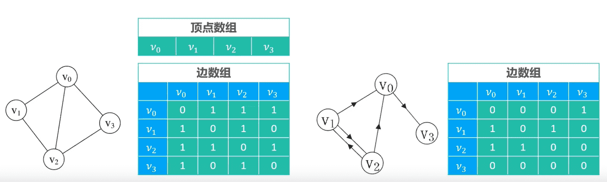
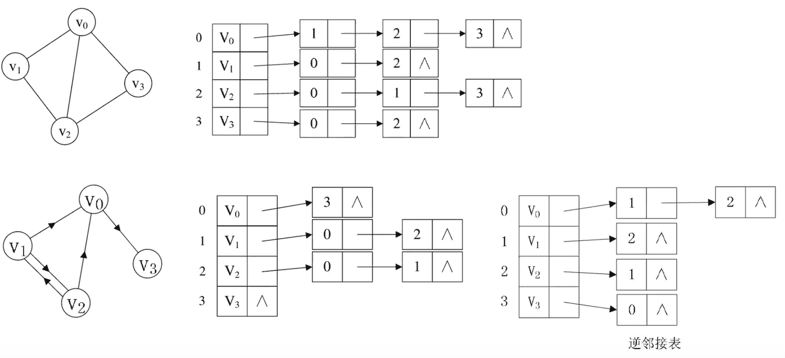

# 图

### 概念

- 图由顶点（vertex）和边（edge）组成，通常表示为G = (V，E)
  - V是顶点（Vertex，图中的数据元素）的**有穷非空**集合
  - E是V中顶点对（也称为边，表示两个顶点之间的关系）的有穷集
  - 通常，也将图G的顶点集和边集分别记为V(G)和E(G)。E(G)可以是**空集**，若E(G)为空，则图G只有顶点而没有边
- 有向图（Directed Graph）：有向图的边是有明确方向的
  - 有向无环图（Directed Acyclic Graph，简称DAG）：如果一个有向图，从任意顶点触发无法经过若干条边回到该顶点，则该有向图叫作有向无环图
  - 出度：一个顶点的出度为x，指有x条边以该顶点为起点
  - 入度：一个顶点的入度为x，指有x条边以该顶点为终点
- 无向图：无向图的边是没有方向的
- 平行边：
  - 在无向图中，关联一对顶点的无向边如果多于一条，则称这些边为平行边
  - 在有向图中，关联一对顶点的有向边如果多于一条，且它们的方向相同，则称这些边为平行边
- 多重图：有平行边或者有自环的图
- 简单图：没有平行边或自环的图
- 无向完全图：无向图的任意两个顶点都存在边
  - n个顶点的无向完全图的边数：n(n-1)/2
- 有向完全图：有向图的任意两个顶点都存在方向相反的两条边，n个顶点的有向完全图的边数：n(n-1)
- 稠密图：边数接近于或等于完全图
- 稀疏图：边数远远小于完全图
- 有权图：有权图的边可以拥有权值
- 连通图：所有的顶点之间互相连通
  - 连通：如果顶点x和顶点y之间存在可以相互抵达的路径（间接或者直接的路程），则称x和y是连通的
  - 连通分量：无向图的极大连通子图；
    - 连通图只有一个连通分量，即自身；
    - 非连通的无向图有n多个连通分量
  - 强连通图：如果有向图G中任意2个顶点都是连通的，则称G为强连通图
  - 强连通分量：有向图的极大连通子图
    - 强连通图只有一个连通分量，即自身；
    - 非强连通的有向图有n多个连通分量

### 实现

图有两种实现方案：

- 邻接矩阵：Adjacency Matrix
- 邻接表：Adjacency List

##### 邻接矩阵

邻接矩阵的存储方式：适合用来存储稠密图

- 一维数组存放顶点信息
- 二维数组存放边信息

##### 邻接表

