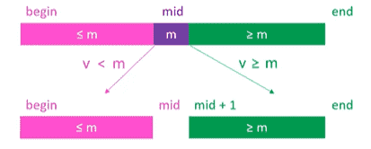

# 排序算法


注意：

- 以上表格是基于数组进行排序的一般性结论
- 冒泡、选择、插入、归并、快速、希尔、堆排序，属于比较排序（Comparison Sorting）

##### 常见递推式


##### 排序算法的稳定性

- 排序前后两个相等元素的相对位置保持不变，这就是稳定的排序算法
- 排序算法的稳定性会影响自定义对象的排序效果

##### 原地算法（In-place Algorithm）

- 指不依赖额外的资源或者依赖少数的额外资源，仅依靠输出来覆盖输入，一般空间复杂度为 O（1） 的都可以认为是原地算法
- 非原地算法：Not-in-place 或者 Out-of-place

##### 准备

1. `Abstract<E>` 抽象出的公共类：

    ```java
    @SuppressWarnings("unchecked")
    public abstract class AbstractSort<E> implements Comparable<AbstractSort<E>> {

        protected E[] elements;
        protected int cmpCoun t;
        protected int swapCount;
        protected long time;

        /**
         * 泛型 E 要么继承了Comparable，要么自己定义比较器
         */
        protected Comparator<E> comparator;

        public AbstractSort() {
            this(null);
        }

        public AbstractSort(Comparator<E> comparator) {
            this.comparator = comparator;
        }

        public AbstractSort<E> sort(E[] elements) {
            this.elements = elements;

            /**
             * 当elements不为null而且length>1时才需要进行排序
             */
            if (needSort()) {
                long start = System.currentTimeMillis();
                E[] ans = sort();
                time = System.currentTimeMillis() - start;
            }

            return this;
        }

        /**
         * 具体的排序函数
         *
         * @return
         */
        protected abstract E[] sort();

        /**
         * 元素比较
         *
         * @param e1
         * @param e2
         * @return 相等，返回0；e1>e2，返回正数；e1<e2，返回负数
         */
        protected int compare(E e1, E e2) {
            cmpCount++;
            if (comparator != null) {
                return comparator.compare(e1, e2);
            }
            return ((Comparable<E>) e1).compareTo(e2);
        }

        protected boolean blank() {
            return null == elements || elements.length == 0;
        }

        protected boolean notBlank() {
            return !blank();
        }

        protected boolean needSort() {
            return null != elements && elements.length > 1;
        }

        /**
         * 交换元素的值
         * @param e1
         * @param e2
         */
        protected void swap(int e1, int e2) {
            swapCount++;

            E tmp = elements[e1];
            elements[e1] = elements[e2];
            elements[e2] = tmp;
        }

        /**
         * 对排序后的结果进行打印
         *
         * @return
         */
        protected AbstractSort<E> printArray() {
            StringBuilder builder = new StringBuilder();
            builder.append("【").append(getClass().getSimpleName())
                    .append("】").append("\n")
                    .append("size = ").append(elements.length).append("\n")
                    .append("[");
            for (E element : elements) {
                builder.append(element).append("\t");
            }
            builder.append("]");
            System.out.println(builder.toString());
            return this;
        }

        /**
         * 继承Comparable接口，实现compareTo方法，用于对各个排序算法
         * 根据用时进行排序
         *
         * @param o
         * @return
         */
        @Override
        public int compareTo(AbstractSort<E> o) {
            return (int) (this.time - o.time);
        }

        protected String easyPrint(int n) {
            if (n < 10000) {
                return String.valueOf(n);
            }
            if (n < 100000000) {
                return n / 10000 + "万";
            }
            return n / 100000000 + "亿";
        }

        @Override
        public String toString() {
            String timeStr = "耗时：" + (time / 1000) + "s(" + time + "ms)";
            String compareCount = "比较：" + easyPrint(cmpCount);
            String swap = "交换：" + easyPrint(swapCount);
            return "【" + getClass().getSimpleName() + "】\n"
                    + timeStr + "\n"
                    + compareCount + "\n"
                    + swap + "\n";
        }
    }

    ```
    
2. 用于数组生成和复制的工具类：Utils

    ```java
    public class Utils {
        public static Integer[] get(int n, int bound) {
            Integer[] elements = new Integer[n];
            Random random = new Random();
            for (int i = 0; i < n; i++) {
                elements[i] = random.nextInt(bound);
            }
            return elements;
        }
    
        public static Integer[] copy(Integer[] elements) {
            Integer[] res = new Integer[elements.length];
            System.arraycopy(elements, 0, res, 0, elements.length);
            return res;
        }
    
        /**
         * 打印多个排序的结果，按顺序打印
         * @param array
         * @param sorts
         */
        public static void testSorts(Integer[] array,AbstractSort<Integer>... sorts){
            for (AbstractSort<Integer> sort:sorts){
                sort.sort(copy(array));
            }
    
            Arrays.sort(sorts);
    
            for (AbstractSort<Integer> sort : sorts) {
                System.out.println(sort);
            }
        }
    }
    ```

### 冒泡排序

> 它重复地走访过要排序的元素列，依次比较两个相邻的元素，如果顺序（如从大到小、首字母从Z到A）错误就把他们交换过来。走访元素的工作是重复地进行直到没有相邻元素需要交换，也就是说该元素列已经排序完成。
>
> 这个算法的名字由来是因为越小的元素会经由交换慢慢“浮”到数列的顶端（升序或降序排列），就如同碳酸饮料中二氧化碳的气泡最终会上浮到顶端一样，故名“冒泡排序”。

##### 原理

1. 比较相邻的元素。如果第一个比第二个大，就交换他们两个
2. 对每一对相邻元素做同样的工作，从开始第一对到结尾的最后一对。在这一点，最后的元素应该会是最大的数 
3. 针对所有的元素重复以上的步骤，除了最后一个
4. 持续每次对越来越少的元素重复上面的步骤，直到没有任何一对数字需要比较

##### 优化

- 方案一：一趟扫描下来未发生交换，说明序列已经完全有序，可以提前终止冒泡排序
- 方案二：每次扫描记录交换的最后一个位置，说明该位置之后的元素已经局部有序，进行下一次扫描终点的更新

##### 复杂度

- 最坏、平均时间复杂度：O（n^2)
- 最好时间复杂度：O（n），指经过优化的冒泡排序
- 空间复杂度：O（1）
- 冒泡排序属于**稳定的原地排序**算法

##### 实现

```java
// 基本写法
public class BubbleSort1<E> extends AbstractSort<E> {

    public BubbleSort1() {
        super();
    }

    public BubbleSort1(Comparator<E> comparator) {
        super(comparator);
    }

    @Override
    protected E[] sort() {
        // 每循环一次，都有一位最大值被移至最后
        for (int end = elements.length - 1; end > 0; end--) {
            for (int j = 1; j <= end; j++) {
                if (compare(elements[j - 1], elements[j]) > 0) {
                    swap(j - 1, j);
                }
            }
        }
        return elements;
    }
}

// 提前终止优化
public class BubbleSort2<E> extends AbstractSort<E> {
    public BubbleSort2() {
        super();
    }

    public BubbleSort2(Comparator<E> comparator) {
        super(comparator);
    }

    @Override
    protected E[] sort() {
        // 如果一趟扫描没有元素交换，则说明已经完全有序，可以终止循环
        // 该改进只适合数组中元素有序较多的情况，否则会比原始版本慢
        boolean swap = false;
        for (int end = elements.length - 1; end > 0; end--) {
            swap = false;
            for (int j = 1; j <= end; j++) {
                if (compare(elements[j - 1], elements[j]) > 0) {
                    swap(j - 1, j);
                    swap = true;
                }
            }
            // 未进行过交换，说明完全有序
            if (!swap) {
                break;
            }
        }
        return elements;
    }
}

// 扫描端点智能更新优化
public class BubbleSort3<E> extends AbstractSort<E> {
    public BubbleSort3() {
        super();
    }

    public BubbleSort3(Comparator<E> comparator) {
        super(comparator);
    }

    @Override
    protected E[] sort() {
        // 记录每次扫描最后一次交换的位置，说明该交换之后的元素是局部有序的
        // 可以减少比较次数
        int pos = elements.length;
        for (int end = elements.length - 1; end > 0; end--) {
            // 记录每一轮交换的索引
            pos = 1;
            for (int j = 1; j <= end; j++) {
                if (compare(elements[j - 1], elements[j]) > 0) {
                    swap(j - 1, j);
                    // 记录最后一次交换的位置
                    pos = j;
                }
            }
            end = pos;
        }
        return elements;
    }
}
```

### 选择排序

> 第一次从待排序的数据元素中选出最小（或最大）的一个元素，存放在序列的起始位置，然后再从剩余的未排序元素中寻找到最小（大）元素，然后放到已排序的序列的末尾。以此类推，直到全部待排序的数据元素的个数为零。

##### 原理

1. 首先在未排序序列中找到最大元素，然后与最末尾的元素交换位置，执行一轮后，最末尾元素为最大的元素
2. 然后，忽略上述找到的最大元素，再从剩余未排序元素中继续寻找最大元素，重复执行步骤1

##### 复杂度

- 选择排序的交换次数要远远少于冒泡排序，平均性能优于冒泡排序
- 最好、最坏、平均复杂度：O（n^2)
- 空间复杂度：O（1）
- 属于**不稳定的原地**排序

##### 实现

```java
public class SelectionSort<E> extends AbstractSort<E> {
    public SelectionSort() {
        super();
    }

    public SelectionSort(Comparator<E> comparator) {
        super(comparator);
    }

    @Override
    protected E[] sort() {
        for (int len = elements.length - 1; len > 0; len--) {
            int pos = 0;
            for (int i = 1; i <= len; i++) {
                if (compare(elements[i], elements[pos]) > 0) {
                    // 记录每一趟扫描到的最大值的索引
                    pos = i;
                }
            }
            swap(pos, len);
        }
        return elements;
    }
}
```

### 堆排序(Heap sort)

> 堆排序（英语：Heapsort）是指**利用堆**这种数据结构所设计的一种排序算法，堆排序是一种选择排序。堆是一个近似完全二叉树的结构，并同时满足堆积的性质：即子结点的键值或索引总是小于（或者大于）它的父节点。

##### 堆结构

堆是具有以下性质的**完全二叉树**：

- 每个结点的值都大于或等于其左右孩子结点的值，称为大顶堆

- 或者每个结点的值都小于或等于其左右孩子结点的值，称为小顶堆

- 示意图：

  

  对堆中的每个节点按层进行编号，映射到数组中：

  

  该数组从逻辑上将就是一个堆结构，用简单的公式来描述一下堆的定义：

  - 大堆顶：arr[i] >= arr[2i+1] && arr[i] >= arr[2i+2]
  - 小堆顶：arr[i] <= arr[2i+1] && arr[i] <= arr[2i+2]

##### 堆排序基本思想

> 堆排序的基本思想是：
>
> 1. 将待排序序列构造成一个大顶堆，此时，整个序列的最大值就是堆顶的根节点
> 2. 将其与末尾元素进行交换，此时末尾就为最大值
> 3. 然后将剩余 n-1个元素重新构造成一个堆，这样会得到n个元素的次小值
> 4. 如此反复执行，便能得到一个有序序列了

1. 对序列进行原地建堆（heapify）
2. 重复执行一下操作，直到堆的元素数量为1
   1. 交换堆顶元素与尾元素
   2. 堆的元素数量减1
   3. 对0位置进行一次siftDown操作

##### 复杂度

- 最好、最坏、平均时间复杂度均为 O（nlogn）
- 空间复杂度O（1）
- 属于不稳定的原地排序

##### 图解思路

1. 构造初始堆：将给定无序序列构造成一个大顶堆（一般升序采用大顶堆，降序采用小顶堆)

   1. 假定给定的无序序列结构如下：

      

   2. 此时我们从最后一个非叶子结点开始（叶结点自然不用调整，第一个非叶子结点 arr.length/2-1=5/2-1=1，也就是下面的6结点），从左至右，从下至上进行调整

      

   3. 找到第二个非叶节点 4，由于[4，9，8]中 9 元素最大，4 和 9交换

      

      交换后导致了子根[4，5，6]结构混乱，继续调整，[4，5，6]中6最大，交换4和6.

   4. 此时，就将一个无序序列构造成了一个大堆顶

2. 将堆顶元素与末尾元素进行交换，使末尾元素最大。然后继续调整堆，再将堆顶元素与末尾元素交换，得到第二大元素。如此反复进行交换、重建、交换

   1. 将堆顶元素9和末尾元素4进行交换

      

   2. 重新调整结构，使其继续满足堆定义

      

   3. 再将堆顶元素8与末尾元素5进行交换，得到第二大元素8

      

   4. 后续过程，继续进行调整，交换，如此反复进行，最终使得整个序列有序

      

##### 实现

```java
public class HeapSort<E> extends AbstractSort<E> {

    private int heapSize;

    public HeapSort() {
        this(null);
    }

    public HeapSort(Comparator<E> comparator) {
        super(comparator);
    }

    @Override
    protected E[] sort() {
        // 设置大堆顶的长度heapSize
        heapSize = elements.length;

        // 构建大堆顶
        for (int i = (heapSize >> 1) - 1; i >= 0; i--) {
            siftDown(i);
        }
        // 堆排序过程
        while (heapSize > 1) {
            swap(0, --heapSize);
            siftDown(0);
        }
        return elements;
    }

    /**
     * 调整大堆顶
     *
     * @param index
     */
    private void siftDown(int index) {
        // 取出当前位置元素的值
        E element = elements[index];
        // 当前堆大小的一半
        int half = heapSize >> 1;
        // index必须是非叶子节点
        while (index < half) {
            // 默认是左边节点跟父节点比
            int childIndex = (index << 1) + 1;
            E child = elements[childIndex];

            int rightIndex = childIndex + 1;
            // 右子节点存在且比左子节点大
            if (rightIndex < heapSize &&
                    compare(elements[rightIndex], child) > 0) {
                // 将比较节点更换为右子节点，包括索引与值
                child = elements[childIndex = rightIndex];
            }
            // 如果当前节点大于等于子节点
            if (compare(element, child) >= 0) {
                break;
            }
            // 当前节点小于子节点
            elements[index] = child;
            index = childIndex;
        }
        elements[index] = element;
    }
}
```

### 插入排序

> 插入排序，一般也被称为直接插入排序。对于少量元素的排序，它是一个有效的算法 。
>
> - 插入排序是一种最简单的排序方法，它的基本思想是将一个记录插入到已经排好序的有序表中，从而一个新的、记录数增1的有序表
> - 在其实现过程使用双层循环，外层循环对除了第一个元素之外的所有元素，内层循环对当前元素前面有序表进行待插入位置查找，并进行移动

##### 基本流程

- 在执行过程中，插入排序会将序列分为2部分：
  - 头部是已经排号序的
  - 尾部是待排序的
- 从头到尾扫描每一个元素：每当扫描到一个元素，就将其插入到头部合适的位置，使头部数据依然保持有序

##### 逆序对

逆序对：

- 设 A 为一个有 n 个数字的有序集 (n>1)，其中所有数字各不相同
- 如果存在正整数 i, j 使得 1 ≤ i < j ≤ n 而且 A[i] > A[j]，则 <A[i], A[j]> 这个有序对称为 A 的一个逆序对，也称作逆序数
- 例如，数组（3，1，4，5，2）的逆序对有(3,1),(3,2),(4,2),(5,2)，共4个

##### 复杂度

插入排序的复杂度与逆序对的数量成正比关系

- 逆序对的数量越多，插入排序的时间复杂度越高
- 最坏、平均时间复杂度为 O（n^2），最坏即每次将元素插到开头
- 最好时间复杂度：O（n），即只有 n 次比较
- 空间复杂度：O（1）
- 属于稳定的原地排序算法
- 注意事项：
  - 当逆序对数量极少时，插入排序的效率特别高
  - 数据量不是特别大的时候，插入排序的效率也挺高

##### 优化

- 思路一：将【交换】转换为【挪动】

  - 先将插入的元素备份
  - 头部有序数组中比待插元素大的，均朝尾部方向挪动一个位置
  - 将待插元素放到最终的合适位置

- 思路二：在有序数组中查找元素位置时使用二分搜索

  二分查找思路：假设在 [begin,end) 范围内搜寻某个元素 v，mid == (begin+end)/2

  

  - 如果 v < m，去 [begin,mid) 范围内搜索
  - 如果 v > m，去 [mid+1，end) 范围内搜索
  - 如果 v == m，直接返回 mid
  - begin == end，查找失败，返回 begin

  二分搜索算法优化（插入排序优化）：在元素 v 插入的过程中，先二分搜索出合适的插入位置，即**第一个大于 v 的元素位置**，然后再将元素 v 插入。

  假设在 [begin,end) 范围内搜寻某个元素 v，mid == (begin+end)/2：

  

  - 如果 v < m，去 [begin,mid) 范围内搜索
  - 如果 v >= m，去 [mid+1，end) 范围内搜索
  - 当退出循环时，begin == end，且 begin 即为待插入位置

##### 实现

```java
public class InsertionSort<E> extends AbstractSort<E> {
    public InsertionSort() {
        super();
    }

    public InsertionSort(Comparator<E> comparator) {
        super(comparator);
    }

    @Override
    protected E[] sort() {
        for (int begin = 1; begin < elements.length; begin++) {
            for (int pos = begin; pos > 0; pos--) {
                if (compare(elements[pos], elements[pos - 1]) >= 0) {
                    break;
                }
                swap(pos - 1, pos);
            }
        }
        return elements;
    }
}

// 优化版
public class InsertionSort1<E> extends AbstractSort<E> {
    public InsertionSort1() {
        super();
    }

    public InsertionSort1(Comparator<E> comparator) {
        super(comparator);
    }

    @Override
    protected E[] sort() {
        for (int begin = 1; begin < elements.length; begin++) {
            int insert = begin;
            E element = elements[begin];
            while (insert > 0 && compare(element, elements[insert - 1]) < 0) {
                elements[insert] = elements[insert - 1];
                insert--;
            }
            elements[insert] = element;
        }
        return elements;
    }
}

// 二分查找优化版插入排序
public class InsertionSort2<E> extends AbstractSort<E> {

    public InsertionSort2() {
        super();
    }

    public InsertionSort2(Comparator<E> comparator) {
        super(comparator);
    }

    @Override
    protected E[] sort() {
        for (int begin = 1; begin < elements.length; begin++) {
            // 保存一份待插入元素的副本
            E element = elements[begin];
            int pos = binarySearch(0, begin, element);
            // 元素复制：arraycopy比for循环快太多了
//            for (int i = begin; i > pos; i--) {
//                elements[i] = elements[i - 1];
//            }
            System.arraycopy(elements, pos, elements, pos + 1, begin - pos);
            elements[pos] = element;
        }
        return elements;
    }

    /**
     * 二分查找寻找待插入的位置：第1个大于 target 的元素位置
     *
     * @param begin  二分查找的起始位置
     * @param end    二分查找的终止位置
     * @param target 待插入的元素
     * @return 第1个大于 target 的元素位置
     */
    private int binarySearch(int begin, int end, E target) {
        while (begin < end) {
            int mid = (begin + end) >> 1;
            if (compare(target, elements[mid]) < 0) {
                end = mid;
            } else {
                begin = mid + 1;
            }
        }
        return begin;
    }
}
```

### 归并排序

> 归并排序（Merge Sort）是建立在归并操作上的一种有效，稳定的排序算法，该算法是采用分治法（Divide and Conquer）的一个非常典型的应用。将已有序的子序列合并，得到完全有序的序列；即先使每个子序列有序，再使子序列段间有序。若将两个有序表合并成一个有序表，称为二路归并。

##### 执行流程


1. 不断地将当前序列平均分割成 2 个子序列，直到不能再分割（序列中只剩下一个元素）
2. 不断地将 2 个子序列合并成一个有序序列，直到最终只剩下一个有序序列

##### 复杂度

- 因为归并排序总是平均分割子序列，所以最好、最坏、平均时间复杂度都是：O（nlogn）
- 空间复杂度：O（n/2+logn) = O(n)
- 稳定的排序算法

##### 实现

```java
@SuppressWarnings("unchecked")
public class MergeSort<E> extends AbstractSort<E> {

    public MergeSort() {
        super();
    }

    public MergeSort(Comparator<E> comparator) {
        super(comparator);
    }

    @Override
    protected E[] sort() {
        sort(0, elements.length);
        return elements;
    }

    /**
     * 对[begin,end)范围内的数据进行归并排序
     *
     * @param begin
     * @param end
     */
    private void sort(int begin, int end) {
        if (end - begin < 2) {
            return;
        }
        int mid = (begin + end) >> 1;
        sort(begin, mid);
        sort(mid, end);
        merge(begin, mid, end);
    }

    /**
     * 对[begin,mid)和[mid,end)两个区间进行合并
     *
     * @param begin
     * @param mid
     * @param end
     */
    private void merge(int begin, int mid, int end) {
        // 使用双指针加备份左子区间数据
        int left = mid - begin;
        // 开辟空间并备份左子区间
        E[] tmp = (E[]) new Object[mid - begin];
        System.arraycopy(elements, begin, tmp, 0, left);
        // 双指针进行数据拷贝
        int pos = 0;
        while (pos < left && mid < end) {
            // 为了保持稳定性，在元素相等时让左子区间的元素填充
            if (compare(elements[mid], tmp[pos]) < 0) {
                elements[begin++] = elements[mid++];
            } else {
                elements[begin++] = tmp[pos++];
            }
        }
        // 如果左边结束，右边无需移位
        // 如果左边未结束，则左边需要进行元素拷贝
        if (pos < left) {
            System.arraycopy(tmp, pos, elements, begin, left - pos);
        }
    }
}
```

### 快速排序

##### 原理

本质：逐渐将每一个元素转换成轴点元素

1. 从序列中选择一个轴点元素（pivot），这里选最左端元素
2. 利用 pivot 将序列分割成 2 个子序列
   - 将小于 pivot 的元素放在 pivot 前面（左侧）
   - 将大于 pivot 的元素放在 pivot 后面（右侧）
   - 等于 pivot 的元素放哪边都行
3. 对子序列进行 1、2操作，直到不能再分割（子序列只剩下一个元素）

##### 轴点构造


##### 复杂度

- 在轴点左右元素数量比较均匀的情况下，同时也是最好的情况：T(n) = 2*T(n/2)+O(n) = O(nlogn)
- 轴点左右元素极度不均匀，最坏情况：T(n) = T(n-1)+O(n)=O(n^2)
- 为了降低最坏情况的出现概率，一般采取的做法是：**随机选择轴点元素**
- 最好、平均时间复杂度为：O(nlogn)
- 最差时间复杂度：O(n^2)
- 由于递归调用的缘故，空间复杂度：O(logn)
- 属于不稳定排序

##### 实现

```java
public class QuickSort<E> extends AbstractSort<E> {

    public QuickSort() {
        super();
    }

    public QuickSort(Comparator<E> comparator) {
        super(comparator);
    }

    @Override
    protected E[] sort() {
        sort(0, elements.length);
        return elements;
    }

    /**
     * 对[begin,end)范围进行快速排序
     *
     * @param begin
     * @param end
     */
    private void sort(int begin, int end) {
        if (end - begin < 2) {
            return;
        }
        // 确定轴点位置
        int pivot = pivotIndex(begin, end);
        // 对左右子序列分别进行快速排序
        sort(begin, pivot);
        sort(pivot + 1, end);
    }

    /**
     * 构造出[begin,end)范围的轴点位置
     *
     * @param begin
     * @param end
     * @return 轴点元素的索引
     */
    private int pivotIndex(int begin, int end) {
        // 随机选择一个元素跟begin位置进行交换
        swap(begin, (int) (begin + Math.random() * (end - begin)));

        // 备份begin的位置的元素
        E pivot = elements[begin];
        // end要指向最后一个元素
        end--;

        while (begin < end) {
            while (begin < end) {
                if (compare(pivot, elements[end]) < 0) {
                    // 右边元素>轴点元素：不加等于是避免最坏情况的出现
                    end--;
                } else {
                    // 右边元素<=轴点元素
                    elements[begin++] = elements[end];
                    break;
                }
            }

            while (begin < end) {
                if (compare(pivot, elements[begin]) > 0) {
                    // 左边元素<轴点元素
                    begin++;
                } else {
                    // 左边元素>=轴点元素
                    elements[end--] = elements[begin];
                    break;
                }
            }
        }

        // begin == end
        // 将轴点元素放入最终位置
        elements[begin] = pivot;
        // 返回轴点元素的位置
        return begin;
    }
}
```

### 希尔排序（Shell Sort）

希尔排序把整个序列看作一个矩阵，分成 m 列，逐列进行排序：

- m从某个正数逐渐减为 1
- 当 m 为 1 时，整个序列完全有序

因此，希尔排序也被称为递减增量排序（Diminishing Increment Sort）


矩阵的列数取决于步长序列（step sequence），不同的步长序列，执行效率也不同。

- 希尔本人给出的步长序列：n/(2^k)，比如 n 为16 时，步长序列为{1，2，4，8}，希尔给出的步长序列最坏的时间复杂度为O(n^2)

- 目前已知的最好的步长序列，最坏情况时间复杂度为 $ O(n^{\frac{4}{3}}) $ ，在 1986 年由Robert Sedgewick提出

  

- 希尔排序在执行过程中，逆序对的数量在逐渐较少，因此，希尔排序底层一般使用插入排序对每一列进行排序，所以很多资料认为希尔排序是插入排序的改进版

##### 复杂度

- 最好情况步长序列只有 1 ，且序列几乎有序，时间复杂度为 O(n)
- 空间复杂度为O(1)
- 不稳定的原地排序

##### 实现

```java
public class ShellSort<E> extends AbstractSort<E> {
    public ShellSort() {
        super();
    }

    public ShellSort(Comparator<E> comparator) {
        super(comparator);
    }

    @Override
    protected E[] sort() {
        // 生成步长序列
        List<Integer> stepSequence = myStepSequence();

        for (Integer step : stepSequence) {
            sort(step);
        }
        return elements;
    }

    /**
     * 分步长排序
     *
     * @param step
     */
    private void sort(int step) {
        // col：第几列
        for (int col = 0; col < step; col++) {
            // 对每 col 列 [0,array.length) 分别进行排序，使用插入排序
            // 每个元素的索引 col+row*step
            for (int begin = col + step; begin < elements.length; begin += step) {
//                for (int pos = begin; pos > col; pos -= step) {
//                    if (compare(elements[pos], elements[pos - step]) >= 0) {
//                        break;
//                    }
//                    swap(pos - step, pos);
//                }
                int cur = begin;
                while (cur > col && compare(elements[cur], elements[cur - step]) < 0) {
                    swap(cur, cur - step);
                    cur -= step;
                }
            }
        }
    }

    /**
     * 生成步长序列
     *
     * @return
     */
    private List<Integer> shellStepSequence() {
        List<Integer> stepSequence = new ArrayList<>();
        int step = elements.length;
        while ((step >>= 1) > 0) {
            stepSequence.add(step);
        }
        return stepSequence;
    }

    /**
     * 目前最好的希尔排序步长序列
     *
     * @return
     */
    private List<Integer> myStepSequence() {
        List<Integer> stepSequence = new LinkedList<>();
        int k = 0, step = 0;
        while (true) {
            if ((k & 1) == 0) {
                // k为偶数
                int pow = (int) Math.pow(2, k >> 1);
                step = 1 + 9 * (pow * pow - pow);
            } else {
                // k为奇数
                int pow1 = (int) Math.pow(2, (k - 1) >> 1);
                int pow2 = (int) Math.pow(2, (k + 1) >> 1);
                step = 1 + 8 * pow1 * pow2 - 6 * pow2;
            }
            if (step >= elements.length) {
                break;
            }
            stepSequence.add(0, step);
            k++;
        }

        return stepSequence;
    }
}
```

### 计数排序（Counting Sort）

##### 小总结

- 上述的冒泡、选择、插入、归并、快速、希尔、堆排序，都是基于**比较**的排序，平均时间复杂度目前最低是 O(nlogn)
- 计数排序、桶排序、基数排序，都不是基于比较的排序
  - 它们是典型的用空间换时间，在某些时候，平均复杂度可以比O(nlogn)更低
  - 计数排序：适合对一定范围内的整数进行排序

##### 核心思想

统计每个整数在序列中出现的次数，进而推导出每个整数在有序序列中的索引

改进思路：


假设 elements 中元素最小值是 min：

- elements 中元素 k 对应的 counts 的索引是 k - min
- array中元素 k 在有序序列中的索引
- counts[ k - min ] - p，p代表的是倒数第几个k

复杂度：

- 最好、最坏、平均时间复杂度：O(n+k)
- 空间复杂度O(n+k)
- k是整数的取值范围
- 属于稳定排序

##### 实现

```java
// 最简单的实现
public class CountingSort extends AbstractSort<Integer> {

    public CountingSort() {
        super();
    }

    public CountingSort(Comparator<Integer> comparator) {
        super(comparator);
    }

    @Override
    protected Integer[] sort() {
        // 找出最大值
        int max = elements[0];
        for (Integer element : elements) {
            max = element > max ? element : max;
        }
        // 开辟空间，存储每个整数出现的次数
        int[] counts = new int[max + 1];
        // 统计每个整数出现的次数
        for (Integer element : elements) {
            counts[element]++;
        }
        // 索引
        int pos = 0;
        for (int i = 0; i < counts.length; i++) {
            while (counts[i]-- > 0) {
                elements[pos++] = i;
            }
        }
        return elements;
    }
}

// 改进
public class CountingSort1 extends AbstractSort<Integer> {
    public CountingSort1() {
        super();
    }

    public CountingSort1(Comparator<Integer> comparator) {
        super(comparator);
    }

    @Override
    protected Integer[] sort() {
        int min = elements[0];
        int max = elements[0];
        for (Integer element : elements) {
            min = min < element ? min : element;
            max = element > max ? element : max;
        }
        // 开辟空间
        int[] counts = new int[max - min + 1];
        // 计算每个元素出现的次数
        for (Integer element : elements) {
            counts[element - min]++;
        }
        // 每个元素累加上其前面的所有元素，得到的就是
        // 元素在有序序列中的位置信息
        for (int i = 1; i < counts.length; i++) {
            counts[i] += counts[i - 1];
        }
        // 从后往前遍历元素，将它放到有序数组中的合适位置
        Integer[] newArray = new Integer[elements.length];
        for (int i = elements.length - 1; i >= 0; i--) {
            newArray[--counts[elements[i] - min]] = elements[i];
        }
        elements = newArray;
        return elements;
    }
}
```

### 基数排序Radix Sort

基数排序非常适合用于整数排序（尤其是非负整数）

##### 原理

执行流程：依次对个位数、十位数、百位数、千位数、万位数...进行排序（从地位到高位）

##### 实现

最好、最坏、平均时间复杂度：O(d*(n+k))，d是最大值的位数，k是进制，属于稳定排序

空间复杂度：O(n+k)，k是进制

```java
public class RadixSort extends AbstractSort<Integer> {
    @Override
    protected Integer[] sort() {
        // 找到最大值
        int max = elements[0];
        for (Integer element : elements) {
            max = element > max ? element : max;
        }

        for (int divider = 1; divider <= max; divider *= 10) {
            countingSort(divider);
        }
        return elements;
    }

    private void countingSort(int divider) {
        // 开辟空间
        int[] counts = new int[10];
        // 计算每个元素出现的次数
        for (Integer element : elements) {
            counts[element / divider % 10]++;
        }
        // 每个元素累加上其前面的所有元素，得到的就是
        // 元素在有序序列中的位置信息
        for (int i = 1; i < counts.length; i++) {
            counts[i] += counts[i - 1];
        }
        // 从后往前遍历元素，将它放到有序数组中的合适位置
        Integer[] newArray = new Integer[elements.length];
        for (int i = elements.length - 1; i >= 0; i--) {
            newArray[--counts[elements[i] / divider % 10]] = elements[i];
        }
        elements = newArray;
    }
}
```

另一种实现方式：

- 空间复杂度：O(kn+k)，时间复杂度O(dn)
- d是最大值的十进制位数，k是进制


```java
public class RadixSort1 extends AbstractSort<Integer> {
    @Override
    protected Integer[] sort() {
        int max = elements[0];
        for (Integer element : elements) {
            max = element > max ? element : max;
        }

        // 桶数组
        int[][] buckets = new int[10][elements.length];
        // 每个桶的元素数量
        int[] bucketSizes = new int[buckets.length];
        for (int divider = 1; divider <= max; divider *= 10) {
            // 入桶
            for (int i = 0; i < elements.length; i++) {
                int no = elements[i] / divider % 10;
                buckets[no][bucketSizes[no]++] = elements[i];
            }
            // 出桶
            int index = 0;
            for (int i = 0; i < buckets.length; i++) {
                for (int j = 0; j < bucketSizes[i]; j++) {
                    elements[index++] = buckets[i][j];
                }
                bucketSizes[i] = 0;
            }
        }
        return elements;
    }
}
```

### 桶排序 Bucket Sort

##### 执行流程

1. 创建一定数量的桶（比如数组、链表等作为桶）
2. 按照一定的规则（不同类型的数据、不同规则等），将序列中的元素均匀的分配到对应的桶中
3. 分别对桶进行单独排序
4. 将所有非空桶的元素合并成有序序列

比如存储2位小数：元素在桶中的索引 = 元素值 * 元素数量

### reference

- 堆排序内容，原文链接：[https://www.cnblogs.com/chengxiao/p/6129630.html](https://www.cnblogs.com/chengxiao/p/6129630.html)

