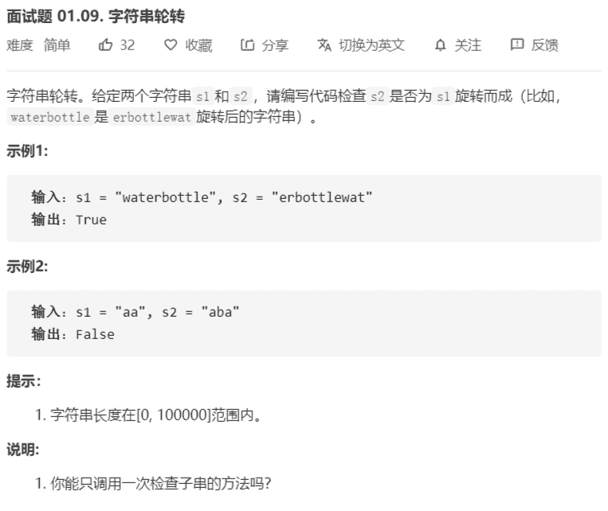

# 字符串轮转



解法：

1. 轮转字符串：s1+s1，然后在拼接后的字符串中找是否包含s2

```java
class Solution {
    public boolean isFlipedString(String s1, String s2) {
        return s1.length() == s2.length() && (s2 + s2).contains(s1);
    }
}
```

