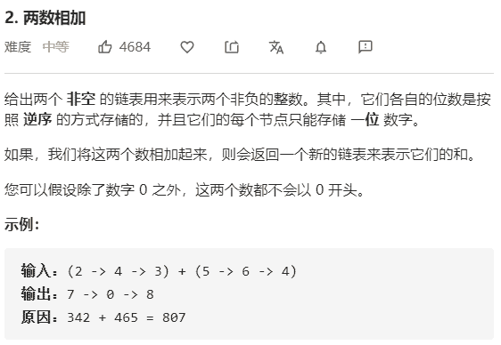

# 两数相加



解决：

```java
class Solution {
    public ListNode addTwoNumbers(ListNode l1, ListNode l2) {

        if (l1 == null){
            return l2;
        }
        if (l2 == null){
            return l1;
        }

        // 创建一个虚拟头节点，方便统一操作
        ListNode head = new ListNode(0);
        // 遍历用的节点
        ListNode node = head;
        // 中间变量
        int pos = 0;
        int sum = 0;
        // 遍历
        while (l1 != null || l2 != null) {
            int v1 = 0;
            int v2 = 0;
            if (l1 != null) {
                v1 = l1.val;
                l1 = l1.next;
            }
            if (l2 != null) {
                v2 = l2.val;
                l2 = l2.next;
            }
            sum = v1 + v2 + pos;
            pos = sum >= 10 ? 1 : 0;
            sum = pos == 0 ? sum : sum - 10;
            node.next = new ListNode(sum);
            node = node.next;
        }
        if (pos > 0) {
            node.next = new ListNode(pos);
        }
        return head.next;
    }
}
```

