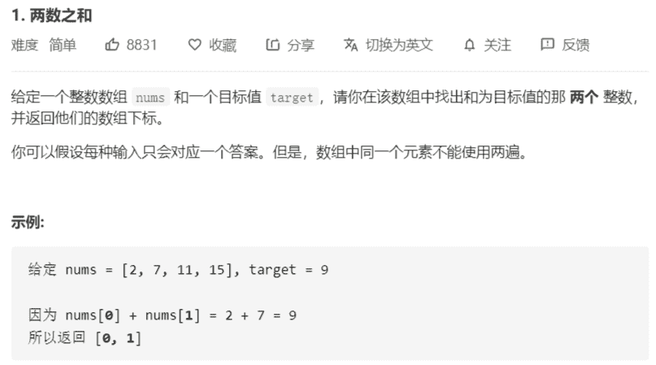

# 1-两数之和



解法：

```java
class Solution {
    public int[] twoSum(int[] nums, int target) {
        if (nums.length < 2) {
            return null;
        }
        // 中间哈希数组
        Map<Integer, Integer> map = new HashMap<>();
        map.put(nums[0], 0);
        for (int i = 1; i < nums.length; i++) {
            int tmp = target - nums[i];
            if (map.containsKey(tmp)) {
                return new int[]{i, map.get(tmp)};
            }
            map.put(nums[i], i);
        }
        return null;
    }
}
```

