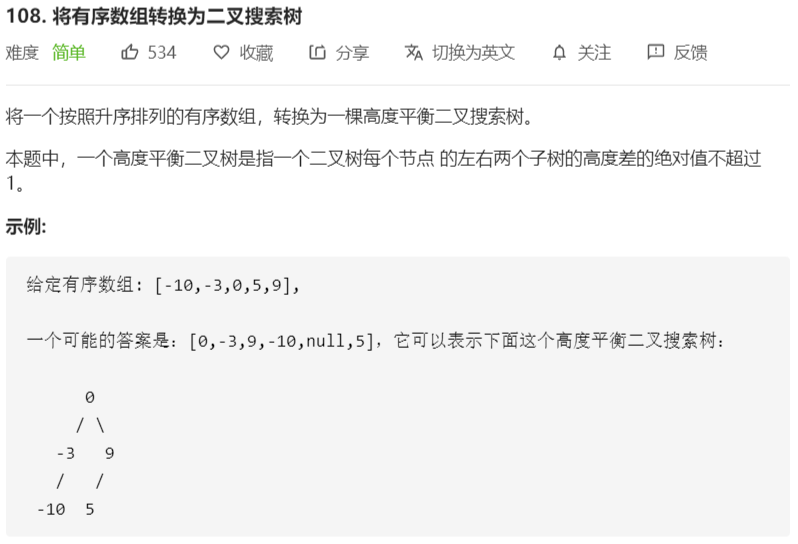

# 108-将有序数组转换为二叉搜索树



解法：

```java
/**
 * Definition for a binary tree node.
 * public class TreeNode {
 *     int val;
 *     TreeNode left;
 *     TreeNode right;
 *     TreeNode(int x) { val = x; }
 * }
 */
class Solution {
    public TreeNode sortedArrayToBST(int[] nums) {
        return make(nums, 0, nums.length);
    }

    private TreeNode make(int[] nums, int i, int j) {
        if (i == j) {
            return null;
        }
        if (i + 1 == j) {
            return new TreeNode(nums[i]);
        }
        int mid = (j + i) >> 1;
        TreeNode node = new TreeNode(nums[mid]);
        node.left = make(nums, i, mid);
        node.right = make(nums, mid + 1, j);
        return node;
    }
}
```

