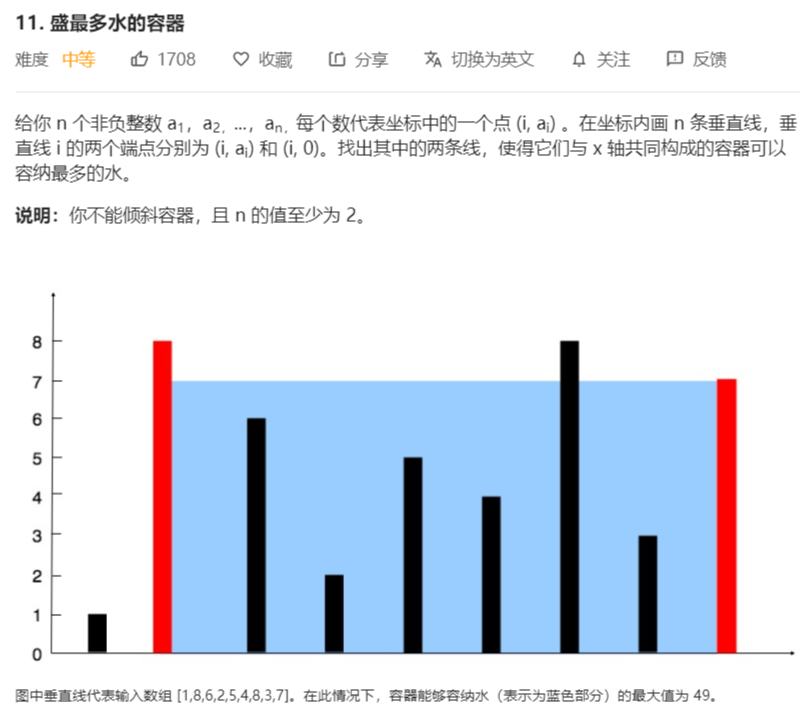

# 11-接最多的水



解法：

从最宽进行计算：int l = 0，r = height.length - 1;

指针移动时，移动端点中较短的一根，往中心移动

```java
class Solution {
    public int maxArea(int[] height) {
        // 使用双指针
        int l = 0;
        int r = height.length - 1;
        int max = 0;
        while (l < r) {
            int s = r - l;
            int h = height[l] > height[r] ? height[r--] : height[l++];
            max = Math.max(h * s, max);
        }
        return max;
    }
}
// 更简写
class Solution {
    public int maxArea(int[] height) {
        // 使用双指针
        int l = 0;
        int r = height.length - 1;
        int max = 0;
        while (l < r) {
            int h = height[l] > height[r] ? height[r--] : height[l++];
            max = Math.max(h * (r - l + 1), max);
        }
        return max;
    }
}
```

