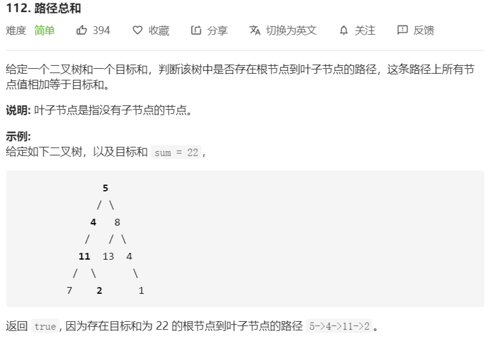

# 112-路径总和



解法：

```java
/**
 * Definition for a binary tree node.
 * public class TreeNode {
 *     int val;
 *     TreeNode left;
 *     TreeNode right;
 *     TreeNode(int x) { val = x; }
 * }
 */
class Solution {
    public boolean hasPathSum(TreeNode root, int sum) {
        return root == null ? false : dfs(root, 0, sum);
    }

    private boolean dfs(TreeNode node, int add, int sum) {
        if (node.left == null && node.right == null) {
            // 搜索到达叶子节点
            return sum == add + node.val;
        }
        return (node.left != null && dfs(node.left, add + node.val, sum)) ||
               (node.right != null && dfs(node.right, add + node.val, sum));
    }
}
```

