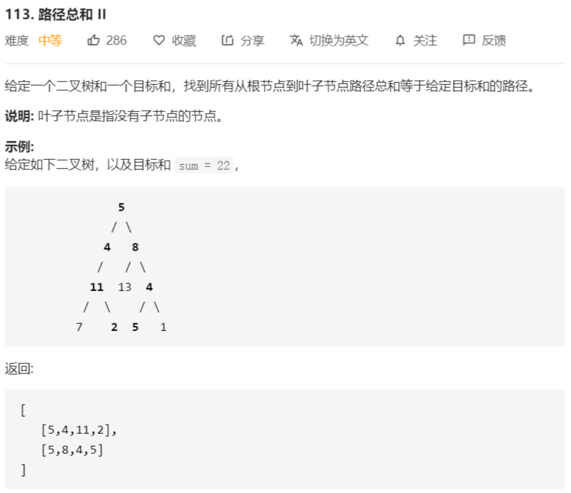

# 113-路径总和2



解法：

```java
class Solution {
    public List<List<Integer>> pathSum(TreeNode root, int sum) {
        // 结果数组
        List<List<Integer>> ans = new ArrayList<>();
        // 根节点为 null，返回空数组
        if (root == null) {
            return ans;
        }
        // 深度优先搜索
        dfs(root, new ArrayList<>(), ans, sum);
        return ans;
    }

    /**
     * 深度优先搜索求解
     *
     * @param node   搜索到的节点
     * @param tmp    中间数组，用于保存搜索过程中节点的值
     * @param ans    结果数组
     * @param remain 每添加一个节点，就减去节点的值，到最后剩余值等于叶子节点的值即符合要求
     */
    private void dfs(TreeNode node, List<Integer> tmp, List<List<Integer>> ans, int remain) {
        if (node.right == null && node.left == null) {
            // 到达叶子节点，搜索结束，判断结果是否满足要求
            if (remain == node.val) {
                tmp.add(node.val);
                ans.add(new ArrayList<>(tmp));
                tmp.remove(tmp.size() - 1);
            }
            return;
        }
        tmp.add(node.val);
        if (node.left != null) {
            dfs(node.left, tmp, ans, remain - node.val);
        }
        if (node.right != null) {
            dfs(node.right, tmp, ans, remain - node.val);
        }
        tmp.remove(tmp.size() - 1);
    }
}
```

