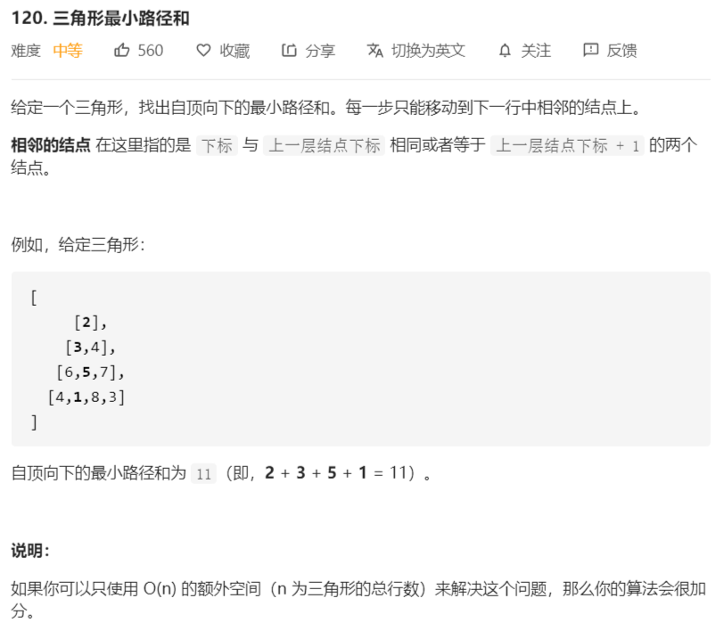

# 120-三角形最小路径和



```java
// 深度遍历搜索，会超时
class Solution {
    private int max = Integer.MAX_VALUE;
    public int minimumTotal(List<List<Integer>> triangle) {
        if (triangle.size() < 1){
            return 0;
        }
        dfs(triangle , 0 , 0 , 0);
        return max;
    }
    private void dfs(List<List<Integer>> triangle,int ans,int level,int pos){
        if (triangle.size() == level){
            max = Math.min(max , ans);
            return;
        }
        dfs (triangle, ans + triangle.get(level).get(pos), level + 1, pos);
        if (pos + 1 < triangle.get(level).size()){
            dfs (triangle, ans + triangle.get(level).get(pos + 1), level + 1, pos + 1);
        }
    }
}

// 动态规划，从上往下，有点复杂
class Solution {
    public int minimumTotal(List<List<Integer>> triangle) {        
        if (triangle.size() < 1) {
            return 0;
        }
        // dp数组
        int row = triangle.size();
        int col = triangle.get(row - 1).size();

        int[][] dp = new int[row][col];
        dp[0][0] = triangle.get(0).get(0);

        for (int i = 1; i < row; i++) {
            dp[i][0] = dp[i - 1][0] + triangle.get(i).get(0);
        }

        for (int i = 1; i < row; i++) {
            dp[i][i] = dp[i - 1][i - 1] + triangle.get(i).get(i);
        }

        for (int i = 2; i < row; i++) {
            for (int j = 1; j < i; j++) {
                dp[i][j] = Math.min(dp[i - 1][j], dp[i - 1][j - 1]) + triangle.get(i).get(j);
            }
        }
        int pos = row - 1;
        int min = dp[pos][0];
        for (int i = 1; i < dp[pos].length; i++) {
            min = Math.min(dp[pos][i], min);
        }
        return min;
    }
}

// 反向dp
class Solution {
    public int minimumTotal(List<List<Integer>> triangle) {        
        if (triangle.size() < 1) {
            return 0;
        }
        int row = triangle.size();
        // dp数组，从下往上dp
        // 数组规模比size大1，方便统一操作，避免初值
        int[][] dp = new int[row + 1][row + 1];
        for (int i = row - 1; i >= 0; i--) {
            for (int j = 0; j <= i; j++) {
                dp[i][j] = Math.min(dp[i + 1][j], dp[i + 1][j + 1]) 
                    + triangle.get(i).get(j);
            }
        }
        return dp[0][0];
    }
}
```

