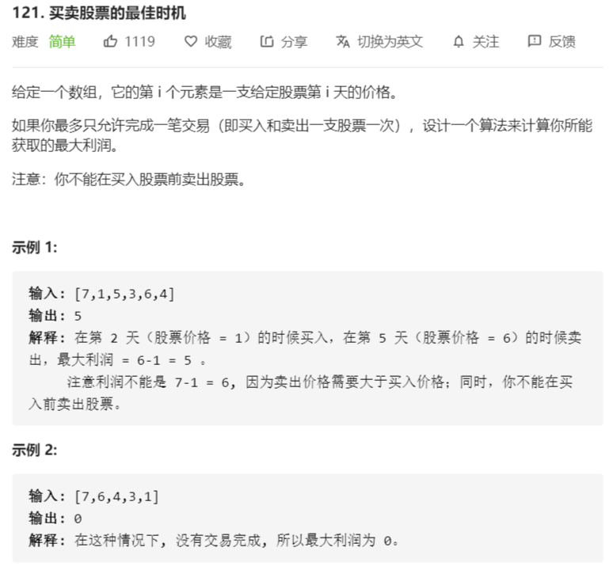

# 买卖股票的最佳时机



解法：

- 动态规划解题思路：第 i 天买，第 j 天卖的利润为：第 i - j 天内，所有相邻两天的股价差的和
- 如[7,1,5,3,6,4]，相邻两天的股价差[-6,4,-2,3,-2]，因此，题目就转化成了求【最大子序和】的问题，也就是求【最大连续子序和】的问题

```java
class Solution {
    public int maxProfit(int[] prices) {
        int len = prices.length;
        int min = 0;
        int max = 0;
        int tmp = 0;
        if (len > 1) {
            min = prices[0];
            for (int i = 1; i < len; i++) {
                tmp = prices[i] - min;
                max = tmp > max ? tmp : max;
                min = tmp > 0 ? min : prices[i];
            }
        }
        return max;
    }
}

class Solution {
    public int maxProfit(int[] prices) {
        // 动态规划解题：第i天买入和第j天卖的利润等于i到j所有相邻两天利润差的和
        if (prices.length < 2) {
            return 0;
        }
        int[] tmp = new int[prices.length - 1];
        for (int i = 1; i < prices.length; i++) {
            tmp[i - 1] = prices[i] - prices[i - 1];
        }
        // 最大连续子序和
        int max = tmp[0];
        // dp用的中间值
        int dp = tmp[0];
        for (int i = 1; i < tmp.length; i++) {
            dp = dp > 0 ? dp + tmp[i] : tmp[i];
            max = Math.max(max, dp);
        }
        return max > 0? max : 0 ;
    }
}
```

