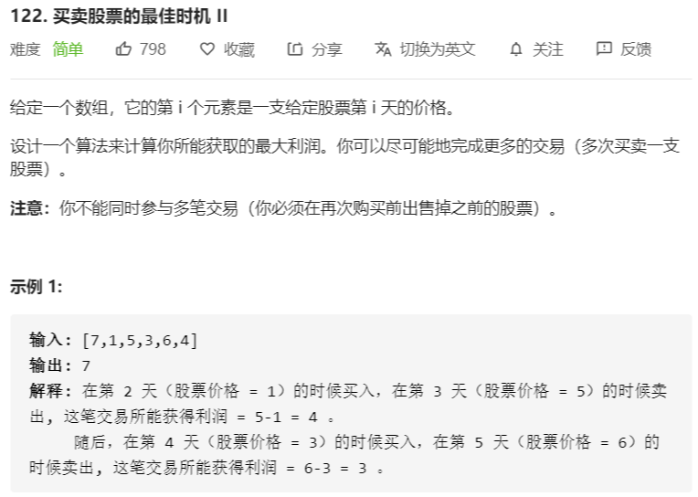
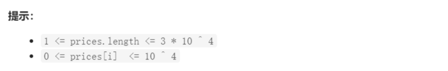

# 买卖股票的最佳时机II





解法：

- 动态规划解题思路：第 i 天买，第 j 天卖的利润为：第 i - j 天内，所有相邻两天的股价差的和

```java
class Solution {
    public int maxProfit(int[] prices) {
        if (prices.length < 2) {
            return 0;
        }
        int max = 0;
        for (int i = 1; i < prices.length; i++) {
            int tmp = prices[i] - prices[i - 1];
            if (tmp > 0) {
                max += tmp;
            }
        }
        return max;
    }
}
```

