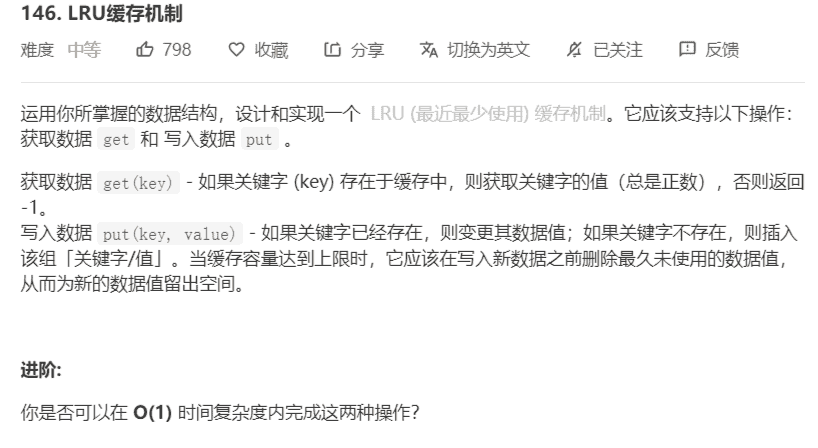

# 146-LRU缓存机制




解法：

```java
class LRUCache {
    // LRU：使用双向链表+哈希表，
    // 双向链表靠近头节点为最常使用节点
    // 且为了统一操作，使用虚拟头尾节点
    private Map<Integer, Node> map;
    private int capacity;
    // 虚拟头、尾节点
    private Node head;
    private Node tail;

    public LRUCache(int capacity) {
        map = new HashMap<>();
        this.capacity = capacity;

        head = new Node();
        tail = new Node();
        head.next = tail;
        tail.prev = head;
    }

    public int get(int key) {
        Node node = map.get(key);
        // 如果节点不存在，返回 -1
        if (node == null) return -1;
        // 如果节点存在，将该节点放在头节点后，返回其值
        removeNode(node);
        addAfterHead(node);
        return node.value;
    }

    public void put(int key, int value) {
        Node node = map.get(key);
        if (node != null) {
            node.value = value;
            // 访问过将节点移至头节点后
            removeNode(node);
            addAfterHead(node);
        } else {
            // 添加一对k-v
            if (map.size() == capacity) {
                // 进行淘汰，淘汰tail尾部之前的节点
                // 删除map和链表中存储的节点
                removeNode(map.remove(tail.prev.key));
            }
            // 新插入的节点位于头节点后
            map.put(key, node = new Node(key, value));
            addAfterHead(node);
        }
    }

    // 删除节点元素
    private void removeNode(Node node) {
        node.prev.next = node.next;
        node.next.prev = node.prev;
    }

    // 在头节点后添加节点
    private void addAfterHead(Node node) {
        // 头节点的next节点的prev节点指向node
        head.next.prev = node;
        // node节点的next指向头节点的next
        node.next = head.next;
        // 头节点的next指向node，node的prev指向头节点
        node.prev = head;
        head.next = node;
    }
	
    // 自定义双向链表的节点
    private static class Node {
        int key;
        int value;
        Node prev;
        Node next;

        public Node() {
        }

        public Node(int key, int value) {
            this.key = key;
            this.value = value;
        }
    }
}
```

