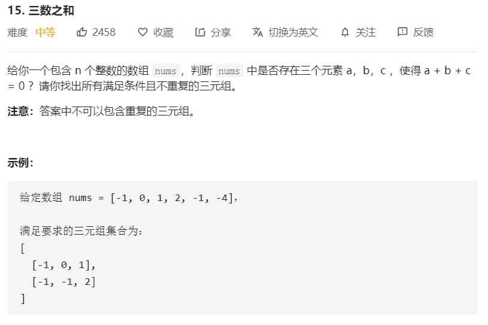

# 15-三数之和



解法：

```java
class Solution {
    public List<List<Integer>> threeSum(int[] nums) {
        List<List<Integer>> ans = new ArrayList<>();
        if (nums.length < 3) {
            return ans;
        }
        Arrays.sort(nums);
        int last = nums.length - 1;
        for (int i = 0; i < nums.length - 2; i++) {
            if (i > 0 && nums[i] == nums[i - 1]) {
                continue;
            }
            int j = i + 1;
            int k = last;
            while (j < k) {
                int res = nums[j] + nums[k] + nums[i];
                if (res == 0) {
                    List<Integer> tmp = new ArrayList<>(3);
                    tmp.add(nums[i]);
                    tmp.add(nums[j]);
                    tmp.add(nums[k]);
                    ans.add(tmp);

                    while(j<k && nums[j] == nums[j+1]) j++;
                    while(j<k && nums[k] == nums[k-1]) k--;
                    k--;
                    j++;
                } else if (res > 0) {
                    k--;
                } else {
                    j++;
                }
            }
        }
        return ans;
    }
}
```

