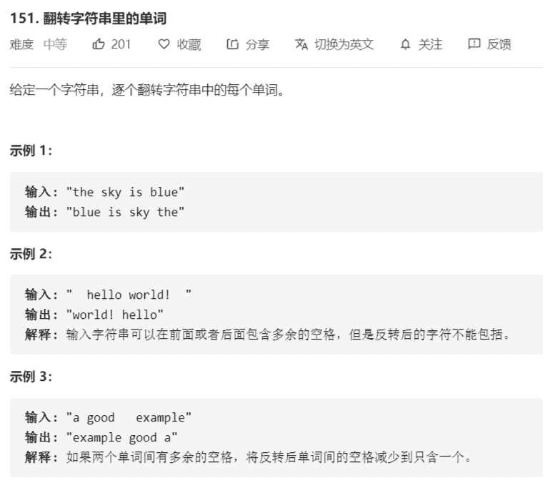
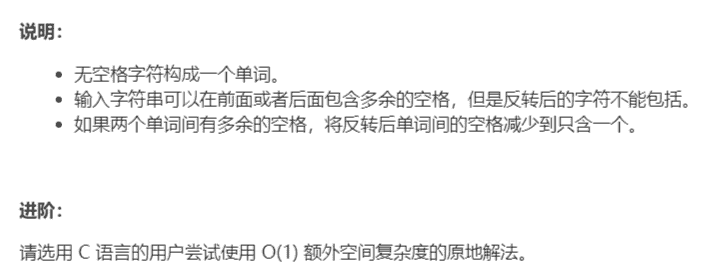

# 翻转字符串里的单词





解法：

```java
class Solution {
    public static String reverseWords(String s) {
        if (s == null) {
            return "";
        }

        // 1.消除多余的空格
        char[] chars = s.toCharArray();
        // 字符串最终的有效长度
        int len = 0;
        // 当前用来存放字符的位置
        int cur = 0;
        // 前面一个为空格字符
        boolean space = true;
        for (int i = 0; i < chars.length; i++) {
            if (chars[i] != ' ') {
                // 非空格字符
                chars[cur++] = chars[i];
                space = false;
            } else if (!space) {
                // 空格字符
                chars[cur++] = ' ';
                space = true;
            }
        }

        len = space ? (cur - 1) : cur;
        if (len <= 0) {
            return "";
        }

        // 2.对有效范围的字符进行逆序
        reverse(chars, 0, len);

        // 3.分别对每个单词进行逆序
        // 前一个空格的index
        int k = -1;
        for (int i = 0; i < len; i++) {
            if (chars[i] != ' ') {
                continue;
            }
            reverse(chars, k + 1, i);
            k = i;
        }
        reverse(chars, k + 1, len);
        return String.copyValueOf(chars, 0, len);
    }

    /**
     * 将[l,r)范围内的字符进行逆序
     *
     * @param chars
     * @param start
     * @param end
     */
    private static void reverse(char[] chars, int start, int end) {
        end--;
        while (start < end) {
            char tmp = chars[start];
            chars[start++] = chars[end];
            chars[end--] = tmp;
        }
    }
}
```

