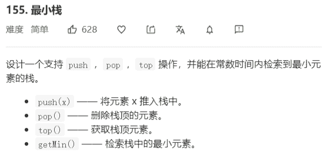

# 最小栈



**提示：**

- `pop`、`top` 和 `getMin` 操作总是在 **非空栈** 上调用。

**解答：**

```java
// 设计两个栈，一个栈存放数据，一个栈存放对应栈顶的最小值
class MinStack {

    private Stack<Integer> stack;
    private Stack<Integer> minStack;

    /**
     * initialize your data structure here.
     */
    public MinStack() {
        stack = new Stack<>();
        minStack = new Stack<>();
    }

    public void push(int x) {
        stack.push(x);

        if (minStack.isEmpty()) {
            minStack.push(x);
        } else {
            minStack.push(Math.min(x, minStack.peek()));
        }
    }

    public void pop() {
        stack.pop();
        minStack.pop();
    }

    public int top() {
        return stack.peek();
    }

    public int getMin() {
        return minStack.peek();
    }
}

// 同样的思路，不过使用链表实现，插入时进行头插，这次没有使用虚拟头节点
class MinStack {
    private Node head;

    /**
     * initialize your data structure here.
     */
    public MinStack() {

    }

    public void push(int x) {
        if (head == null) {
            head = new Node(x, x, null);
        } else {
            Node node = new Node(x, Math.min(x, head.min), head);
            head = node;
        }
    }

    public void pop() {
        head = head == null ? null : head.next;
    }

    public int top() {
        return head.val;
    }

    public int getMin() {
        return head.min;
    }

    static class Node {
        int val;
        int min;
        Node next;

        public Node(int val, int min, Node next) {
            this.val = val;
            this.min = min;
            this.next = next;
        }
    }
}
```

