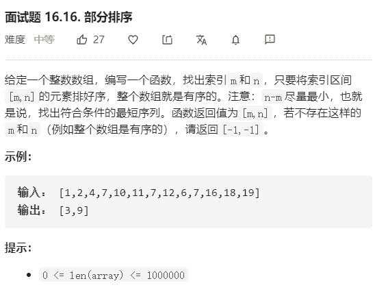

# 部分排序



解法：

```java
// 按题意为找到逆序对
// 最右边的位置：最右边的逆序对的位置
// 最左边的位置：最左边的逆序对的位置
class Solution {
    public int[] subSort(int[] array) {
        if (array.length < 2) {
            return new int[]{-1, -1};
        }

        // 寻找最右边的逆序对
        // 方法：从左到右做一趟扫描，寻找逆序对，正序，逐渐变大
        //   在扫描过程中记录已经扫描过的最大值tmp，tmp初始指向索引0，
        //   如果当前值小于tmp，即逆序，记录当前的逆序位置，直至结束
        int right = -1;
        int tmp = array[0];
        for (int i = 1; i < array.length; i++) {
            if (tmp > array[i]) {
                right = i;
            } else {
                tmp = array[i];
            }
        }
        
        // 提前结束
        if (right == -1){
            return new int[]{-1,-1};
        }

        // 寻找最左边的逆序对
        // 方法：从右到左做一趟扫描，寻找逆序对，正序，逐渐变小
        //   在扫描过程中记录已经扫描过的最大值tmp，tmp初始指向索引length-1，
        //   如果当前值大于tmp，即逆序，记录当前的逆序位置，直至结束
        int left = -1;
        tmp = array[array.length - 1];
        for (int i = array.length - 2; i >= 0; i--) {
            if (tmp<array[i]){
                left = i;
            } else {
                tmp = array[i];
            }
        }
        return new int[]{left, right}; 
    }
}
```

