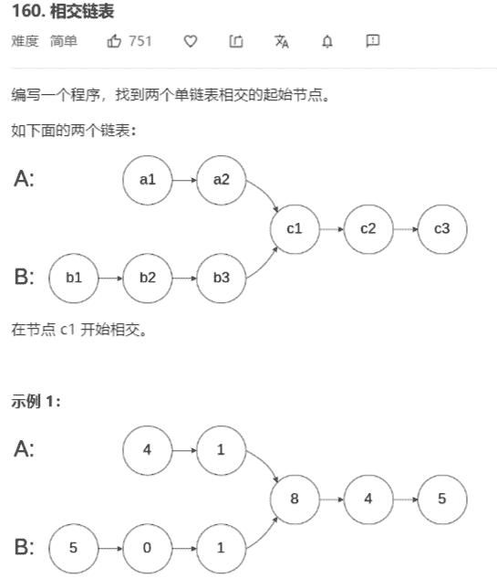

# 相交链表




解法：

```java
class Solution{
	public ListNode getIntersectionNode(ListNode headA, ListNode headB) {
        if (headA == null || headB == null) {
            return null;
        }
        // 两条链表长度未定，直接比较时会无法得出相交点在那个位置
        // 因此，可以分别以headA和headB为起点，使用l1和l2进行遍历
        // l1遍历完headA链表时，跳转到headB链表，
        // l2遍历完headB链表时，跳转到headA链表，
        // 然后两链表会相在交点 或者headA+headB得末尾 null
        ListNode l1 = headA;
        ListNode l2 = headB;

        while (l1 != l2) {
            l1 = l1 == null ? headB : l1.next;
            l2 = l2 == null ? headA : l2.next;
        }
        // 循环终结条件 l1 == l2，而l1 == l2时情况有两种：
        // 1.l1==l2==null，即两个指针同时遍历到l1+l2链表长度的末尾
        // 2.l1==l2==相交结点
        return l1;
    }
}
```

