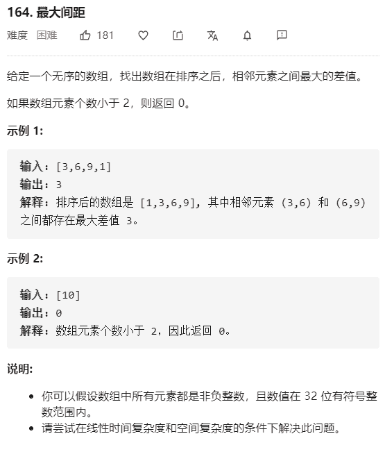

# 164-最大间距



解法：

```java
// 先排序，然后一次遍历
// 先使用自己实现的快排
class Solution {
    public int maximumGap(int[] nums) {
        if (nums.length < 2) {
            return 0;
        }
        sort(nums, 0, nums.length);
        int max = 0;
        int tmp = 0;
        for (int i = 1; i < nums.length; i++) {
            tmp = nums[i] - nums[i - 1];
            max = Math.max(tmp, max);
        }
        return max;
    }
    
    private static void sort(int[] nums, int begin, int end) {
        if (end - begin < 2) {
            return;
        }
        // 确定轴点位置
        int pivot = pivotIndex(nums, begin, end);
        // 对左右子序列分别进行快速排序
        sort(nums, begin, pivot);
        sort(nums, pivot + 1, end);
    }

    private static int pivotIndex(int[] nums, int begin, int end) {
        end--;
        int pivot = nums[begin];
        while (begin < end) {
            while (begin < end) {
                if (nums[end] > pivot) {
                    end--;
                } else {
                    nums[begin++] = nums[end];
                    break;
                }
            }
            while (begin < end) {
                if (nums[begin] < pivot) {
                    begin++;
                } else {
                    nums[end--] = nums[begin];
                    break;
                }
            }
        }
        nums[begin] = pivot;
        return begin;
    }
}
```

