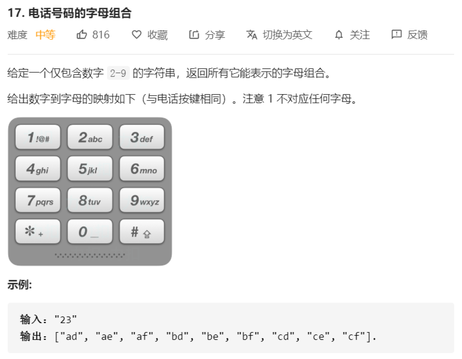

# 17-电话号码的字母组合



解法：

```java
class Solution {
    public List<String> letterCombinations(String digits) {
        // dfs：深度遍历搜索，回溯+剪枝
        list = new ArrayList<>();
        if (digits == null || digits.length() == 0) {
            return list;
        }
        chars = digits.toCharArray();
        string = new char[chars.length];
        dfs(0);
        return list;
    }

    /**
     * 原字符数组
     */
    private char[] chars;
    /**
     * 结果字符串列表
     */
    private List<String> list;
    /**
     * 用来存储每一层选择的字母
     */
    private char[] string;

    private void dfs(int index) {
        if (index == chars.length) {
            // 已经到达最后一层了，不能再深入
            // 得到一个正确的解
            list.add(String.copyValueOf(string));
            return;
        }

        // 先枚举这一层所有可以做的选项
        char[] letters = lettersArray[chars[index] - '2'];
        for (char letter : letters) {
            string[index] = letter;
            dfs(index + 1);
        }
    }

    private char[][] lettersArray = {
            {'a', 'b', 'c'}, {'d', 'e', 'f'}, {'g', 'h', 'i'},
            {'j', 'k', 'l'}, {'m', 'n', 'o'}, {'p', 'q', 'r', 's'},
            {'t', 'u', 'v'}, {'w', 'x', 'y', 'z'}
    };
}
```

