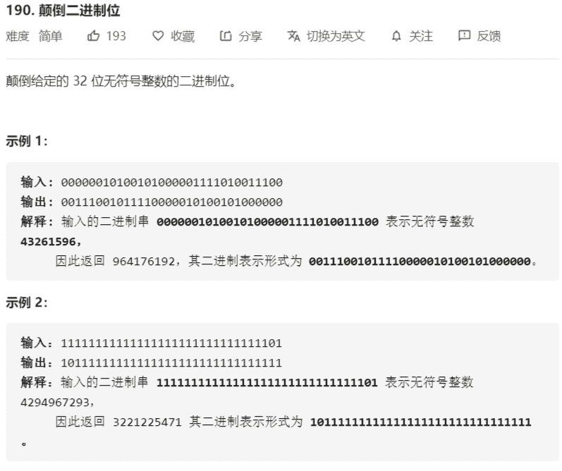

# 190-颠倒二进制位



提示：

请注意，在某些语言（如 Java）中，没有无符号整数类型。在这种情况下，输入和输出都将被指定为有符号整数类型，并且不应影响您的实现，因为无论整数是有符号的还是无符号的，其内部的二进制表示形式都是相同的。
在 Java 中，编译器使用二进制补码记法来表示有符号整数。因此，在上面的 示例 2 中，输入表示有符号整数 -3，输出表示有符号整数 -1073741825。

进阶:
如果多次调用这个函数，你将如何优化你的算法？

解法：

```java
// 交换法
class Solution{
	public static int reverseBits(int n) {
        // 一次循环，比较首末两位的数字是否相同
        // 不相同则进行交换
        for (int i = 0; i < 16; i++) {
            int j = 31 - i;
            // n>>i，将n的第i位移到第一位
            if (((n >> i) & 1) != ((n >> j) & 1)) {
                // 0^1=1，1^1=0，即能实现取反的目的
                n ^= ((1 << i) | (1 << j));
            }
        }
        return n;
    }
}
// 采用中间值
public class Solution {
    // you need treat n as an unsigned value
    public int reverseBits(int n) {
        int ans = 0;
        for (int i = 0; i < 32; i++) {
            ans <<= 1;
            ans |= n & 1;
            n >>= 1;
        }
        return ans;
    }
}
```

来源：力扣（LeetCode）
链接：https://leetcode-cn.com/problems/reverse-bits
著作权归领扣网络所有。商业转载请联系官方授权，非商业转载请注明出处。