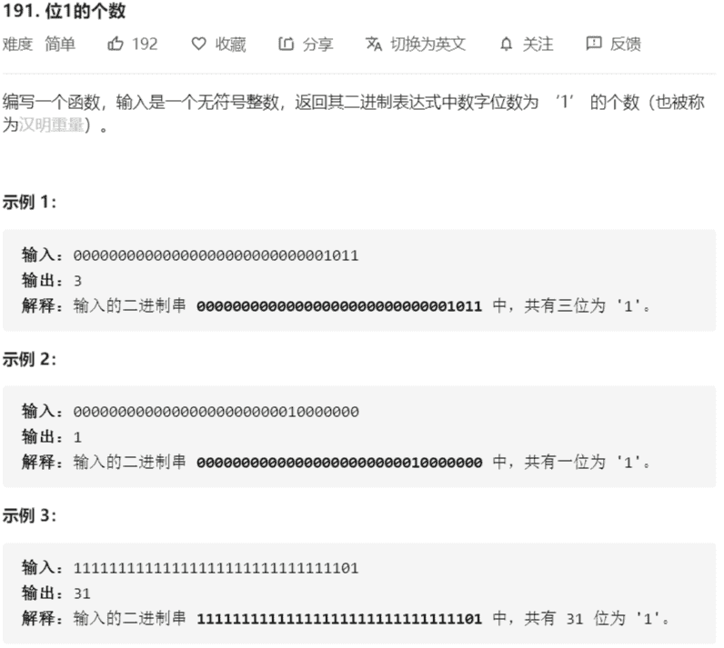
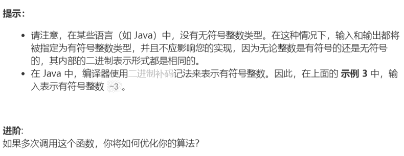

# 191-位1的个数





解法：

1. 解法1：通过位移消去低位的1，n & 1，可以得出 n 最后一位是否为 1，然后将 n 无符号位移一位，继续计算，直到 n == 0
2. 解法2：通过位运算 n & (n - 1) 可以消去 n 的二进制表示的最低位的 1，循环

```java
// 位移法
public class Solution {
    // you need to treat n as an unsigned value
    public int hammingWeight(int n) {
        int count = 0;
        while (n != 0){
            count += n & 1;
            // n 无符号右移一位
            n >>>= 1;
        }
        return count;
    }
}
// 消去法
public class Solution {
    // you need to treat n as an unsigned value
    public int hammingWeight(int n) {
        int count = 0;
        while (n != 0){
            // 消去 n 二进制表示的低位的1
            n &= n - 1;
            count++;
        }
        return count;
    }
}
```

