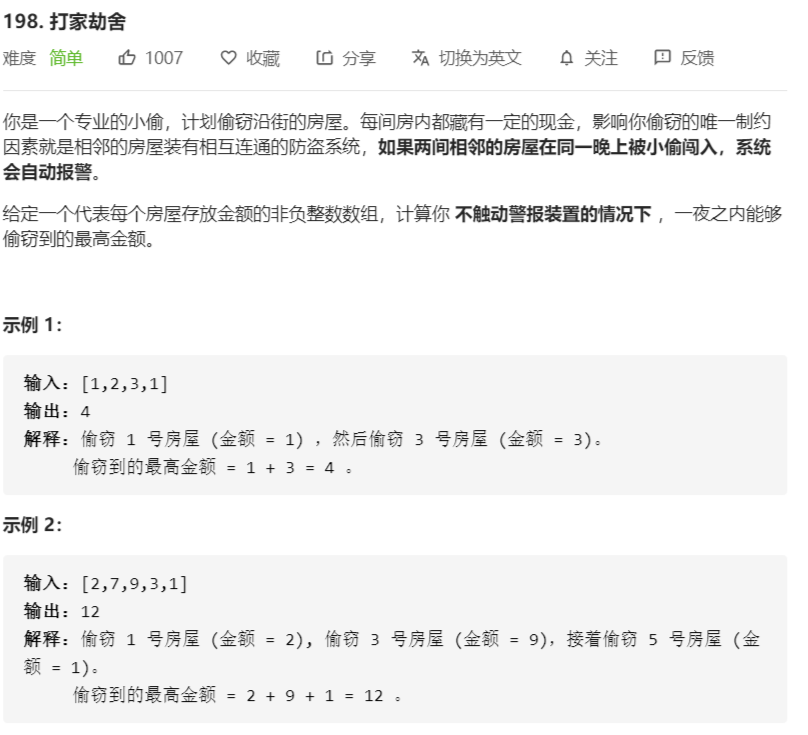

# 198-打家劫舍



解法：

- 对状态的定义：考虑偷取[x...n-1]范围里的房子（函数的定义）

- 状态转移方程：

  f(0) = max{v(0) + f(2)，v(1) + f(3),...,v(n-3) + f(n-1), v(n-2) , v(n-1)}

```java
// 记忆化搜索
class Solution {
    public int rob(int[] nums) {
        memo = new int[nums.length];
        Arrays.fill(memo , -1);
        return tryRob(nums, 0);
    }

    // 表示抢劫[i,...nums.length)的最大收益
    private int[] memo;

    // 考虑抢劫nums[index,...nums.length)的所有房子
    private int tryRob(int[] nums, int index) {
        // 抢劫到了终点
        if (index >= nums.length) {
            return 0;
        }
        if (memo[index] != -1) {
            return memo[index];
        }
        int max = -1; 
        for (int i = index; i < nums.length; i++) {
            max = Math.max(max, nums[i] + tryRob(nums, i + 2));
        }
        memo[index] = max;
        return max;
    }
}

// 动态规划
class Solution {
    public int rob(int[] nums) {
        if (nums.length < 1) {
            return 0;
        }
        // memo[i]表示抢劫nums[0,...i-1]所能获得的最大利益
        // dp数组长度等于原数组+1是为了避免处理越界
        int[] memo = new int[nums.length + 1];
        // 初始化，memo[0]默认初始化为0
        memo[1] = nums[0];
        for (int i = 2; i <= nums.length; i++) {
            memo[i] = Math.max(memo[i - 1], memo[i - 2] + nums[i - 1]);
        }
        return memo[nums.length];
    }
}
```

