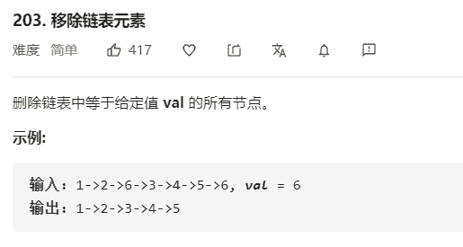

# 203-移除链表元素



解法：

```java
public class ListNode {
    int val;
    ListNode next;

    ListNode(int x) {
        val = x;
    }
}

class Solution {
    public ListNode removeElements(ListNode head, int val) {
        // 使用虚拟头节点的思想，可以统一操作和避免判空
        ListNode newHead = new ListNode(0);
        newHead.next = head;
        // 新建一个遍历节点，从头节点开始
        ListNode pos = newHead;
        // 删除节点时最好用前一个节点来遍历，
        // 删除时可以pos.next = pos.next.next
        while (pos.next != null) {
            if (pos.next.val == val) {
                pos.next = pos.next.next;
            } else {
                pos = pos.next;
            }
        }
        return newHead.next;
    }
}
```

