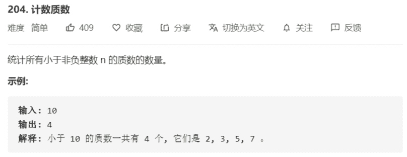

# 204-计数质数



解法：

素数定义：一个数只能被1和它本身整除，那么这个数就是素数

判断一个数是不是素数的方法：

```java
    public boolean isPrime(int n) {
        if (n <= 1) {
            return false;
        }
        // 素数：仅仅能被1和自身整除的数
        for (int i = 2; i * i <= n; i++) {
            // 存在能被非1整除的数说明该数不是素数
            if (n % i == 0) return false;
        }
        // 循环完毕，说明每一个数都不能整除，为素数
        return true;
    }
```

统计所有小于非负整数 n 的质数的数量：

该算法的时间复杂度：跟这两个嵌套的 for 循环有关，其操作数为`n/2 + n/3 + n/5 + n/7 + ... = n * (1/2 + 1/3 + ...)` 括号中是素数的倒数，其最终结果是 O(N*loglogN)

```java
    public int countPrimes(int n) {
        // 筛法 + 打表
        // 初始每个都为素数，false
        boolean[] primes = new boolean[n];
        
        for (int i = 2; i * i < n; i++) {
            // 从2开始，如果为素数，就使用该素数对后面的数进行筛选
            if (!primes[i]) {
                // 素数的倍数一定为非素数
                for (int j = i * i; j < n; j += i) {
                    // true为筛掉，非素数，求得0-n之间素数数组
                    primes[j] = true;
                }
            }
        }
        int count = 0;
        for (int i = 2; i < n; i++) {
            // 统计素数的数量
            if (!primes[i]) count++;
        }
        return count;
    }
```

欧拉筛法：时间复杂度 O(n)，用最小的质因子进行筛选

```java
class Solution {
    public int countPrimes(int n) {
        // 欧拉筛法：用最小的质因子进行筛选
        // 对一个数来说，要么是质数，要么是质数的倍数
        // 默认false，即为素数，true表示被筛掉
        boolean[] isPrimes = new boolean[n];
        // 保存素数
        int[] primes = new int[n];
        // 素数计数器
        int count = 0;
        for (int i = 2; i < n; i++) {
            if (!isPrimes[i]) primes[count++] = i;
            // 循环素数的个数
            for (int j = 0; j < count; j++) {
                // 超过所需要求的边界，退出
                if (i * primes[j] >= n) break;
                // 素数的i倍筛掉
                isPrimes[i * primes[j]] = true;
                // 当前素数为 i 的最小素因子已经出现过，终止循环
                if (i % primes[j] == 0) break;
            }
        }
        return count;
    }
}
```

