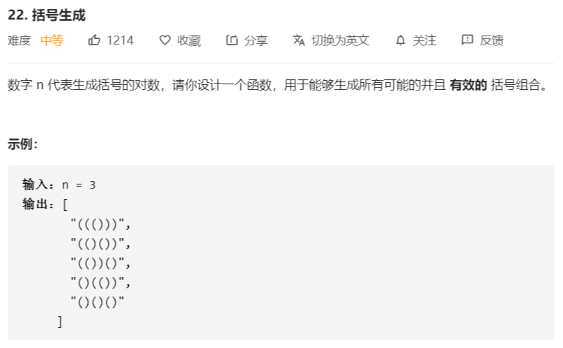

# 22-括号生成



解法：

```java
class Solution {
    public List<String> generateParenthesis(int n) {
        List<String> ans = new ArrayList<>();
        if (n < 1) {
            return ans;
        }
        dfs(ans, new char[n << 1], 0, 0, 0, n);
        return ans;
    }

    /**
     * 进行深度优先搜索
     *
     * @param ans   结果数组，用于保存每一次搜索的结果
     * @param tmp   中间数组，用于保存每一次搜索的字符
     * @param left  已经选择的左括号的数量
     * @param right 已经添加的右括号的数量
     * @param level 搜索的层数
     * @param n     传入的 n
     */
    private void dfs(List<String> ans, char[] tmp, 
                     int left, int right, int level, int n) {
        if (tmp.length == level) {
            // 搜索结束
            ans.add(String.copyValueOf(tmp));
            return;
        }
        // 进行深度遍历搜索
        // left < n，即左括号可选
        if (left < n) {
            if (right < left) {
                // 当right<left，即右括号数小于左括号数，右括号才可选
                tmp[level] = ')';
                dfs(ans, tmp, left, right + 1, level + 1, n);
            }
            // 左括号始终可选
            tmp[level] = '(';
            dfs(ans, tmp, left + 1, right, level + 1, n);
        } else {
            // 左括号不可选，且搜索未结束，即只有右括号可选
            tmp[level] = ')';
            dfs(ans, tmp, left, right + 1, level + 1, n);
        }
    }
}
```

