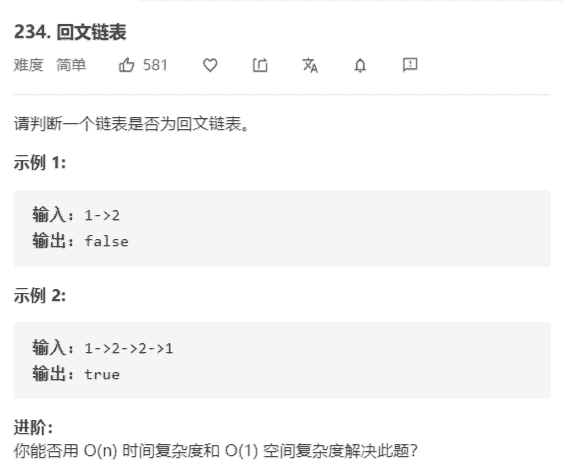

# 回文链表



解法：

```java
class Solution {
    public boolean isPalindrome(ListNode head) {
        if (head == null || head.next == null) {
            return true;
        }
        // 两个节点的情况
        if (head.next.next == null) {
            return head.val == head.next.val;
        }
        // 三个节点的情况
        // 找到中间节点
        ListNode mid = getMid(head);
        // 翻转右边部分
        ListNode tail = reverseList(mid.next);
        while (tail != null) {
            if (head.val != tail.val) {
                return false;
            }
            head = head.next;
            tail = tail.next;
        }
        // 恢复链表结构（对右半部分再次翻转）
        reverseList(tail);
        return true;
    }
    
    private ListNode getMid(ListNode head) {
        // 求出链表的中间节点，利用快慢指针
        ListNode slow = head;
        ListNode fast = head;
        while (fast.next != null && fast.next.next != null) {
            slow = slow.next;
            fast = fast.next.next;
        }
        return slow;
    }

    private ListNode reverseList(ListNode head) {
        // 反转链表
        ListNode newHead = null;
        while (head != null) {
            ListNode tmp = head.next;
            head.next = newHead;
            newHead = head;
            head = tmp;
        }
        return newHead;
    }
}
```

链表中重要的两个小技巧：

1. 反转单链表：

   ```java
       private ListNode reverseList(ListNode head) {
           // 反转链表
           ListNode newHead = null;
           while (head != null) {
               ListNode tmp = head.next;
               head.next = newHead;
               newHead = head;
               head = tmp;
           }
           return newHead;
       }
   ```

2. 求中间节点（快慢指针）：

   ```java
       private ListNode getMid(ListNode head) {
           // 求出链表的中间节点，利用快慢指针
           ListNode slow = head;
           ListNode fast = head;
           while (fast.next != null && fast.next.next != null) {
               slow = slow.next;
               fast = fast.next.next;
           }
           return slow;
       }
   ```

   