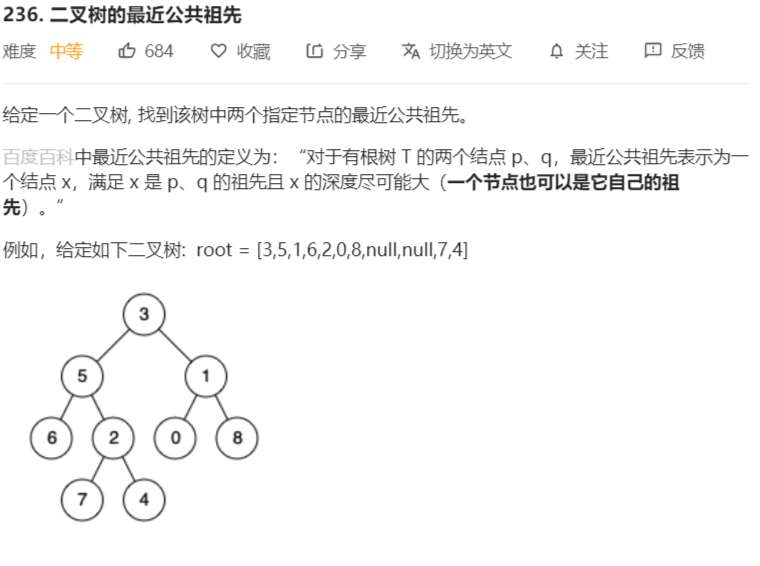

# 二叉树的最近公共祖先




解法：

```java
/**
 * Definition for a binary tree node.
 * public class TreeNode {
 *     int val;
 *     TreeNode left;
 *     TreeNode right;
 *     TreeNode(int x) { val = x; }
 * }
 */
class Solution {
    public TreeNode lowestCommonAncestor(TreeNode root, TreeNode p, TreeNode q) {
        if (root == null || root == p || root == q) {
            return root;
        }
        // 去root.left为根节点的二叉树中查找p、q的最近公共祖先
        TreeNode left = lowestCommonAncestor(root.left, p, q);
        // 去root.right为根节点的二叉树中查找p、q的最近公共祖先
        TreeNode right = lowestCommonAncestor(root.right, p, q);
        if (left != null && right != null) {
            return root;
        }
        return left != null ? left : right;
    }
}
```

