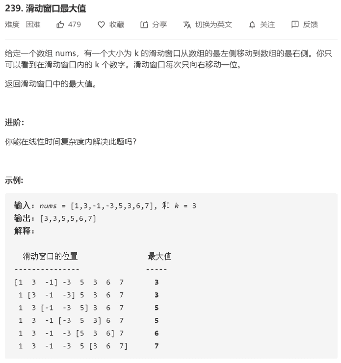
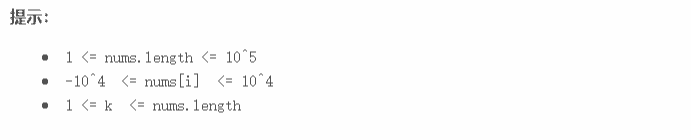

# 滑动窗口最大值





**解法：**

```java
class Solution {
    public int[] maxSlidingWindow(int[] nums, int k) {
        if (nums == null || nums.length == 0 || k < 1) {
            return null;
        }
        if (k == 1) {
            // 滑动窗口为 1
            return nums;
        }
        int[] maxes = new int[nums.length - k + 1];

        // 创建一个双端队列，队列的目的：
        // 1. 队列中存放索引
        // 2.然后队列中的元素从头到尾的元素值是逐渐减小的
        Deque<Integer> deque = new LinkedList<>();

        // 1.如果nums[i]>=nums[队尾]，不断删除队尾，
        // 直到nums[队尾]>nums[i]为止
        // 2.将i加入队尾
        // 3.如果w>=0：
        //     1.如果队头失效，就移除队头（如果队头 < w就代表失效）
        //     2.设置w窗口的最大值为nums[队头]
        for (int i = 0; i < nums.length; i++) {
            // 只要nums[队尾]<=nums[i]，就删除队尾
            while (!deque.isEmpty() && 
                   nums[i] >= nums[deque.peekLast()]) {
                deque.pollLast();
            }
            // 将i加到队尾
            deque.offerLast(i);

            // 检查窗口的索引是否合法
            int w = i - k + 1;
            if (w < 0) {
                continue;
            }

            // 检查对头的合法性
            if (deque.peekFirst() < w) {
                // 队头不合法，失效，不在滑动窗口索引范围内
                deque.pollFirst();
            }

            // 设置窗口的最大值
            maxes[w] = nums[deque.peekFirst()];
        }
        return maxes;
    }
}

// 类似暴力解法，最大值做记录
class Solution {
    public int[] maxSlidingWindow(int[] nums, int k) {
        if (nums == null || nums.length == 0 || k < 1) {
            return nums;
        }
        if (k == 1) {
            // 滑动窗口为 1
            return nums;
        }
        // 结果数组
        int[] maxes = new int[nums.length - k + 1];
        // i=0时滑动窗口的最大值索引
        int max = maxIndex(nums, 0, k);
        // i是滑动窗口的最左边位置
        for (int i = 0; i < maxes.length; i++) {
            int r = i + k - 1;
            if (max < i) {
                // max不在滑动区间内，需要重新计算
                max = maxIndex(nums, i, k);
            } else if (nums[max] <= nums[r]) {
                // max在滑动区间但小于等于新增值，更新max的位置
                max = r;
            }
            // max在滑动区间且大于新增值，无需更新
            
            // 记录滑动窗口的最大值
            maxes[i] = nums[max];
        }
        return maxes;
    }

    // 指定数组nums，[start,start+len)中数组最大值的索引
    private int maxIndex(int[] nums, int start, int len) {
        int max = start;
        for (int i = start + 1; i < start + len; i++) {
            if (nums[i] >= nums[max]) {
                max = i;
            }
        }
        return max;
    }
}
```

