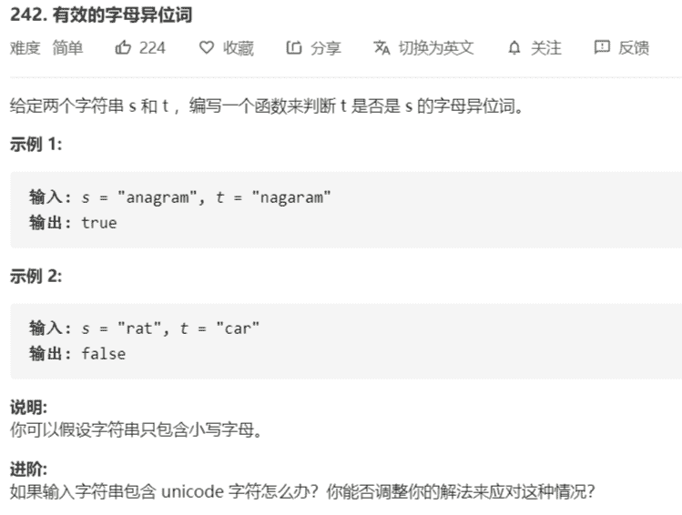

# 有效的字母异位词



解法：

只有小写字母，即 a - z 共 26 个字母，a 的 ascii 码 50H + 01H = 97 

```java
class Solution {
    public boolean isAnagram(String s, String t) {
        if (s.length() != t.length()) {
            return false;
        }

        int[] tmp = new int[26];

        char[] str = s.toCharArray();
        for (char c : str) {
            tmp[c - 97]++;
        }

        str = t.toCharArray();
        for (char c : str) {
            if (tmp[c - 97]-- < 1) {
                return false;
            }
        }
        return true;
    }
}
```

