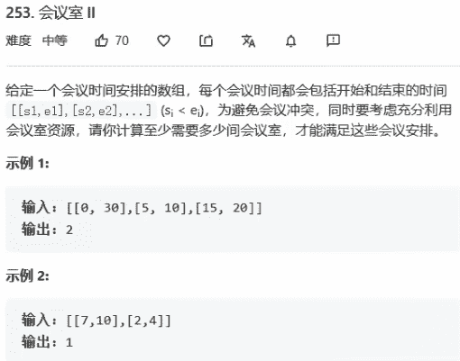

# 253-会议室2



解法：

```java
class Solution{
    public int minMeetingRooms(int[][] intervals) {
        if (intervals == null || intervals.length < 1) {
            return 0;
        }
        // 根据起始时间排序
        Arrays.sort(intervals, (m1, m2) -> m1[0] - m2[0]);
        // 创建一个最小堆，存放每一个会议的结束时间
        PriorityQueue<Integer> heap = new PriorityQueue<>();
        // 存放0号位置的结束时间
        heap.add(intervals[0][1]);
        // 堆顶的含义：（目前占用的会议室中最早结束的时间）
        for (int i = 1; i < intervals.length; i++) {
            // i号会议开始时间>=堆顶（目前会议室中最早结束时间）
            if (intervals[i][0] >= heap.peek()) {
                // 堆顶会议室可用，删除堆顶
                heap.remove();
            }
            // 将目前的结束时间放入堆
            heap.add(intervals[i][0]);
        }
        return heap.size();
    }
}
```

