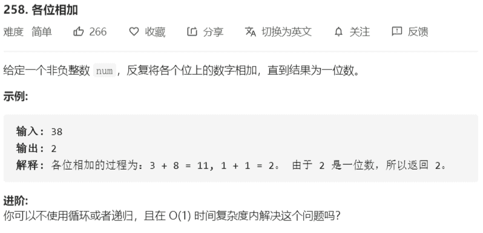

# 258-各位相加



解法：

- `(a * 10 + b) % 9 =(a*9 + a + b)%9 = (a + b)%9`

  `(a * 100 + b * 10 + c) % 9 = (a*99 + b*9 + a + b +c)%9 = (a + b + c)%9` 

  即说明一个数模9等于其各个位数上的和模9，而模9的结果为 0 - 8，而题意要求的结果为 1 - 9

- 又存在 `a%9 = (a-1+1)%9 =  (a - 1)%9 + 1`
- 所以 (num - 1)%9 + 1 即为题意所求，特殊情况为 num == 0 时，结果为 0 

```java
class Solution {
    public int addDigits(int num) {
        return num == 0 ? 0 : (num - 1)%9 + 1; 
    }
}
```


