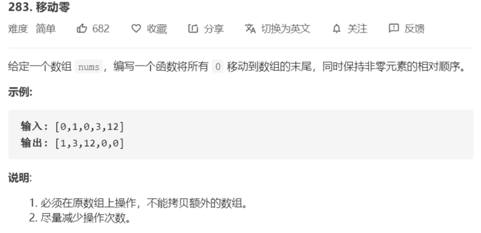

# 283-移动零



```java
class Solution {
    public void moveZeroes(int[] nums) {
        int j = 0;
        // 从左向右扫描，碰到非0字符进行交换
        for (int i = 0; i < nums.length; i++) {
            if (nums[i] != 0) {
                nums[j] = nums[i];
                nums[i] = i == j ? nums[i] : 0;
                j++;
            }
        }
    }
}
```

