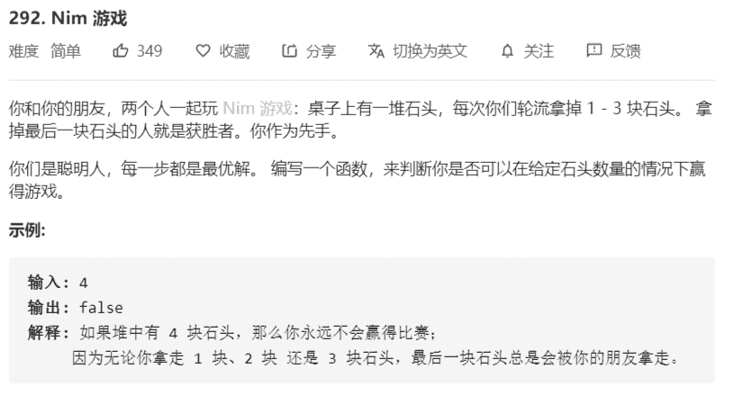

# 292-Nim游戏



解法：

如果n存在一种方式一步到达必输状态：

- 存在 x ，f[n-x] == 必输，其中 1<=x<=3，那么f[n]是必胜
- 不存在这种x就是必输状态，就是别人怎么走都必胜

初始状态：

- f[0] = 必输，f[1] f[2] f[3]必胜
- f[4] = 必输，f[5] f[6] f[7] 必胜

推导：

- 每次取走的是 1、2、3，计 base = 3
- f[0] 必输，f[1] - f[base] 必胜
- f[base+1] 必输，`f[base+2] - f[2*base+1]` 必胜
- `f[k*(base+1)]` 必输，`f[k*(base+1)+p]` 必胜，`1<=p<=base`

结论：

- `n%(base+1)==0` 必输
- `n%(base+1)!=0` 必胜

```java
class Solution {
    public boolean canWinNim(int n) {
        return n % 4 != 0;
    }
}
```

题目变形：

> 一堆N个石子，甲乙两个人取石子，每次取得个数为 a[0]、a[1]、...、a[n]个，取走最后一个获胜

- f[0] = 必输
- f[a[0]] 必胜  f[a[1]] 必胜

```java
// 初始化
memset(f,必输,n+1);
// 填充
for (int i = 0;i < n;i++){
    if (f[i] == 必输){
        for (int j = 0;j<a.size();j++){
            f[i+a[j]] = 必胜
        }
    }
}
return f[n]
```

