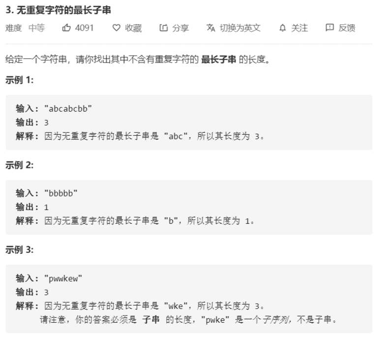

# 无重复字符的最长子串



解法：

```java
class Solution {
    public int lengthOfLongestSubstring(String s) {
        if (s == null) {
            return 0;
        }
        if (s.length() < 2) {
            return s.length();
        }
        char[] chars = s.toCharArray();
        // 用来保存每一个字符上一次出现的位置
        Map<Character, Integer> prevIndexes = new HashMap<>(chars.length);
        prevIndexes.put(chars[0], 0);
        // 以i-1位置字符结尾的最长不重复字符串的开始索引（最左索引）
        int li = 0;
        // 最大的子序列长度
        int maxLen = 1;
        for (int i = 1; i < chars.length; i++) {
            // i 位置字符上一次出现的位置
            Integer pi = prevIndexes.getOrDefault(chars[i], -1);
            if (li <= pi) {
                li = pi + 1;
            }
            // 存储该字符出现的位置
            prevIndexes.put(chars[i], i);
            // 求出最长不重复字串的长度
            maxLen = Math.max(maxLen, ((i - li) + 1));
        }
        return maxLen;
    }
}

// 类似暴力法：已知在[pos,i-1]为含有不重复字符的子串，则：
// 1. chars[i]不在[pos,i-1]中时，[pos,i]为不含重复字符的字符串
// 2. chars[i]在[pos,i-1]中，且索引为index，则[index+1,i]为不含重复字符的字串，且为最长的
class Solution {
    public int lengthOfLongestSubstring(String s) {
        if (s == null) {
            return 0;
        }
        if (s.length() < 2) {
            return s.length();
        }
        char[] chars = s.toCharArray();
        // 左边索引
        int pos = 0;
        // 最大值
        int max = 1;
        for (int i = 1; i < chars.length; i++) {
            int tmp = pos;
            while (tmp < i) {
                // 如果[pos,i)之间存在chars[i]，更新pos的值
                if (chars[i] == chars[tmp]) {
                    pos = tmp + 1;
                    break;
                }
                tmp++;
            }
            max = Math.max(max, i - pos + 1);
        }
        return max;
    }
}
```

