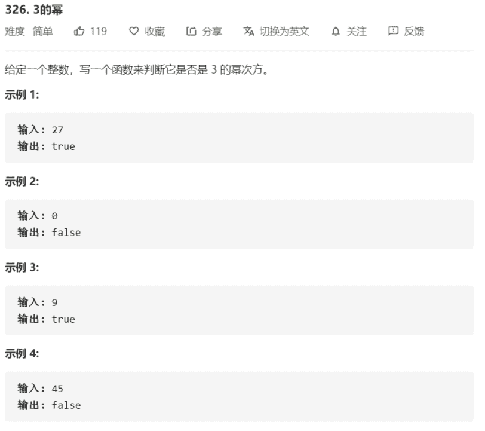

# 326-3的幂



**进阶：**
你能不使用循环或者递归来完成本题吗？

解法：

```java
class Solution {
    public boolean isPowerOfThree(int n) {
        // 3 9 27 81 ...
        // big3 % n == 0，即较大的3的幂能整除较小的3的幂
        // 求整整数种最大的 3 的幂：
        // big3 = 3^k = 1162261467
        // k = log3(maxint) = log(maxint)/log(3) = 19
        return n > 0 && 1162261467 % n == 0;
    }
}

// 使用循环迭代
class Solution {
    public boolean isPowerOfThree(int n) {
        if (n < 1) {
            return false;
        }

        while (n % 3 == 0) {
            n /= 3;
        }

        return n == 1;
    }
}
```

