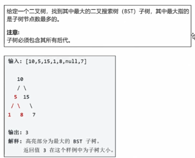

# 最大BST子树



解法：

```java
class Solution{ 
    
	public static class TreeNode {
        int val;
        TreeNode left;
        TreeNode right;

        TreeNode(int x) {
            val = x;
        }
    }

    /**
     * 最大BST子树的信息
     */
    private static class Info {
        /**
         * 根节点
         */
        public TreeNode root;
        /**
         * 节点总数
         */
        public int size = 1;
        /**
         * 最大值
         */
        public int max;
        /**
         * 最小值
         */
        public int min;

        public Info(TreeNode root, int size, int max, int min) {
            this.root = root;
            this.size = size;
            this.max = max;
            this.min = min;
        }
    }

    /**
     * 返回以root为根节点的二叉树的最大BST子树的信息
     *
     * @param root 根节点
     * @return 最大BST子树信息
     */
    private Info getInfo(TreeNode root) {
        if (root == null) {
            return null;
        }
        // li--left info：左子树的最大BST子树信息
        Info li = getInfo(root.left);
        // ri--right info：右子树的最大BST子树信息
        Info ri = getInfo(root.right);

        /**
         * 有四种情况，以root节点为根节点的二叉树就是一棵BST，
         *    最大BST就是其本身
         * 1. li !=null && ri != null
         *    && li.root == root.left && root.val > li.max
         *    && ri.root == root.right && root.val < ri.min
         *
         * 2. li != null && ri == null
         *    && li.root == root.left && root.val > li.max
         *
         * 3. li == null && ri != null
         *    && ri.root == root.right && root.val < ri.min
         *
         * 4. li == null && ri == null
         */
        if ((li == null || (li.root == root.left && li.max < root.val) &&
                (ri == null || (ri.root == root.right && ri.min > root.val))) {
            return new Info(root,
                    (li == null ? 0 : li.size) + (ri == null ? 0 : ri.size) + 1,
                    ri != null ? ri.max : root.val,
                    li != null ? li.min : root.val);
        }

        /**
         * 以 root 为根节点的二叉树不是 BST
         * 1. li != null && ri != null，返回BST子树size最大的
         * 2. li != null && ri == null
         * 3. li == null && ri != null
         * 注意：li == null && ri == null属于以root为根节点的BST
         */
        if (li != null && ri != null) {
            return li.size > ri.size ? li : ri;
        }
        return li != null ? li : ri;
    }

    public int largestBSTSubTree(TreeNode root) {
        return (root == null) ? 0 : getInfo(root).size;
    }
}
```

