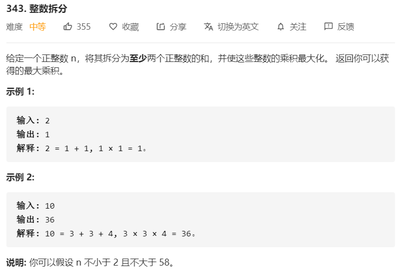

# 343-整数拆分



解法：

```java
// 记忆化搜索
class Solution{
    public int integerBreak(int n) {
        // 记忆数组
        int[] memo = new int[n + 1];
        // 终止条件
        memo[1] = 1;
        return breakInteger(n, memo);
    }

    private int breakInteger(int n, int[] memo) {
        // 利用之前的记忆
        if (memo[n] != 0) {
            return memo[n];
        }
        // 最大值记录
        int max = -1;
        int mid = n >> 1;
        for (int i = 1; i <= mid; i++) {
            // 将 n 分成两半，计算乘积的最大值
            // i * (n - i) 或者 i * breakInteger(n - i)
            max = Math.max(max, Math.max(i * (n - i), i * breakInteger(n - i, memo)));
        }
        // 将最大值存入记忆数组
        memo[n] = max;
        return max;
    }
}

// 记忆化搜索的不同写法
class Solution{
    private int[] memo;
    public int integerBreak(int n) {
        // 整数拆分：动态规划
        memo = new int[n+1];
        return breakInteger(n);
    }

    private int breakInteger(int n) {
        if (n == 1) {
            return 1;
        }
        if (memo[n] != 0){
            return memo[n];
        }
        int max = -1;
        int mid = n >> 1;
        for (int i = 1; i < n; i++) {
            // 分成 i 和 n - i
            max = Math.max(max, Math.max(i * (n - i),i * breakInteger(n - i)));
        }
        memo[n] = max;
        return max;
    }
}

// 动态规划
class Solution{
    public int integerBreak(int n) {
        // 整数拆分：动态规划
        // 记忆数组
        int[] memo = new int[n + 1];
        for (int i = 2; i <= n; i++) {
            int max = -1;
            // 依次循环求出i到n的最大乘积
            int mid = i >> 1;
            for (int j = 1; j <= mid; j++) {
                // 将i分为 j 和 i - j
                max = Math.max(max, Math.max(j * (i - j), j * memo[i - j]));
            }
            memo[i] = max;
        }
        return memo[n];
    }
}
```

