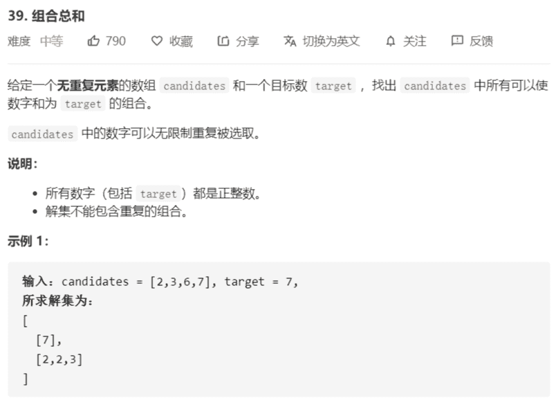

# 39-组合总和




解法：

```java
class Solution {
    public List<List<Integer>> combinationSum(int[] candidates, int target) {
        List<List<Integer>> res = new ArrayList<>();
        if (candidates == null || candidates.length < 1) {
            return res;
        }
        dfs(candidates, 0, res, new ArrayList<>(candidates.length), target);
        return res;
    }

    /**
     * 深度优先搜索，回溯 + 剪枝
     *
     * @param candidates 原数组
     * @param index      下一次搜索起始点
     * @param ans        结果数组，用于返回结果
     * @param tmp        中间数组
     * @param remain     剩余，利用减法
     */
    private void dfs(int[] candidates, int index, List<List<Integer>> ans,
                     List<Integer> tmp, int remain) {
        if (remain == 0) {
            ans.add(new ArrayList<>(tmp));
            return;
        }
        // 数字可以重复使用
        for (int i = index; i < candidates.length; i++) {
            if (candidates[i] > remain) {
                continue;
            }
            // 更新状态
            tmp.add(candidates[i]);
            dfs(candidates, i, ans, tmp, remain - candidates[i]);
            // 状态恢复
            tmp.remove(tmp.size() - 1);
        }
    }
}
```

