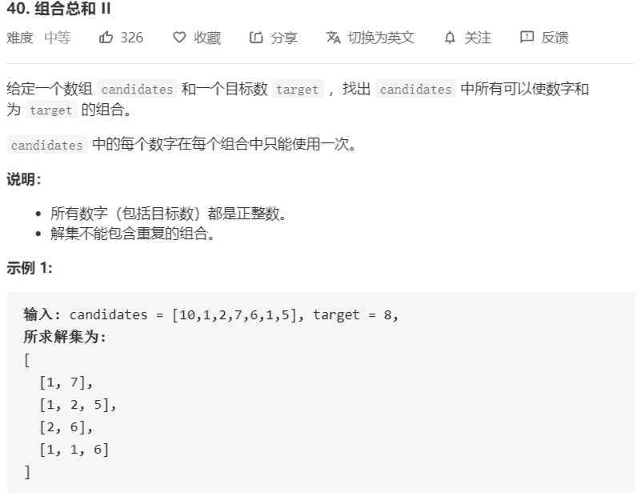

# 40-组合总和2



解法：

```java
class Solution {
    public List<List<Integer>> combinationSum2(int[] candidates, int target) {
        List<List<Integer>> res = new ArrayList<>();
        if (candidates == null || candidates.length < 1) {
            return res;
        }
        // 求的是不重复使用
        Arrays.sort(candidates);
        dfs(res, new ArrayList<>(candidates.length), candidates, 0, target);
        return res;
    }

    private void dfs(List<List<Integer>> res, List<Integer> tmp, int[] candidates, int index, int remain) {
        if (remain == 0) {
            res.add(new ArrayList<>(tmp));
            return;
        }
        for (int i = index; i < candidates.length; i++) {
            if (candidates[i] > remain) {
                // 这个值比剩余的大，不可选
                return;
            }
            // 第二次回溯时略过相同值，即当i>index时，表明已经进行过回溯
            if (i > index && candidates[i] == candidates[i - 1]) {
                continue;
            }
            tmp.add(candidates[i]);
            dfs(res, tmp, candidates, i + 1, remain - candidates[i]);
            tmp.remove(tmp.size() - 1);
        }
    }
}
```

